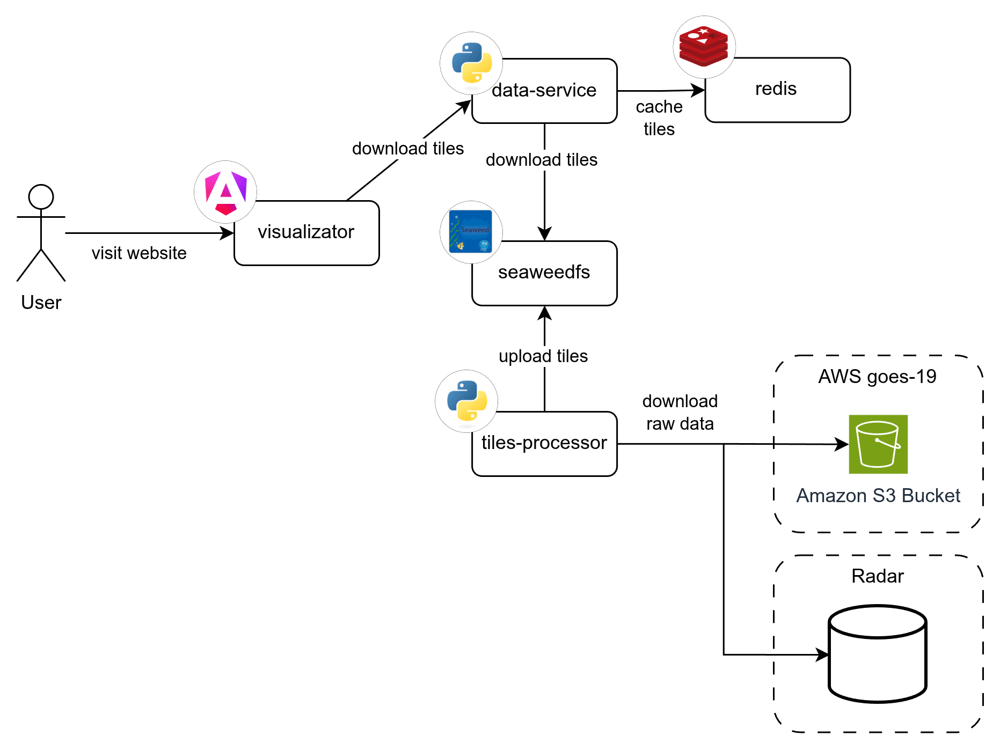

# Visualizer

  

Visualizer is an Angular 21 web application for interactive map visualization, supporting GOES-19 satellite imagery, weather radar, and IGN WMS layers rendered via Leaflet.

**Stack:** Angular 21 · Leaflet · Angular Material · TypeScript (strict) · Vitest · Docker

## Table of Contents

1. [Prerequisites](#prerequisites)
2. [Getting Started](#getting-started)
3. [Services](#services)
4. [Commands](#commands)
5. [Environment Variables](#environment-variables)
6. [Documentation](#documentation)
7. [Architecture](#architecture)
   - [General data flow between all the services](#general-data-flow-between-all-the-services)

## Prerequisites

- **Docker** (recommended) — for `make` commands
- **Node.js 24 LTS** — for running without Docker (`npm start`, `npm test`)

## Getting Started

```bash
# 1. Copy and configure environment variables
cp .env.example .env

# 2. Start the dev environment (Docker, with hot-reload)
make up
```

The app runs at `http://localhost:4200` and the docs service at `http://localhost:${DOCS_HOST_PORT}` (default `6011`).

## Services

The project runs two Docker services:

| Service        | Dev port         | Description                   |
| -------------- | ---------------- | ----------------------------- |
| `visualizer`   | `4200`           | Angular app (this repo)       |
| `docs-service` | `DOCS_HOST_PORT` | Docusaurus documentation site |

Both services start together via `make up`. The `DOCS_URL` env var tells the Angular app where to load the docs iframe from.

## Commands

```bash
make up            # Start dev environment in Docker with hot-reload
make down          # Stop and clean up all containers
make prod          # Build and run the production Docker environment

npm start          # Run dev server directly (without Docker), port 4200
npm run build      # Production build
npm test           # Run unit tests (Vitest)
```

## Environment Variables

| Variable                  | Description                                  | Default                 |
| ------------------------- | -------------------------------------------- | ----------------------- |
| `DATA_SERVICE_BASE_URL`   | Tile and product config API                  | `http://localhost:6006` |
| `ALERTS_SERVICE_BASE_URL` | Polygon alerts backend                       | `http://localhost:6007` |
| `TILE_FORMAT`             | Tile image format (`webp` \| `png`)          | `webp`                  |
| `APP_HOST_PORT`           | Host port for the app in production          | `6010`                  |
| `DOCS_HOST_PORT`          | Host port for the docs service               | `6011`                  |
| `DOCS_URL`                | URL the Angular app loads docs from (iframe) | `http://localhost:6011` |

> In production (`make prod`), env vars are baked into the build at compile time via webpack `DefinePlugin`. In development, they are passed at runtime via Docker environment.

## Documentation

The `/docs` route embeds the Docusaurus docs site (`docs-service`) via iframe, served from `DOCS_URL`.

## Architecture

### General data flow between all the services

<p align="center">
    
</p>
