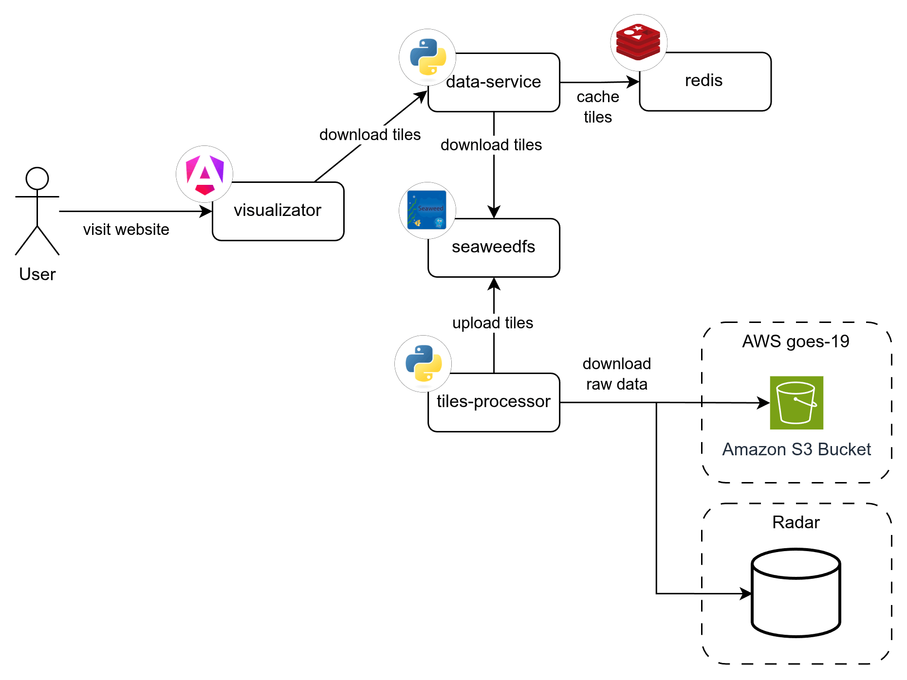

# Visualizer

  

Visualizer is the MapaSMN web UI: an Angular 21 application that renders GOES-19 satellite imagery, weather radar and IGN WMS layers on a Leaflet map.

**Stack:** Angular 21 · Leaflet · Angular Material · TypeScript (strict) · Vitest · Docker

## Prerequisites

- **Docker** (recommended) — for `make` commands
- **Node.js 24 LTS** — for running without Docker (`npm start`, `npm test`)

## Getting Started

```bash
# 1. Copy and configure environment variables
cp .env.example .env

# 2. Start the dev environment (Docker, with hot-reload)
make up
```

The app runs at `http://localhost:4200`, documentation included at `/docs`.

## Services

| Service      | Dev port | Description                                          |
| ------------ | -------- | ---------------------------------------------------- |
| `visualizer` | `4200`   | Angular app (this repo), documentation included       |
| `docs-build` | —        | One-shot MkDocs build; renders `docs/` and then exits |

`make up` runs `docs-build` first, then starts the app.

## Commands

```bash
make up            # Start dev environment in Docker with hot-reload
make down          # Stop and clean up all containers
make prod          # Build and run the production Docker environment
make docs          # Build the documentation into public/docs-site
make docs-serve    # Live-reloading docs preview on http://localhost:8000

npm start          # Run dev server directly (without Docker), port 4200
npm run build      # Production build
npm test           # Run unit tests (Vitest)
```

> Running `npm start` outside Docker? Run `make docs` once first, or `/docs`
> will 404 — the site is gitignored build output.

## Environment Variables

| Variable                  | Description                                  | Default                 |
| ------------------------- | -------------------------------------------- | ----------------------- |
| `DATA_SERVICE_BASE_URL`   | Tile and product config API                  | `http://localhost:6006` |
| `ALERTS_SERVICE_BASE_URL` | Polygon alerts backend                       | `http://localhost:6007` |
| `SMN_API_PROMPT_FOR_TOKEN` | Prompt for token when enabling SMN stations layer | `true`            |
| `APP_HOST_PORT`           | Host port for the app in production          | `6010`                  |
| `DOCS_URL`                | Where the app loads docs from (iframe)       | `/docs-site`            |
| `METRICS_SERVICE_BASE_URL` | tiles-processor metrics API, read by the status dashboard | `http://localhost:6020` |
| `IGN_PLACE_SEARCH_URL`    | IGN gazetteer for place search               | `https://api.ign.gob.ar/buscador/search` |
| `NOMINATIM_SEARCH_URL`    | Nominatim/OSM gazetteer for place search     | `https://nominatim.openstreetmap.org/search` |

> These reach the app through webpack `DefinePlugin` at compile time, not at runtime.
> `make prod` bakes them into the image build; in development the dev server reads them
> from the container environment when it compiles, so changing one means restarting the
> container. `APP_HOST_PORT` is also read by `docker-compose.yml` to publish the port.
> The defaults above are the `.env.example` values; with the variable unset,
> `custom-webpack.config.js` falls back to a different value for `DATA_SERVICE_BASE_URL`,
> `ALERTS_SERVICE_BASE_URL` and `APP_HOST_PORT`.

## Documentation

Sources live in `docs/` and are built with [MkDocs Material](https://squidfunk.github.io/mkdocs-material/) via the pinned `squidfunk/mkdocs-material` image — no local Python needed:

```bash
make docs          # renders docs/ -> public/docs-site (gitignored)
make docs-serve    # live preview while writing
```

Angular copies `public/` verbatim, so nginx serves the site at `/docs-site/` and the `/docs` route embeds it in an iframe from `DOCS_URL`. In the production image the same build runs in a dedicated `docs` stage, so the app image ships its own documentation.

Adding a page means creating the Markdown file in `docs/` and adding it to `nav` in `mkdocs.yml`. Builds run with `--strict`, so a broken link fails the build.

## Architecture

### General data flow between all the services

<p align="center">
    
</p>
