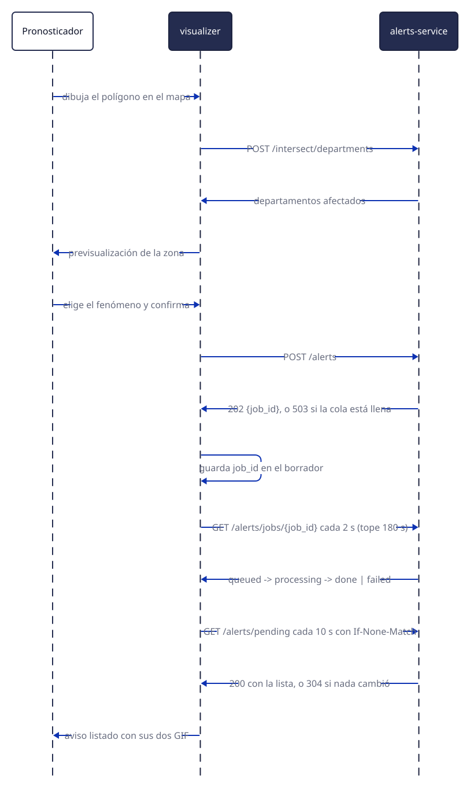

# Avisos a corto plazo

El panel **Avisos a corto plazo** es donde el pronosticador delimita un área, comprueba qué
departamentos abarca y emite un ACP. El sistema calcula la intersección geográfica, genera las
imágenes oficiales y deja el aviso listo para que el circuito de emisión del SMN lo tome.

{ .diagram loading=lazy }

!!! note "El sistema no difunde el aviso"
    Lo deja registrado en la base operativa del SMN. Un servicio del propio organismo lo completa con
    los campos del formulario de emisión y lo difunde por sus canales. Ver
    [Alerts Service](servicios/alerts-service.md).

## Dibujar el área

En la pestaña **Generar**:

1. **Dibujar** entra en modo de trazado. Cada clic en el mapa agrega un vértice; el polígono se
   cierra haciendo clic sobre el primer punto o doble clic en el último. **Cancelar** sale del modo.
2. El deslizador **Nivel de detalle**, de 1 a 5, controla con cuánta fidelidad se recorta el contorno
   del país. Más detalle es más preciso y más costoso de calcular.
3. **Borrar todos** elimina todos los polígonos dibujados.

Cada borrador aparece como una tarjeta con sus **Vértices**, su **Área** y su última modificación.
Desde la tarjeta —o con el botón derecho sobre el polígono en el mapa— se puede editar la geometría,
ocultarlo, recortarlo contra el contorno de Argentina, o eliminarlo.

!!! note "Recortar con Argentina es reversible"
    La acción de recorte tiene su **Deshacer recorte**, así que se puede probar cómo queda el área
    ajustada al territorio y volver atrás.

## Comprobar los departamentos

La fila **Departamentos** de la tarjeta tiene un botón **Buscar** que consulta qué departamentos
toca el polígono. El resultado se lista agrupado por provincia y se puede desplegar o plegar. Sirve
para ajustar el trazado antes de emitir.

## Emitir

**Generar aviso** abre un diálogo que pide el **Código de fenómeno** de una lista desplegable. El
catálogo tiene 28 entradas, de las cuales 27 son seleccionables.

Al confirmar, el sistema encola el trabajo y responde de inmediato con un identificador. La
aplicación consulta sola el estado hasta que termina.

!!! warning "El botón se deshabilita si el polígono tiene demasiados vértices"
    Hay un máximo de vértices, impuesto por el tamaño de la columna donde se guarda el polígono. El
    trazado nunca se bloquea: se puede dibujar un polígono más grande, pero **Generar aviso** queda
    deshabilitado y un aviso indica cuál es el máximo. La forma de resolverlo es simplificar el
    trazado o bajar el nivel de detalle.

!!! note "Recargar la página no duplica el aviso"
    El identificador del trabajo se guarda junto al borrador, así que si se recarga mientras se está
    generando, la aplicación retoma la consulta del estado en lugar de volver a emitir.

Si el sistema está saturado, la emisión falla indicando que la cola está llena. En ese caso el aviso
no se creó y hay que reintentar.

## Avisos emitidos

La pestaña **Emitidos** tiene dos secciones que se actualizan solas cada 10 segundos:

- **Pendientes**: avisos generados a los que todavía no se les completó el formulario de emisión del
  SMN. Cada tarjeta muestra el fenómeno, los departamentos afectados y sus dos imágenes.
- **Activos**: avisos ya emitidos y vigentes. Muestran fenómeno, hora de emisión, hora de cese y el
  tiempo restante.

### Cómo se distinguen en el mapa

| Estado | Aspecto |
|---|---|
| Borrador propio | Naranja |
| Pendiente | Gris, con trazo discontinuo |
| Activo, con más de 30 minutos por delante | Verde |
| Activo, con menos de 30 minutos | Amarillo |
| Activo, con 10 minutos o menos | Rojo |

Los pendientes se dibujan en gris porque todavía no tienen horario de vigencia asignado: no hay un
tiempo restante que codificar en color.

## Las imágenes

Cada aviso genera dos GIF que siguen la plantilla oficial del SMN: uno **del área**, con acercamiento
a la zona afectada y los municipios y cabeceras etiquetados, y uno **general** de todo el país. Se
abren desde la tarjeta de un aviso pendiente con **Ver imagen del área** y **Ver imagen general**, y
el diálogo permite abrirlas en una pestaña nueva.
