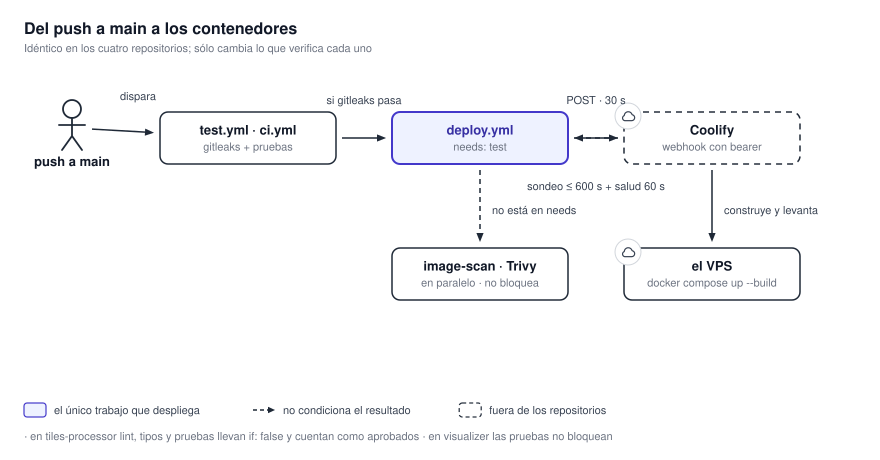

# Despliegue e infraestructura

Los cuatro servicios se despliegan igual: un push a `main` dispara un workflow de GitHub Actions que
llama a un webhook de Coolify, espera a que el despliegue termine y verifica que la aplicación
responda. No hay Kubernetes en ninguna parte: todo corre con Docker Compose sobre un VPS,
detrás de un proxy inverso Caddy.

{ .diagram loading=lazy }

## Los contenedores en producción

| Stack | Contenedores |
|---|---|
| `tiles-processor` | `rabbitmq`, `seaweedfs`, `producer`, `worker1`, `worker2`, `worker-light1`, `worker-light2`, `worker-light3`, `metrics-api` |
| `data-service` | `redis`, API con `APP_ROLE=web`, sincronizador con `APP_ROLE=worker` |
| `alerts-service` | `mysql`, la API |
| `visualizer` | nginx sirviendo el bundle estático |

### Puertos publicados

| Puerto | Servicio |
|---|---|
| `3306` | MySQL de `alerts-service` |
| `5672` | RabbitMQ (AMQP) |
| `6006` | API de `data-service` |
| `6007` | API de `alerts-service` |
| `6010` | Frontend |
| `6011` | Documentación |
| `6020` | API de métricas de `tiles-processor` |
| `8888`, `9000`, `9333` | SeaweedFS: filer, API S3, master |
| `15672` | Panel de RabbitMQ |

## Imágenes fijadas

| Componente | Imagen |
|---|---|
| RabbitMQ | `rabbitmq:4.2.9-management` |
| SeaweedFS | `chrislusf/seaweedfs:4.41` |
| Redis | `redis:8.10-trixie` |
| MySQL | `mysql:8.4` |
| Documentación | `squidfunk/mkdocs-material:9.7.7` |
| Base de `tiles-processor` | `ghcr.io/osgeo/gdal:ubuntu-small-3.12.3-amd64` |
| Base de `data-service` / `alerts-service` | `python:3.13-slim-trixie` |
| Build del visualizador | `node:24-alpine` |
| Runtime del visualizador | `nginx:mainline-alpine-slim` |

`nginx:mainline-alpine-slim` es la única etiqueta que se mueve; todas las demás están fijadas.

!!! warning "Las compose de `tiles-processor` son generadas"
    `docker-compose.yaml` y `docker-compose-dev.yaml` de `tiles-processor` los escribe
    `scripts/generate-compose.sh`, que recibe la cantidad de workers como argumento. Editarlos a mano
    funciona hasta la próxima regeneración, que descarta el cambio. Para cambiar la cantidad de
    workers hay que volver a correr el script.

!!! warning "Sin `restart:`, un reinicio del host puede dejar el servicio caído"
    Todos los servicios de producción declaran `restart: unless-stopped`. Los únicos que no lo hacen
    son `rabbitmq` y `seaweedfs` en la compose de desarrollo de `tiles-processor`, y `docs-build` en
    la del visualizador, que es de un solo uso por diseño. Un servicio de larga vida sin política de
    reinicio no vuelve solo después de un reinicio del host.

## La secuencia de despliegue

Es idéntica en los cuatro repositorios; sólo cambian los números de línea.

1. El workflow llama por GET al webhook de despliegue (`COOLIFY_DEPLOY_HOOK`) con un token bearer y
   un tope de 30 s.
2. Valida la respuesta con `jq` y extrae el identificador del despliegue.
3. Sondea `/deployments/<uuid>` hasta 600 s. Hay **dos** retrocesos distintos: en el camino normal
   incrementa el intervalo de a 2 s con techo en 10 s; ante errores de la API duplica el intervalo y
   aborta tras tres fallos seguidos.
4. Cuando el despliegue termina, sondea `/applications/<uuid>` durante 60 s cada 3 s para
   comprobar que la aplicación quedó sana.
5. Si algo falla, un paso `if: failure()` vuelca los logs.

Dos salidas son deliberadamente blandas: si el chequeo de salud agota su tiempo, el job termina en
éxito igual, y un despliegue marcado como `restart_only` se saltea los chequeos por completo.

### Secretos que usan los workflows

Sólo los nombres; los valores viven en la configuración del repositorio.

| Nombre | Para qué |
|---|---|
| `COOLIFY_DEPLOY_HOOK` | URL del webhook que dispara el despliegue |
| `COOLIFY_DEPLOY_TOKEN` | Token bearer de ese webhook |
| `COOLIFY_BASE_URL` | Base de la API de Coolify para el sondeo |
| `COOLIFY_READ_TOKEN` | Token de lectura para consultar despliegues y aplicaciones |

## Cómo se sirve la documentación

Este sitio se construye dentro de la imagen del visualizador y viaja con él. La etapa `docs` del
`Dockerfile` corre `mkdocs build --strict`, y el resultado se copia a `public/docs-site` **después**
de `COPY . .` —para que no lo tape— y **antes** de `npm run build`, para que el glob de assets
`public/**/*` de `angular.json` lo levante.

nginx lo sirve en `/docs-site/` con distintas políticas de caché:

| Ruta | Caché | Por qué |
|---|---|---|
| `/docs-site/assets/javascripts/`, `/assets/stylesheets/` | `immutable`, un año | Material versiona su bundle por contenido |
| El resto de `/docs-site/assets/` | Una semana | Íconos y logo, sin hash |
| `/docs-site/imgs/`, `/docs-site/videos/` | `immutable`, un año | Cada referencia lleva `?v=<hash>` estampado en la compilación |
| `/docs-site/` (las páginas) | `max-age=60` con `stale-while-revalidate` | Una edición llega al lector en la visita siguiente |

`absolute_redirect off` es necesario porque el sitio usa URLs de directorio: sin eso nginx
reconstruiría la redirección desde su propio bloque `server` y perdería el puerto detrás del proxy.

## Migraciones al arrancar

`alerts-service` corre `alembic -c /config/alembic.ini upgrade head` en su `entrypoint.sh` antes de
levantar uvicorn. `tiles-processor` y `data-service` aplican las suyas en proceso al arrancar,
serializadas con un `flock`.

!!! warning "`MANAGE_DB_SCHEMAS` debe quedar sin definir en producción"
    Todo el árbol de migraciones MySQL de `alerts-service` está detrás de esa variable. En producción
    el esquema pertenece al DBA del SMN y `alembic upgrade head` es deliberadamente una operación
    vacía. Definirla apuntando a la base del cliente ejecutaría DDL sobre un sistema que no es
    nuestro, incluida una revisión que trunca tablas.
