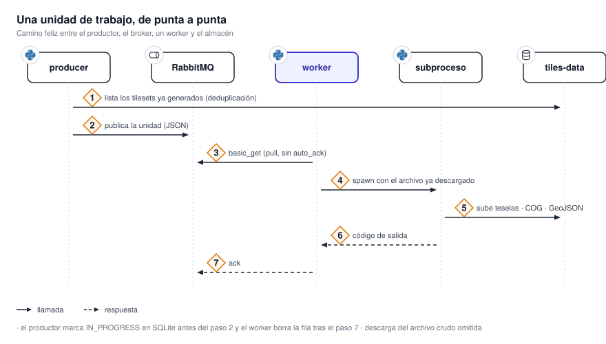
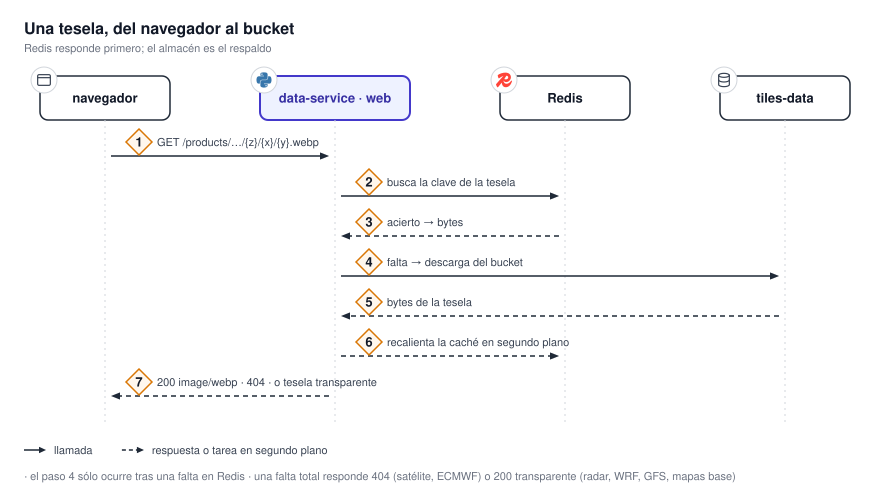

# Flujo de datos

Un dato meteorológico atraviesa el sistema en cuatro tramos: alguien lo descubre y lo encola, un
worker lo procesa y lo sube al almacén de objetos, `data-service` lo sincroniza a Redis, y el
navegador lo pide como tile. Cada tramo tiene su propio ritmo y su propio criterio de reintento.

{ .diagram loading=lazy }

## 1. Descubrimiento

Un único contenedor `producer` corre un scheduler de APScheduler con el cron
`*/5 * * * *` (`settings.json`). En cada tick recorre las fuentes de datos habilitadas y, por cada
una, arma la lista de imágenes que faltan procesar. Para no encolar trabajo repetido cruza tres
fuentes de verdad:

1. Los tilesets que ya existen en el bucket, listados por prefijo.
2. Las filas marcadas como en progreso en una base SQLite compartida.
3. La política de la fuente: cuántas imágenes hacia atrás mirar y cuántas conservar.

El trabajo se publica como un mensaje JSON en RabbitMQ. El cuerpo lleva `work_unit_id`, `image_id`,
`data_source_id`, `source_uri`, `output_prefix`, `bounds`, `processor_id`, `band_id`, `created_at`,
`retry_count` y `max_retries`.

## 2. Colas y workers

{ .diagram loading=lazy }

Hay tres colas de trabajo y una cola de mensajes muertos. El ruteo depende del producto, y existe
porque los trabajos no consumen memoria de la misma manera: procesar una captura de la banda visible
del ABI es mucho más caro en RAM que procesar un producto de radar, y los productos livianos son
además mucho más numerosos.

| Cola | Qué lleva | Quién la consume |
|---|---|---|
| `tiles_work_queue` | Todo lo pesado: GOES-19 ABI, GLM, ECMWF, GFS | Workers `normal`, con prioridad estricta |
| `tiles_radar_light_queue` | Todos los productos de radar | Workers `light`, y workers `normal` cuando la cola pesada está vacía |
| `tiles_wrf_light_queue` | Todos los productos de WRF | Igual que la anterior |
| `tiles_dead_letter_queue` | Unidades que agotaron sus reintentos | Nadie: es un depósito para inspección manual |

Un worker `normal` vacía primero la cola pesada y recién después alterna en round robin entre las dos
livianas; un worker `light` sólo atiende las dos livianas. En producción corren dos workers normales
y tres livianos.

!!! note "El consumo es por *pull*"
    Los workers usan `basic_get` en un bucle propio, no `basic_consume`. No hay ninguna llamada a
    `basic_qos` en el repositorio, de modo que el "prefetch de 1" que menciona un docstring del
    cliente no aplica: la concurrencia real la fija `WORKER_CONCURRENCY`.

## 3. Procesamiento

Cada unidad de trabajo se procesa en un **subproceso aislado**. La razón es la memoria: el stack
geoespacial deja arenas de glibc sin devolver al sistema, y terminar el proceso es la única forma
confiable de recuperarlas. El worker descarga el archivo crudo en el proceso principal y le pasa al
hijo la ruta y el mensaje serializado.

Los pasos, con variaciones por producto, son: georreferenciación y reproyección a EPSG:4326,
transformación científica propia del producto, generación del COG con los valores crudos, generación
de un GeoTIFF RGBA coloreado, generación de la pirámide de tiles WebP con `gdal2tiles`, subida al
bucket y limpieza del directorio de trabajo.

El hijo se comunica con el padre por código de salida: `0` éxito, `2` entrada inservible, `3` apagado
solicitado, `1` cualquier otro error.

### Reintentos y dead letter

{ .diagram loading=lazy }

Los reintentos **no** son redeliveries de AMQP. Ante un error recuperable el worker publica un
mensaje nuevo con `retry_count + 1` en la misma cola de origen y confirma el original. Con
`max_retries` en 3 eso da hasta cuatro intentos; agotados, la unidad va a `tiles_dead_letter_queue`.

| Situación | Qué pasa con la fila SQLite | Qué pasa con el mensaje |
|---|---|---|
| Éxito | Se borra | `ack` |
| Entrada inservible | Queda; la recupera el TTL | `ack` |
| Descarga transitoria fallida | Se libera | `ack`, sin republicar |
| Pronóstico todavía no disponible | Se libera | `ack`; el producer lo vuelve a descubrir |
| Apagado en curso | Queda | `nack` con requeue |
| Otro error, quedan reintentos | Queda | Se republica con `retry_count + 1` |
| Otro error, sin reintentos | Queda | Va a la cola de mensajes muertos |

## 4. Sincronización y caché

`data-service` corre en dos contenedores construidos de la misma imagen: uno con `APP_ROLE=web` que
atiende HTTP y otro con `APP_ROLE=worker` que sincroniza. La estrategia de caché se elige una sola
vez al arrancar:

- **`full`**: seis bucles de fondo recorren el almacén a intervalos fijos y precargan en Redis los
  productos nuevos junto con sus índices. Es el modo desplegado.
- **`on_demand`**: no se levanta ningún bucle; cada lectura resuelve contra Redis y, si falla,
  contra el bucket.

En `full`, cada estrategia delega su camino de fallo a la variante `on_demand`, así que un desalojo
de Redis cuesta latencia pero nunca un error.

## 5. Servido de un tile

{ .diagram loading=lazy }

El navegador pide un tile, `data-service` consulta Redis, y si no está va al bucket y recalienta la
caché en segundo plano.

!!! warning "Un tile faltante no siempre es un 404"
    La respuesta ante un tile inexistente **no es uniforme** y conviene saberlo antes de depurar:
    satélite y ECMWF de precipitación devuelven `404`; radar, WRF, GFS y mapas base devuelven `200`
    con un tile transparente; las barbas de WRF y GFS devuelven `200` con un `FeatureCollection`
    vacío. Un `200` no prueba que el dato exista.

## 6. Dibujado

El visualizador mantiene el catálogo de capas, el estado de cada capa activa y la línea de tiempo, y
traduce todo eso a objetos Leaflet. Ver [Visualizer](../servicios/visualizer.md).
