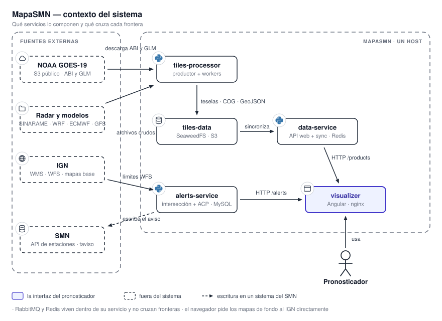

# Visión general del sistema

MapaSMN es un sistema de visualización y aviso por condiciones temporales extremas. Toma datos
meteorológicos crudos de satélite, radar y modelos numéricos, los convierte en tiles de mapa y capas
vectoriales, los sirve por HTTP y los dibuja sobre un mapa interactivo donde un pronosticador puede,
además, trazar un polígono y emitir un aviso a corto plazo.

{ .diagram loading=lazy }

## Los cuatro servicios

El sistema son cuatro repositorios independientes, cada uno con su propio ciclo de vida, su propio
`Dockerfile` y su propio despliegue. No comparten base de datos ni código: se comunican por un
almacén de objetos compatible con S3 y por HTTP.

| Servicio | Rol | Stack |
|---|---|---|
| `tiles-processor` | Descarga los datos crudos y produce tiles WebP, GeoTIFF optimizados para la nube (COG) y capas GeoJSON. | Python 3.12, RabbitMQ, SeaweedFS, GDAL/rasterio/xarray, APScheduler |
| `data-service` | API de lectura. Sincroniza lo que produce `tiles-processor`, lo cachea en Redis y lo sirve al visualizador. | Python 3.13, FastAPI, Redis, S3 |
| `alerts-service` | Intersección geográfica del polígono de un aviso y generación del ACP. | Python 3.13, FastAPI, GeoPandas/Shapely, arquitectura hexagonal |
| `visualizer` | La aplicación web: mapa, capas, línea de tiempo, avisos y tableros de estado. | Angular 21, Leaflet, Angular Material, nginx |

## Por qué un almacén de objetos en el medio

La generación de productos es asíncrona y periódica; el consumo es sincrónico y bajo demanda. Poner
un almacén compatible con S3 entre ambos desacopla los dos ritmos: `tiles-processor` escribe cuando
termina de procesar y `data-service` lee cuando un usuario mira el mapa, sin que ninguno tenga que
esperar al otro ni compartir un sistema de archivos.

!!! note "El almacén es SeaweedFS"
    El almacén desplegado es **SeaweedFS** (`chrislusf/seaweedfs`), expuesto por su puerta de enlace
    S3. El código está escrito contra la API de S3, de modo que el almacén concreto es
    intercambiable; algunos comentarios del repositorio nombran otras implementaciones compatibles
    como alternativa posible, pero lo que corre es SeaweedFS.
    Ver [Almacenamiento y colas](../referencia/almacenamiento.md).

## Las colas son internas

RabbitMQ existe solamente dentro de `tiles-processor`, para coordinar su esquema productor-consumidor.
Ningún otro servicio publica ni consume de esas colas. Ver
[Tiles Processor](../servicios/tiles-processor.md).

## Qué habla con qué

| Origen | Destino | Por dónde |
|---|---|---|
| `tiles-processor` | `data-service` | Bucket `tiles-data` del almacén de objetos |
| `visualizer` | `data-service` | HTTP: `/products/*`, `/basemap/*`, `/weather-stations/*`, `/metrics/*` |
| `visualizer` | `alerts-service` | HTTP: `/intersect/*`, `/alerts/*`, `/metrics/*` |
| `visualizer` | `tiles-processor` | HTTP: `/api/*` de la API de métricas, puerto `6020` |
| `alerts-service` | Base MySQL del SMN | Tabla intermedia `taviso_temporal` |
| `visualizer` | IGN | WMS directo desde el navegador |

El visualizador es el único que habla con tres backends distintos, y los tres exponen una ruta de
métricas de nombre parecido en hosts diferentes. Ver [API HTTP](../referencia/api.md).

## Qué hay en cada página

- [Flujo de datos](flujo-de-datos.md): el recorrido completo de un dato, de la fuente al navegador.
- [Despliegue e infraestructura](despliegue.md): dónde corre cada cosa y cómo llega ahí.
- [Observabilidad](observabilidad.md): qué se mide, dónde se guarda y quién lo muestra.
- [Servicios](../servicios/tiles-processor.md): cada servicio por dentro.
