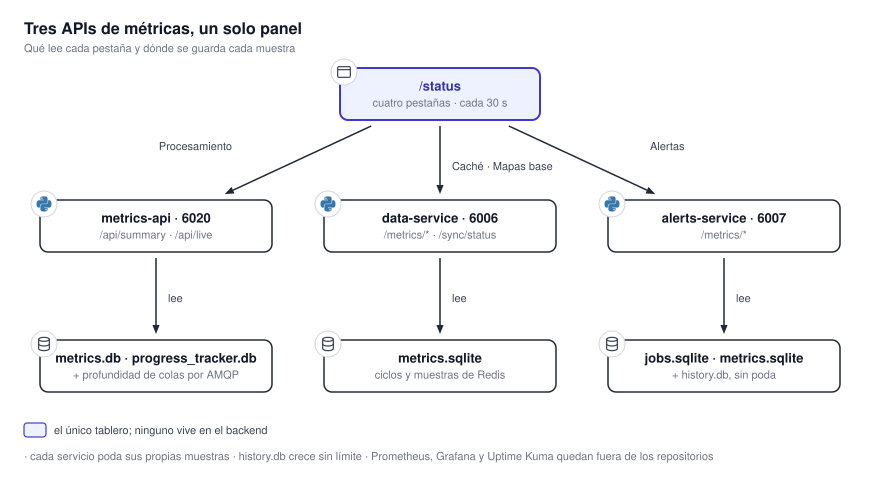

# Observabilidad

Cada servicio instrumenta su propio funcionamiento y expone una API de métricas; ningún tablero vive
en el backend. El tablero es una sección del visualizador que consume esas tres APIs y las dibuja.
Por debajo, cada servicio persiste sus muestras en SQLite con retención propia.

{ .diagram loading=lazy }

!!! warning "Tres rutas con el mismo nombre en tres hosts distintos"
    `tiles-processor` expone `/api/summary` en el puerto `6020`; `data-service` expone
    `/metrics/summary`; `alerts-service` expone también `/metrics/summary`. Son tres servicios
    diferentes con esquemas de respuesta diferentes. Al depurar, lo primero es confirmar contra qué
    host se está hablando.

## Qué mide cada servicio

### tiles-processor

Registra una fila por unidad de trabajo terminada en la tabla `job_metrics`: tipo de trabajo,
resultado, host del worker, tiempos de descarga, de proceso y total, y un desglose por etapa en JSON.

| Ruta | Qué devuelve |
|---|---|
| `GET /api/summary` | Agregado por tipo de trabajo: conteos por resultado, tasa de error, promedios y percentil 95 |
| `GET /api/jobs` | Las filas crudas, con filtros por tipo, resultado y ventana temporal |
| `GET /api/throughput` | Conteos por bucket de `hour`, `day` o `10min` |
| `GET /api/timeseries` | Series de duración por bucket |
| `GET /api/live` | Profundidad de las colas y unidades en curso |
| `GET /api/export` | Volcado crudo de la ventana pedida |
| `POST /api/import` | Ingesta de un volcado; **la única ruta autenticada** |

!!! note "`/api/live` se degrada en lugar de fallar"
    Si RabbitMQ no responde, las profundidades vuelven en `null` y el resto de la respuesta se
    mantiene. `queues.light` no es una cola real: es la suma de radar y WRF.

### data-service

Cada ciclo de sincronización deja una fila en `sync_cycles` con dominio, duración, objetos
procesados, errores y resultado. Los dominios son `satellite`, `radar`, `ecmwf_tp`, `ecmwf_mslp`,
`wrf` y `gfs`, más mapas base y estaciones.

Aparte, un colector de fondo muestrea el uso de memoria de Redis desglosado por dominio. Redis no
ofrece ese desglose de forma nativa, así que el colector recorre el espacio de claves y clasifica
cada una por prefijo, estimando el tamaño por muestreo para acotar el costo de la medición. Junto con
cada muestra guarda una instantánea global: memoria usada, fragmentación, claves expiradas y
desalojadas, aciertos y fallos.

### alerts-service

Registra por trabajo la duración de cada etapa —intersección, filtrado, renderizado y persistencia—
y su resultado, en `jobs.sqlite`. Por separado, un muestreador periódico escribe en
`processor_samples` la salud del pool: profundidad de la cola, workers ocupados, respawns y avisos
pendientes.

## Dónde se guarda cada cosa

| Base | Servicio | Tabla | Retención |
|---|---|---|---|
| `metrics.db` | tiles-processor | `job_metrics` | Tope de filas, podado por el producer cada hora |
| `progress_tracker.db` | tiles-processor | `processed_images` | Ventana temporal (`JOB_TTL_MINUTES`) |
| SQLite de métricas | data-service | `sync_cycles`, `redis_memory_samples`, `redis_info_samples` | Ventana y tope de filas |
| `jobs.sqlite` | alerts-service | `alert_jobs` | Se poda sola en cada escritura |
| `metrics.sqlite` | alerts-service | `processor_samples` | Podada por el muestreador en cada tick |
| `history.db` | alerts-service | `job_runs` | **Ninguna** |

!!! warning "`history.db` crece sin límite"
    A diferencia de las otras cinco bases, `history.db` no está gestionada por Alembic: el adaptador
    crea la tabla con un `CREATE TABLE IF NOT EXISTS`, sin índices y sin poda. Guarda una fila por
    refresco semanal de capas, así que crece despacio, pero crece para siempre.

## Salud de los procesos

`producer` y los workers de `tiles-processor` levantan un servidor HTTP mínimo en un hilo demonio que
responde `GET /health` con `200` o `503` según RabbitMQ esté conectado. El puerto nunca se publica al
host: sólo lo consulta el healthcheck del contenedor. La API de métricas tiene su propio `/health`,
que es una ruta de FastAPI distinta.

`alerts-service` declara `--start-period=8m` en su healthcheck porque el primer arranque descarga las
capas del IGN, las simplifica en todos los niveles de detalle y construye tres cachés antes de que
uvicorn conteste.

## El tablero

La sección `/status` del visualizador tiene cuatro pestañas: **Procesamiento** (lee
`tiles-processor`), **Caché** y **Mapas base** (ambas leen `data-service`) y **Alertas** (lee
`alerts-service`). El intervalo de refresco es configurable —sin refresco, 10 s, 30 s o 60 s— y por
defecto son 30 s.

!!! note "El sondeo no se detiene con la pestaña oculta"
    No hay ningún manejador de `visibilitychange` en la aplicación. El sondeo sólo se corta cuando el
    router destruye la vista al cambiar de pestaña dentro de `/status`. Una pestaña del navegador
    dejada de fondo sigue consultando.

Ver [Panel de estado](../panel-de-estado.md) para la guía de uso de esas pestañas.

## Monitoreo de infraestructura

Por fuera de las métricas de aplicación hay un nivel de infraestructura: Prometheus y Grafana para
consumo de recursos por servidor y por contenedor, y Uptime Kuma para disponibilidad. Ese nivel es
independiente del sistema y no se documenta acá.

!!! warning "Sin verificar"
    En `data-service` existe un hash de Redis `sync:status` que las rutas de métricas **leen**, pero
    el único método que lo escribiría no lo invoca nadie en `src/`. No pudo determinarse si es un
    resto de una versión anterior o si se espera que algo externo lo escriba. Las rutas afectadas
    devuelven los valores por defecto de su modelo cuando el hash no existe.
