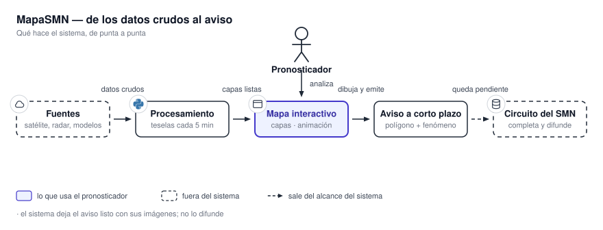

# 1. Inicio

MapaSMN es el sistema de visualización y aviso del Servicio Meteorológico Nacional para
condiciones extremas. **Reúne satélite, radar, modelos y estaciones en un mismo mapa.** Sobre ese
mapa, el pronosticador **dibuja el área afectada y deja listo un aviso a corto plazo.**

{ .diagram loading=lazy }

El recorrido tiene cuatro etapas. Las fuentes entregan datos crudos. **El procesamiento los
convierte en capas listas cada cinco minutos.** El mapa las muestra y las anima. **El aviso sale del
mapa como un polígono con un fenómeno.** El circuito del organismo lo completa y lo difunde.

## Dos mitades, dos lectores

Esta documentación está partida en dos. **Cada mitad se lee sola**, sin pasar por la otra.

-   ### :material-book-open-variant: [Manual de usuario](manual/index.md)

    **Para quien usa la aplicación.**

    Qué es cada cosa en pantalla, qué producto muestra cada capa, cómo animar, cómo consultar un
    valor y cómo emitir un aviso. **No explica meteorología**: explica el programa.

    [Empezar por acá](manual/index.md)

-   ### :material-server-network: [Documentación técnica](tecnica/index.md)

    **Para quien lo despliega, lo opera o lo audita.**

    Las unidades desplegables, los puertos, los contratos entre servicios, la puesta en marcha y la
    seguridad. **Orientada a infraestructura, no a desarrollo.**

    [Ir a la referencia técnica](tecnica/index.md)

## Qué hace el sistema

- **Satélite GOES-19**: tres canales de imágenes y tres productos de descargas eléctricas.
- **Radar SINARAME**: seis variables de cada uno de los 18 radares, en tres elevaciones.
- **Modelos numéricos**: ECMWF, WRF en su configuración argentina, y GFS.
- **Estaciones de superficie**: las observaciones del SMN, con historial de 48 horas por estación.
- **Capas de referencia del IGN**: límites, hidrografía, infraestructura y más.
- **Animación** de cualquier capa temporal, sola o sincronizada con otras.
- **Consulta puntual** del valor numérico de una capa en un punto del mapa.
- **Avisos a corto plazo**: polígono, departamentos afectados y las dos imágenes oficiales.

## Cómo elegir

| Si querés… | Andá a |
|---|---|
| Saber qué producto es cada capa | [4. Qué muestra cada producto](manual/productos/index.md) |
| Emitir un aviso | [6. Emitir un aviso a corto plazo](manual/avisos.md) |
| Levantar el sistema en tu propia red | [14. Puesta en marcha](tecnica/operacion/puesta-en-marcha.md) |
| Desplegar Beta-1 completo en una VM de 8 GB | [14.1 Beta-1](tecnica/operacion/beta-1.md) |
| Repartirlo en más de una máquina | [15. Distribuir el sistema](tecnica/operacion/distribucion.md) |
| Saber qué puertos expone y qué queda autenticado | [19.1 Superficie expuesta](tecnica/seguridad/superficie.md) |
| Consultar una ruta o una variable de entorno | [12. Contratos entre servicios](tecnica/contratos/index.md) |

**El aviso no se difunde desde acá.** El sistema lo deja generado, con sus imágenes, y el circuito del
SMN lo completa. Ese límite se repite en las dos mitades porque **define qué es y qué no es el
sistema.**
