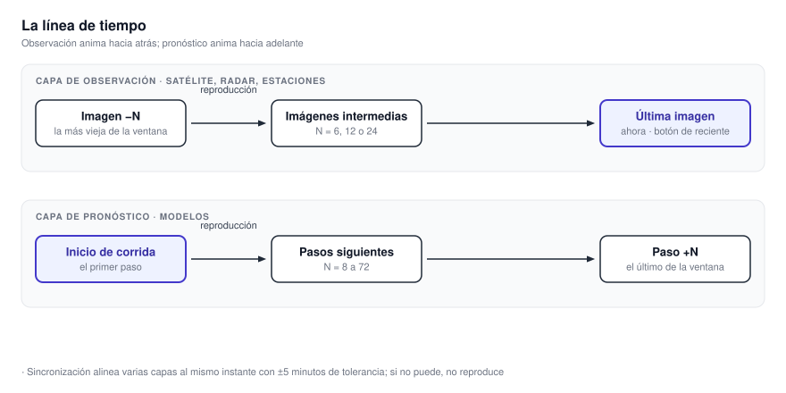
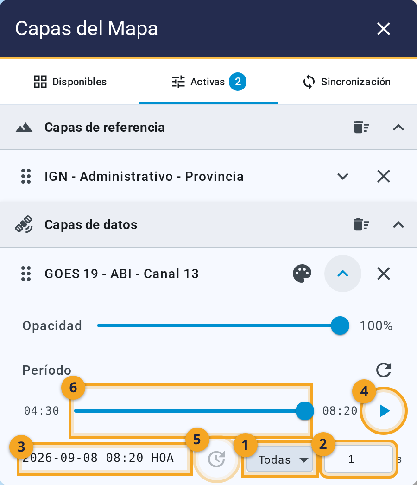
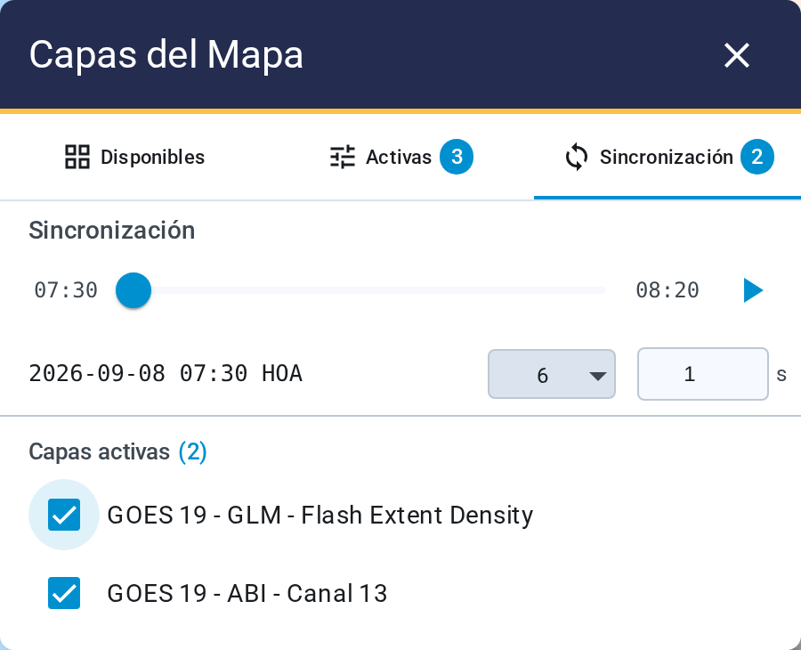
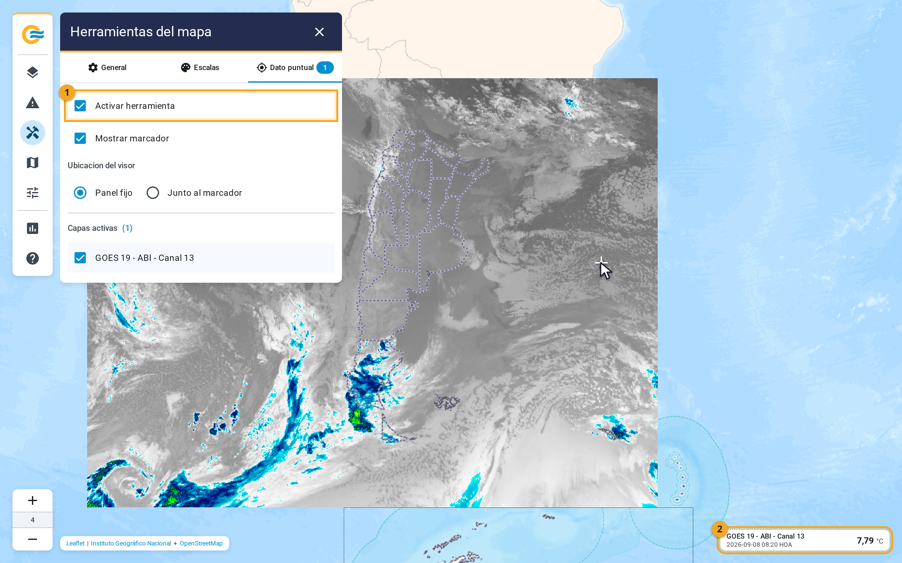

# 5. Ver la evolución y consultar un punto

Toda capa con tiempo tiene una sección **Período** dentro de su fila. **Ahí se elige qué imagen ver
y se reproduce la secuencia.** La segunda parte del capítulo es la consulta puntual: el valor
numérico de una capa en un punto del mapa.

{ .diagram loading=lazy }

**Observación y pronóstico animan hacia lados distintos.** Una capa de satélite, radar o estaciones
recorre las últimas imágenes y termina en la más reciente. **Una capa de modelo recorre los primeros
pasos de la corrida**, empezando por la hora de inicio. **El mismo control se comporta distinto según
la capa.**

## Animar una capa

{ .doc-figure loading=lazy }

1. **El selector de cantidad de imágenes.** **Las opciones dependen de la familia**: 6, 12 o 24 en
   satélite; 6 o 12 en radar; hasta 72 en WRF.
2. **El intervalo, en segundos por imagen**, entre 0,1 y 10.
3. **La marca de tiempo de la imagen que estás viendo**, con su sufijo HOA o UTC.
4. **El botón de reproducción.** **Al lado, un botón lleva a la imagen más reciente.**

**Debajo hay un deslizador para moverte cuadro por cuadro.** **El deslizador sigue funcionando con la
reproducción detenida.**

<video preload="none" loop muted playsinline title="Reproducir la animación de una capa"
       width="100%" poster="../../videos/05-animacion-poster.webp"
       style="max-height: 500px">
  <source src="../../videos/05-animacion.webm" type="video/webm" />
  Tu navegador no soporta este video.
</video>

**La lista de imágenes se renueva sola cada diez segundos.** **El botón de recarga junto al título
Período fuerza esa consulta.** Si la capa no tiene nada que mostrar, el lugar del deslizador lo dice:
**«No hay períodos disponibles»**, o qué falta elegir antes, como una elevación o una corrida.

## Animar varias capas juntas

**Si reproducís dos capas por separado, cada una avanza a su ritmo.** **La pestaña Sincronización
alinea varias capas al mismo instante.** Elegís las capas bajo Capas activas, y la aplicación busca
para cada cuadro una imagen de cada capa dentro de **cinco minutos de diferencia.**

{ .doc-figure loading=lazy }

Cuando una capa está sincronizada:

- **Su sección Período muestra la marca «Sincronizado».**
- **Sus controles propios quedan deshabilitados**: manda la sincronización.
- **Su botón de reproducción pasa a ofrecer «Desconectar de sincronización».**

**Si una capa tiene menos imágenes que las demás, la ventana se achica a esa cantidad.** El panel lo
avisa con «Mostrando N de M», y la capa lleva una marca con su cantidad real.

!!! warning "Si no se pueden alinear, no se reproduce"
    **Sin instantes en común, el panel bloquea la reproducción** y lo dice: «Las capas seleccionadas
    no tienen períodos en común». Si el mejor alineamiento supera los cinco minutos, el mensaje es
    «No se pudo alinear temporalmente las capas seleccionadas».

## Consultar un valor puntual

Los colores dan una idea aproximada. **La consulta puntual devuelve el número.** Está en
**Herramientas del mapa ▸ Dato puntual.**

{ .doc-figure loading=lazy }

1. **La herramienta viene activada de fábrica.** Si la apagaste, marcá **Activar herramienta**.
2. Marcá, bajo Capas activas, **qué capas querés consultar.** Cada capa de datos que encendés se
   agrega sola a la lista. **Una capa sin marcar no devuelve nada.**
3. Hacé clic en el mapa.

<video preload="none" loop muted playsinline title="Consultar el valor de una capa en un punto"
       width="100%" poster="../../videos/05-consulta-poster.webp"
       style="max-height: 500px">
  <source src="../../videos/05-consulta.webm" type="video/webm" />
  Tu navegador no soporta este video.
</video>

**Cada capa consultada tiene un panel** con su nombre, su instante, su corrida o elevación si
corresponde, y el valor con su unidad. **Hasta el primer clic, el panel dice «Sin dato».** **El valor es el dato, no el color leído de la imagen.** **Si
en ese punto no hay dato, el panel dice «Sin dato».** **Cada panel se cierra con su propia cruz.**

La casilla **Mostrar marcador** deja una marca en el punto consultado. Con el marcador prendido
aparece **Ubicación del visor**: **Panel fijo** junta los resultados en la columna derecha, y
**Junto al marcador** los pega al punto. **La consulta y sus resultados se recuerdan** al volver a
entrar.
