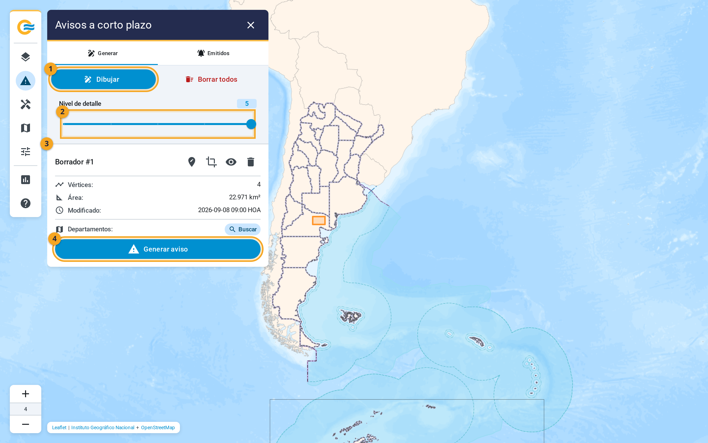
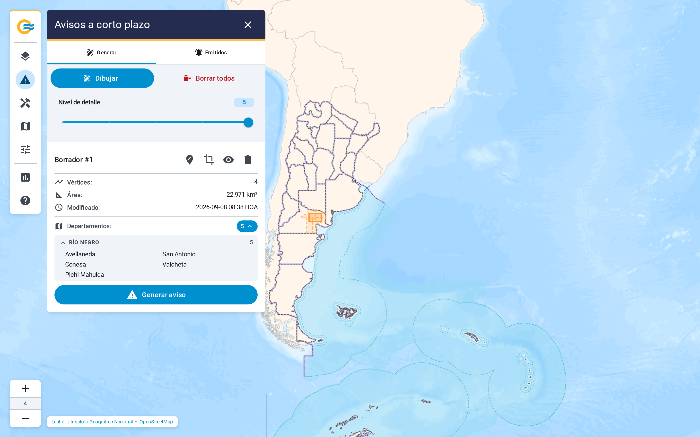
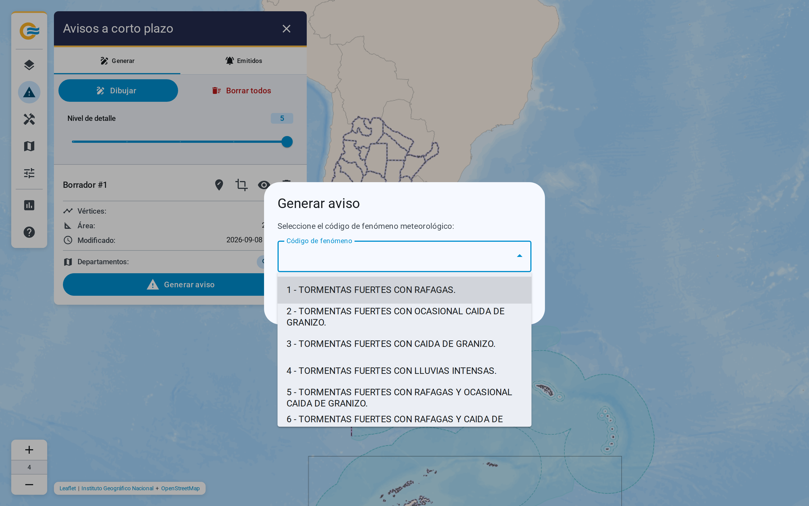
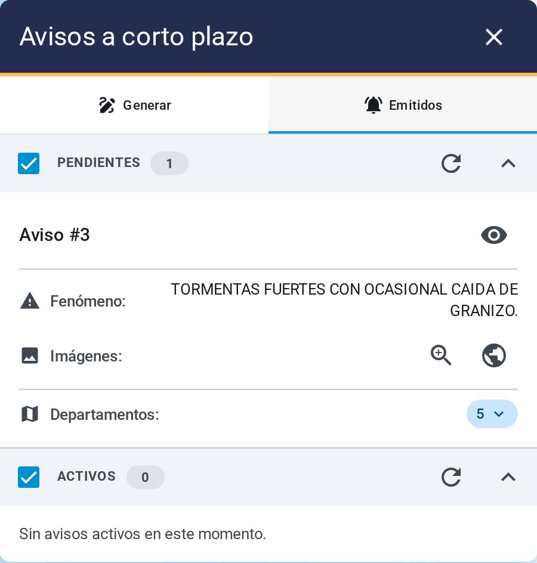

# 6. Emitir un aviso a corto plazo

El panel Avisos a corto plazo reúne el trabajo necesario para preparar un ACP. Desde allí se delimita
el área afectada, se revisan los departamentos incluidos y se solicita la generación del aviso y de
sus imágenes.

{ .diagram loading=lazy }

!!! note "El sistema no difunde el aviso"
    Lo deja generado y registrado, con sus imágenes, en estado pendiente. El circuito del SMN lo
    completa con el formulario y lo difunde. Generar el aviso acá no equivale a publicarlo.

{ .doc-figure loading=lazy }

## 1. Dibujar el área

En la pestaña Generar:

- Dibujar (1) entra en modo de trazado. Cada clic agrega un vértice. El polígono se cierra con un
   clic sobre el primer punto, o con doble clic en el último. Cancelar sale del modo.
- Nivel de detalle (2), de 1 a 5, controla con cuánta fidelidad se recorta el contorno del país.
   Más detalle tarda más en calcularse.
- Borrar todos elimina todos los borradores, previa confirmación.

<video preload="none" loop muted playsinline title="Dibujar el polígono del aviso"
       width="100%" poster="../../videos/06-dibujar-poster.webp"
       style="max-height: 500px">
  <source src="../../videos/06-dibujar.webm" type="video/webm" />
  Tu navegador no soporta este video.
</video>

Cada borrador aparece como una tarjeta (3), Borrador #N. Muestra sus vértices, su área en km² y la hora
de la última modificación. Un clic en el título centra el mapa en el polígono. Los botones de la
tarjeta, y el menú del botón derecho sobre el polígono, ofrecen lo mismo:

| Acción | Qué hace |
|---|---|
| Editar geometría | Mueve los vértices. Aparece una barra flotante con Guardar y Cancelar. |
| Ocultar / Mostrar | Saca el polígono del mapa sin borrarlo. |
| Recortar con Argentina | Ajusta el área al territorio. Tiene su Deshacer recorte. |
| Mostrar departamentos | Sólo en el menú: lista los departamentos ya calculados. |
| Generar aviso | Lo mismo que el botón de la tarjeta. |
| Eliminar | Borra el borrador, previa confirmación. |

Mientras un polígono está en edición, Dibujar queda deshabilitado.

## 2. Verificar los departamentos

{ .doc-figure loading=lazy }

La fila Departamentos de la tarjeta tiene un botón Buscar. Calcula qué departamentos toca
el polígono y los lista agrupados por provincia. Pasar el mouse por un departamento lo resalta en
el mapa. La lista es exactamente la que va a quedar en el aviso.

## 3. Generar

{ .doc-figure loading=lazy }

Generar aviso (4) abre un diálogo que pide el código de fenómeno. La lista la entrega el servicio de
avisos; si no responde, la aplicación usa una lista propia de 27 códigos. Al confirmar, el trabajo
se encola y la aplicación responde de inmediato. A partir de ahí consulta el estado cada dos
segundos, hasta que el aviso está listo.

<video preload="none" loop muted playsinline title="Generar el aviso y verlo en Pendientes"
       width="100%" poster="../../videos/06-generar-poster.webp"
       style="max-height: 500px">
  <source src="../../videos/06-generar.webm" type="video/webm" />
  Tu navegador no soporta este video.
</video>

!!! warning "El botón puede aparecer deshabilitado"
    Hay un máximo de vértices por polígono. El trazado no se bloquea, pero con un polígono más
    complejo el botón queda gris y su ayuda dice cuál es el máximo. Se resuelve simplificando el
    trazado o bajando el nivel de detalle.

Cuando la generación falla, la aplicación lo avisa con un mensaje en la esquina de la pantalla.
Los casos son cuatro:

- El área es demasiado grande.
- El servicio tardó de más.
- La aplicación dejó de esperar, a los tres minutos.
- Un error genérico.

Cuando la aplicación deja de esperar, el mensaje manda a revisar Pendientes en unos minutos. En los otros tres casos el aviso no se creó y hay que reintentar.

!!! note "Recargar la página no duplica el aviso"
    Si recargás mientras se genera, la aplicación retoma el seguimiento del trabajo en curso. No
    emite uno nuevo.

## 4. Seguir los avisos emitidos

{ .doc-figure loading=lazy }

La pestaña Emitidos tiene dos secciones. Las dos se renuevan solas cada diez segundos, y cada
una tiene su casilla para mostrarla en el mapa, su contador, su botón de recarga y su pliegue.

- Pendientes: avisos generados a los que todavía no se les completó el formulario del SMN. La
  tarjeta muestra el fenómeno, los departamentos y los botones de las dos imágenes.
- Activos: avisos ya emitidos y vigentes, con fenómeno, hora de emisión, hora de cese y tiempo
  restante.

Cada aviso tiene un ojo para ocultarlo del mapa, y esa elección se recuerda. Con el botón
derecho sobre un aviso en el mapa aparece un menú con su número, su estado y las mismas acciones.

### Los colores en el mapa

| Estado | Cómo se ve |
|---|---|
| Borrador propio | Naranja |
| Pendiente | Gris, con trazo discontinuo |
| Activo, con más de 30 minutos por delante | Verde |
| Activo, con 30 minutos o menos | Amarillo |
| Activo, con 10 minutos o menos | Rojo |

Los pendientes son grises porque todavía no tienen vigencia. El color de los activos sólo
codifica el tiempo restante.

## Las imágenes

Cada aviso genera dos imágenes animadas con la plantilla oficial del SMN: la del área, con
acercamiento a la zona afectada, y la general, de todo el país. Se abren desde la tarjeta del aviso
pendiente con Ver imagen del área y Ver imagen general. El diálogo permite abrirlas en una
pestaña nueva.
