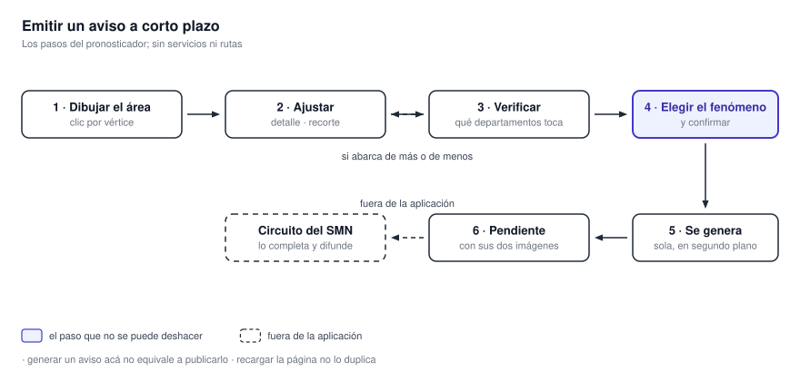

# Emitir un aviso a corto plazo

Un aviso a corto plazo (ACP) es el producto operativo de esta herramienta. Todo lo demás —las capas,
la animación, la consulta puntual— existe para sostener la decisión que se toma acá.

El panel **Avisos a corto plazo** es donde delimitás el área afectada, comprobás qué departamentos
abarca y generás el aviso con sus imágenes oficiales.

{ .diagram loading=lazy }

!!! note "El sistema no difunde el aviso"
    Lo deja registrado en el sistema operativo del SMN, listo y con sus imágenes. El circuito de
    emisión del organismo lo completa con los campos del formulario y lo difunde por sus canales.
    Generar el aviso acá no equivale a publicarlo.

## 1. Dibujar el área

En la pestaña **Generar**:

1. **Dibujar** entra en modo de trazado. Cada clic agrega un vértice. El polígono se cierra haciendo
   clic sobre el primer punto, o con doble clic en el último. **Cancelar** sale del modo.
2. El deslizador **Nivel de detalle**, de 1 a 5, controla con cuánta fidelidad se recorta el contorno
   del país. Más detalle es más preciso y tarda más en calcularse.
3. **Borrar todos** elimina todos los polígonos dibujados.

Cada borrador aparece como una tarjeta con la cantidad de **vértices**, su **área** y la hora de su
última modificación. Desde la tarjeta —o con el botón derecho sobre el polígono en el mapa— podés
editar la geometría, ocultarlo, recortarlo contra el contorno de Argentina o eliminarlo.

!!! note "Recortar con Argentina se puede deshacer"
    El recorte tiene su **Deshacer recorte**, así que podés probar cómo queda el área ajustada al
    territorio y volver atrás si no te convence.

### Cómo conviene trazar

- **Dibujá sobre lo observado, no sobre lo pronosticado.** El modelo te dice hacia dónde mirar; el
  área se traza sobre lo que el radar y el satélite están mostrando.
- **Tené prendido el límite interdepartamental** mientras dibujás. El aviso se emite por
  departamento: ver esos límites mientras trazás evita incluir o dejar afuera uno por unos pocos
  kilómetros.
- **Menos vértices es mejor.** Un contorno simple es más fácil de leer, se procesa más rápido y no
  corre riesgo de chocar con el límite de vértices.

## 2. Verificar los departamentos

La fila **Departamentos** de la tarjeta tiene un botón **Buscar** que consulta qué departamentos toca
el polígono. El resultado se lista agrupado por provincia.

Es el paso que conviene no saltear: la lista es exactamente la que va a quedar en el aviso, y es el
momento de corregir el trazado si abarca de más o de menos.

## 3. Generar

**Generar aviso** abre un diálogo que pide el **código de fenómeno** de una lista desplegable. El
catálogo tiene 28 entradas, de las cuales 27 se pueden seleccionar.

Al confirmar, el trabajo se encola y la aplicación responde de inmediato. A partir de ahí consulta
sola el estado, hasta que el aviso está listo.

!!! warning "El botón puede aparecer deshabilitado"
    Hay un máximo de vértices para el polígono. El trazado nunca se bloquea —podés dibujar uno más
    complejo—, pero si lo superás, **Generar aviso** queda deshabilitado y un mensaje te indica cuál
    es el máximo. Se resuelve simplificando el trazado o bajando el nivel de detalle.

!!! note "Recargar la página no duplica el aviso"
    Si recargás mientras el aviso se está generando, la aplicación retoma el seguimiento del trabajo
    en curso en lugar de emitir uno nuevo.

Si el sistema está saturado, la emisión falla indicando que la cola está llena. En ese caso el aviso
**no** se creó y hay que reintentar.

## 4. Seguir los avisos emitidos

La pestaña **Emitidos** tiene dos secciones, que se actualizan solas cada diez segundos:

- **Pendientes**: avisos generados a los que todavía no se les completó el formulario de emisión del
  SMN. Cada tarjeta muestra el fenómeno, los departamentos afectados y las dos imágenes.
- **Activos**: avisos ya emitidos y vigentes, con su fenómeno, hora de emisión, hora de cese y el
  tiempo que les queda.

### Los colores en el mapa

| Estado | Cómo se ve |
|---|---|
| Borrador propio | Naranja |
| Pendiente | Gris, con trazo discontinuo |
| Activo, con más de 30 minutos por delante | Verde |
| Activo, con menos de 30 minutos | Amarillo |
| Activo, con 10 minutos o menos | Rojo |

Los pendientes son grises porque todavía no tienen horario de vigencia: no hay un tiempo restante
que codificar en color. El verde-amarillo-rojo de los activos es un semáforo de vencimiento, y sirve
para saber de un vistazo cuál va a necesitar una decisión pronto.

## Las imágenes

Cada aviso genera dos imágenes animadas con la plantilla oficial del SMN:

- **La del área**, con acercamiento a la zona afectada y los municipios y cabeceras etiquetados.
- **La general**, de todo el país, para ubicar el evento en contexto.

Se abren desde la tarjeta del aviso pendiente con **Ver imagen del área** y **Ver imagen general**, y
desde el diálogo se pueden abrir en una pestaña nueva.
