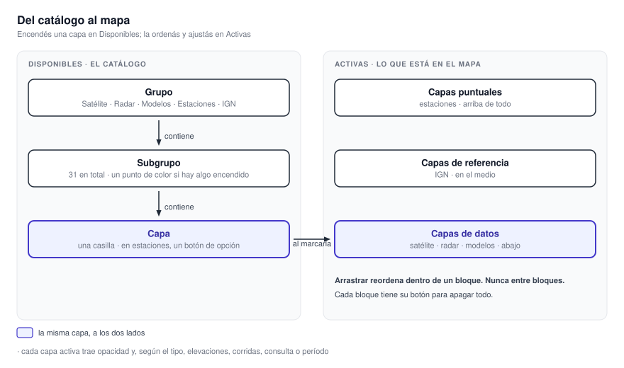
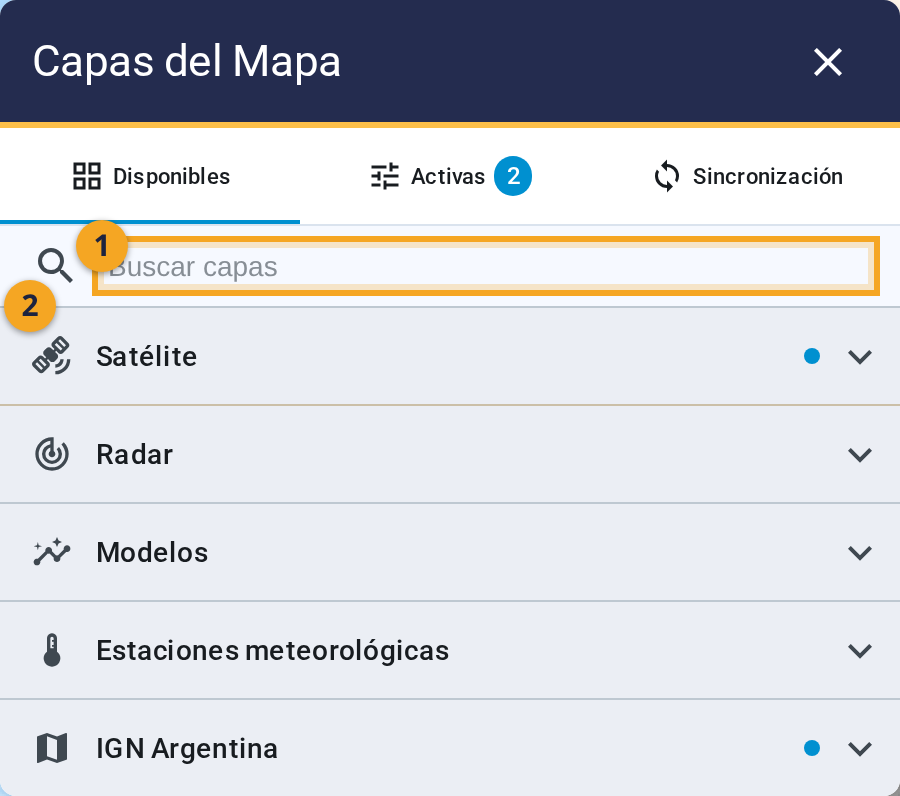
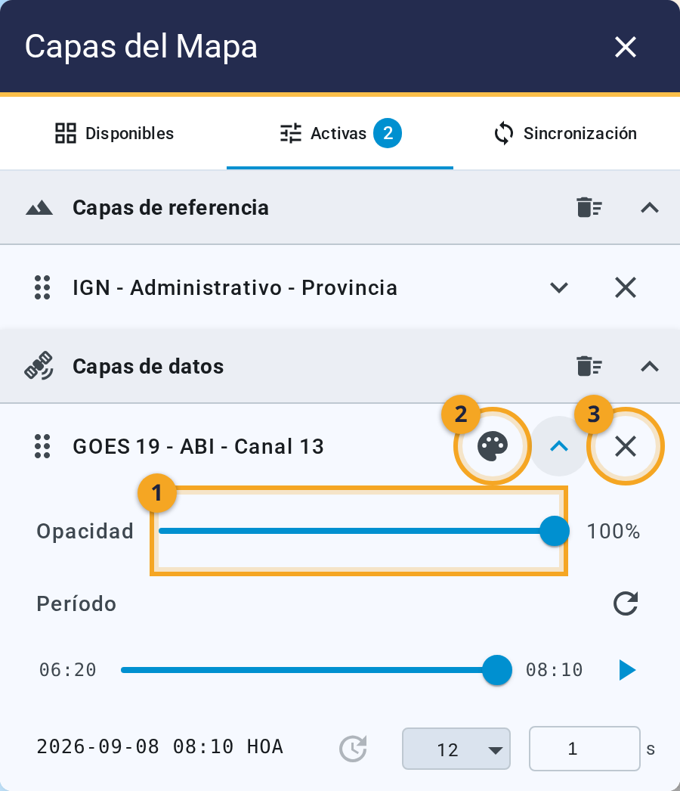
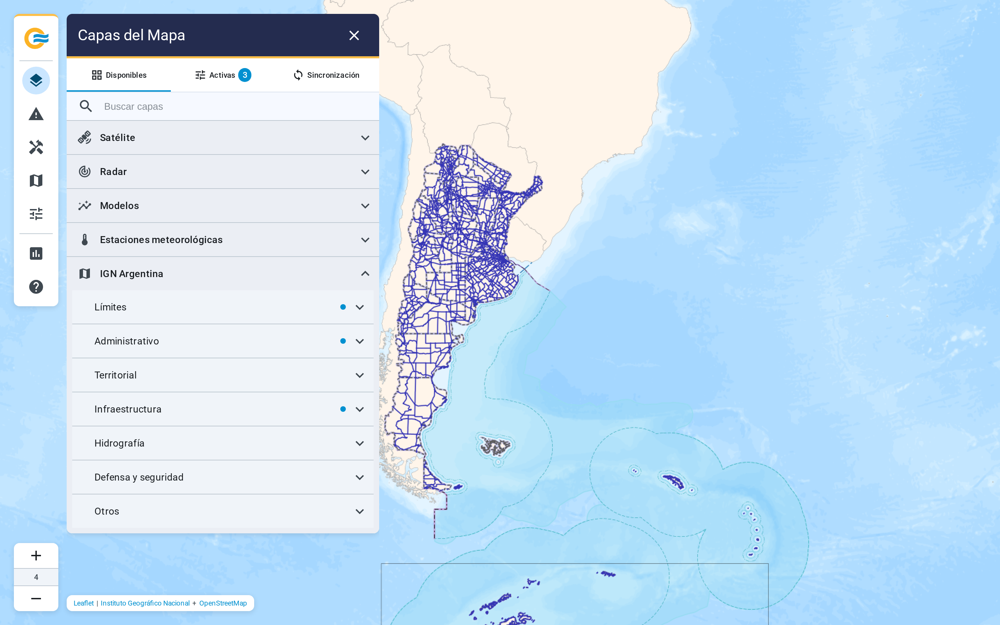

# 3. Trabajar con capas

Todo lo que se dibuja sobre el mapa es una **capa**. **Encenderla, ordenarla y ajustarla es el
trabajo cotidiano**, y todo pasa por el panel Capas del mapa.

{ .diagram loading=lazy }

**El panel tiene tres pestañas.** Disponibles es el catálogo. Activas es lo que está en el mapa.
Sincronización anima varias capas a la vez, y se explica en el [capítulo 5](animacion.md). Las dos
últimas llevan un número: **cuántas capas hay activas, y cuántas elegiste sincronizar.**

{ .doc-figure loading=lazy }

## Disponibles: elegir qué ver

Arriba hay un buscador (1) que **filtra el catálogo completo por nombre**. Debajo, los cinco grupos,
empezando por Satélite (2):

| Grupo | Qué contiene |
|---|---|
| **Satélite** | Tres canales de imágenes y tres productos de descargas eléctricas del GOES-19. |
| **Radar** | Un subgrupo por radar, 18 en total, con seis variables cada uno. |
| **Modelos** | ECMWF, WRF y GFS. |
| **Estaciones meteorológicas** | Las siete variables de las estaciones del SMN. |
| **IGN Argentina** | Dieciocho capas de referencia geográfica. |

**Cada grupo se abre en subgrupos, y cada subgrupo lista sus capas.** **Encender una capa es marcar su
casilla.** Podés encender varias del mismo subgrupo. **Las estaciones son la excepción**: usan
botones de opción, porque muestran una sola variable por vez.

<video preload="none" loop muted playsinline title="Abrir un grupo y encender una capa"
       width="100%" poster="../../videos/03-grupo-toggle-poster.webp"
       style="max-height: 500px">
  <source src="../../videos/03-grupo-toggle.webm" type="video/webm" />
  Tu navegador no soporta este video.
</video>

**Un punto de color sobre un grupo plegado avisa que adentro hay algo encendido.** **Al desplegarlo,
el punto desaparece.**

### Capas grises

Una capa atenuada con la etiqueta **Sin datos** existe en el catálogo, pero **no tiene imágenes
recientes**. Con la etiqueta **No disponible**, el servicio que la sirve no contestó. **La
aplicación vuelve a comprobar el catálogo cada minuto.** **Si no querés esperar, el subgrupo muestra un
botón para volver a verificar.** **Aparece sólo cuando hay alguna capa gris adentro.**

## Activas: ordenar y ajustar

{ .doc-figure loading=lazy }

La pestaña Activas separa las capas en tres bloques. **El orden de los bloques es fijo**, y define
quién tapa a quién.

| Bloque | Qué contiene | Dónde se dibuja |
|---|---|---|
| **Capas puntuales** | Estaciones | Arriba de todo |
| **Capas de referencia** (1) | IGN | En el medio |
| **Capas de datos** (2) | Satélite, radar y modelos | Abajo |

**Podés arrastrar una capa para reordenarla dentro de su bloque.** No se puede pasar una capa de un
bloque a otro: **una imagen de satélite nunca tapa un límite provincial.** **Cada bloque tiene un botón
para apagar de una vez todas sus capas.**

### Los tres botones de cada fila

{ .doc-figure loading=lazy }

- **La paleta (2) muestra u oculta la escala de colores** de esa capa sobre el mapa. **Sólo aparece
  si la capa tiene escala y está dibujando algo.**
- **La flecha expande la fila** con sus controles. Es el (3) de la captura de Activas.
- **La cruz (3) apaga la capa.**

### Los controles de una capa expandida

- **Opacidad** (1): un deslizador con el porcentaje al lado. **Todas las capas lo tienen.** Arranca en 100 %.
- **Elevaciones**: sólo en radar. Una casilla por elevación, cada una con su propia opacidad.
- **Corridas**: sólo en modelos. Qué corridas mostrar, y qué superposiciones de cada una.
- **Consulta** y **Tolerancia**: sólo en estaciones. Qué instante mostrar y con cuánta holgura.
- **Período**: en toda capa con tiempo. Es la animación, y se explica en el
  [capítulo 5](animacion.md).

<video preload="none" loop muted playsinline title="Ajustar la opacidad de una capa"
       width="100%" poster="../../videos/03-opacidad-poster.webp"
       style="max-height: 500px">
  <source src="../../videos/03-opacidad.webm" type="video/webm" />
  Tu navegador no soporta este video.
</video>

**La lista de imágenes de cada capa activa se renueva sola cada diez segundos.** **No hace falta
apagar y prender una capa para ver lo nuevo.**

## Escalas de color

Cada variable tiene su propia escala. **El botón de la paleta la muestra sobre el mapa**, en la
columna derecha. Para ver varias juntas hay una herramienta aparte: **Herramientas del mapa ▸
Escalas**. Primero marcá **Activar herramienta**. Después elegí, bajo Variables activas, qué capas
mostrar. **La herramienta no agrega escalas sola**: sólo lista las capas activas que tienen una
configurada.

## Las capas de referencia del IGN

El grupo IGN Argentina no trae datos meteorológicos. **Trae el contexto geográfico**, provisto por el
Instituto Geográfico Nacional. Sus capas van en el bloque de referencia: **por encima de los datos y
por debajo de las estaciones.**

{ .doc-figure loading=lazy }

| Subgrupo | Capas |
|---|---|
| **Límites** | Límite interdepartamental o de partido, límite internacional |
| **Administrativo** | Localidad, sublocalidad, gobierno local, provincia |
| **Territorial** | Área de montaña |
| **Infraestructura** | Aeródromo, aeropuerto, helipuerto, red vial nacional |
| **Hidrografía** | Corriente de agua, ferrocarril |
| **Defensa y seguridad** | Cuartel de bomberos, pasos de fronteras internacionales |
| **Otros** | Línea de transmisión eléctrica, central eléctrica, centro de esquí |

**Provincia es la única que viene encendida de fábrica.** Las dieciocho se piden al IGN en el
momento. **Seis de ellas también tienen copia en el sistema**, y esa copia responde si el IGN no lo
hace.

!!! note "Las capas del IGN no tienen período"
    **No se animan y no tienen escala.** En su fila sólo vas a encontrar la opacidad.
