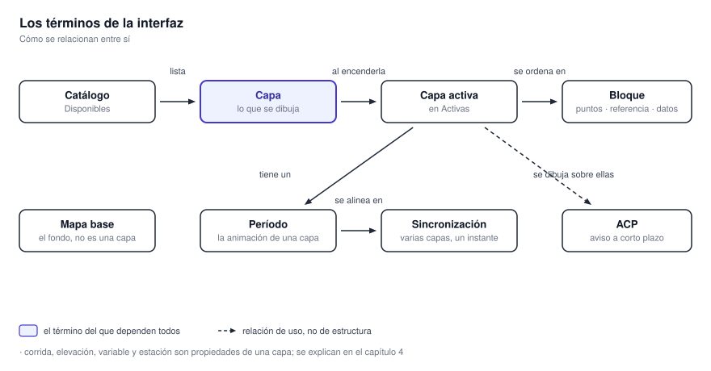
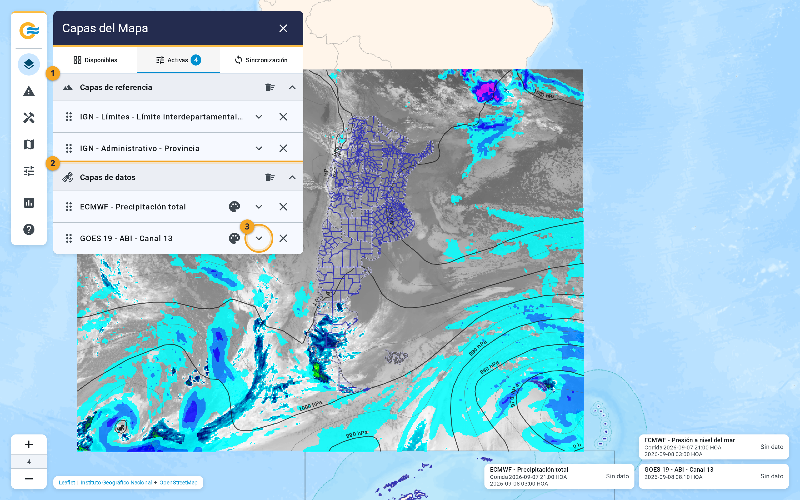

# 8. Glosario

Los términos que aparecen en la interfaz, explicados en una línea. **Los nombres de productos se
explican sólo como qué capa son en la aplicación**, no como meteorología.

{ .diagram loading=lazy }

**Todo depende de la capa.** El catálogo la lista, al encenderla pasa a Activas, ahí se ordena en un
bloque, tiene un período, y varios períodos se alinean en Sincronización. **El aviso se dibuja sobre
las capas, pero no es una.**

{ .doc-figure loading=lazy }

En la captura: el bloque de referencia (1), el bloque de datos (2) y la flecha que expande una capa (3).

## De la interfaz

**Capa**
:   Cada cosa que se dibuja sobre el mapa. **Se enciende con una casilla en Disponibles.**

**Grupo y subgrupo**
:   Los dos niveles del catálogo. Cinco grupos, 31 subgrupos, 153 capas.

**Capa activa**
:   Una capa encendida. **Aparece en la pestaña Activas, dentro de su bloque.**

**Bloque**
:   Los tres niveles de dibujo de las capas activas: puntuales arriba, referencia en el medio, datos
    abajo. **Nunca se cruza de un bloque a otro.**

**Mapa base**
:   La cartografía de fondo. **No es una capa**: se elige en Explorador ▸ Mapa base.

**Opacidad**
:   Cuán transparente se dibuja una capa. De 0 a 100 %, en la fila de la capa.

**Escala de colores**
:   La leyenda de una variable. **Se muestra con el botón de la paleta**, o desde Herramientas ▸
    Escalas.

**Período**
:   La sección de una capa activa que elige qué imagen ver y reproduce la secuencia.

**Imagen, instante, paso**
:   Cada cuadro de la secuencia. En observación se llama instante; en modelos, paso.

**Sincronización**
:   Reproducir varias capas con sus instantes alineados, con cinco minutos de tolerancia.

**Sincronizado**
:   La marca que lleva una capa mientras la controla la sincronización.

**Sin datos, No disponible**
:   Las dos etiquetas de una capa gris. **Sin datos**: nada reciente. **No disponible**: el servicio
    no contestó.

**Consulta y tolerancia**
:   En estaciones: qué instante mostrar, y cuántas horas de holgura aceptar.

**Dato puntual**
:   La herramienta que devuelve el valor de una capa en un punto del mapa.

**HOA y UTC**
:   Las dos zonas horarias de la aplicación. **HOA es UTC−3, fija.**

**Clave de acceso**
:   La credencial de las estaciones del SMN. Se carga en Configuración ▸ SMN.

**Borrador**
:   Un polígono dibujado y todavía no generado como aviso. Se numera Borrador #N.

**Nivel de detalle**
:   De 1 a 5: con cuánta fidelidad se recorta el contorno del país al calcular el área.

**Recorte**
:   Ajustar un polígono al territorio argentino. Tiene deshacer.

**Pendiente y activo**
:   Los dos estados de un aviso emitido. **Pendiente**: sin formulario completado. **Activo**:
    vigente.

**ACP**
:   Aviso a corto plazo: un área, un fenómeno y una vigencia, con sus dos imágenes.

## De producto a capa

**ABI, GLM**
:   Los dos subgrupos de Satélite: canales de imágenes y productos de descargas eléctricas.

**Canal 2, 9 y 13**
:   Las tres capas de ABI: reflectancia, y dos temperaturas de brillo en K.

**FED, TOE, MFA**
:   Las tres capas de GLM, con escala logarítmica.

**DBZH, KDP, VRAD, RHOHV, ZDR**
:   Las variables de cada radar. DBZH 450 km es el barrido de largo alcance.

**Elevación**
:   Cada ángulo de barrido de un radar: 0.5°, 0.9° y 1.3°, como casillas en la capa.

**Corrida**
:   Un pronóstico completo de un modelo, identificado por su hora de inicio. **Se elige en
    Corridas.**

**Colmax, MUCAPE, CAPE-BRN, Granizo**
:   Capas de WRF. Granizo es un índice; el tamaño está en sus contornos.

**500 hPa, 250 hPa**
:   Las dos capas de GFS con imagen de fondo. Presión a nivel del mar es sólo líneas.

**Superposición**
:   Las líneas y barbas que una capa de modelo dibuja sobre su imagen. Se apagan por corrida.

**Estación convencional**
:   El subgrupo de Estaciones meteorológicas. Una variable por vez, con ficha por clic derecho.
