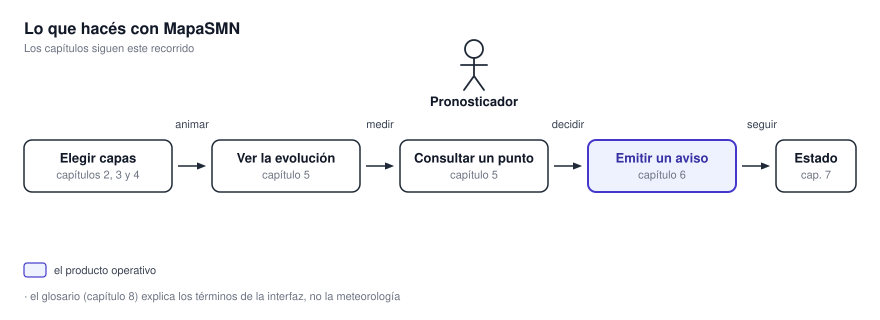

# Manual de usuario

Este manual está escrito para el pronosticador de turno. **No explica meteorología.** **Explica el programa**: qué hace cada control, dónde está, y qué no va a hacer.

{ .diagram loading=lazy }

**Los capítulos siguen el recorrido del diagrama.** **Primero elegís qué ver, después lo animás y lo
medís, y al final emitís el aviso.** **El panel de estado queda para cuando algo no llega.**

## Los capítulos

| Capítulo | Qué resuelve |
|---|---|
| [2. Primeros pasos](primeros-pasos.md) | La ventana, el mapa de fondo, los indicadores y la configuración. |
| [3. Trabajar con capas](capas.md) | Encender, ordenar y ajustar capas. Las capas de referencia del IGN. |
| [4. Qué muestra cada producto](productos/index.md) | Qué capa es qué producto, con sus unidades, escalas y horas. |
| [5. Ver la evolución y consultar un punto](animacion.md) | Animar una capa o varias juntas, y leer el valor en un punto. |
| [6. Emitir un aviso a corto plazo](avisos.md) | Dibujar el área, verificar departamentos y generar el aviso. |
| [7. El panel de estado](panel-de-estado.md) | Saber si lo que ves está actualizado. |
| [8. Glosario](glosario.md) | Los términos de la interfaz, en una línea cada uno. |

{ .doc-figure loading=lazy }

**La barra lateral (1), los botones de zoom (2) y la atribución (3) se explican en el capítulo 2.**

## Cómo leerlo

**Cada capítulo empieza con una captura de la ventana entera**, marcada con números, para ubicar
dónde vive la función. **Después vienen las capturas de cada panel y los clips de las secuencias.**
**Los clips arrancan solos al llegar a ellos**, sin controles, y se repiten en bucle.

**Las capturas se generan de forma automática** a partir de un estado fijo de la aplicación. **Si la
interfaz cambia, se vuelven a generar.** Tu pantalla puede diferir en el fondo del mapa y en los datos del momento. **No en los controles.**

!!! note "Si es tu primera vez"
    **Leé el capítulo 2 y el 3 en orden.** **El resto se consulta cuando hace falta.**
