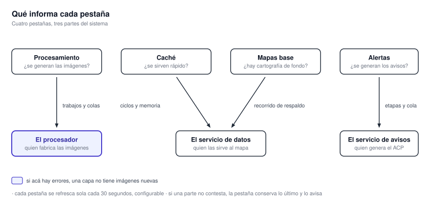
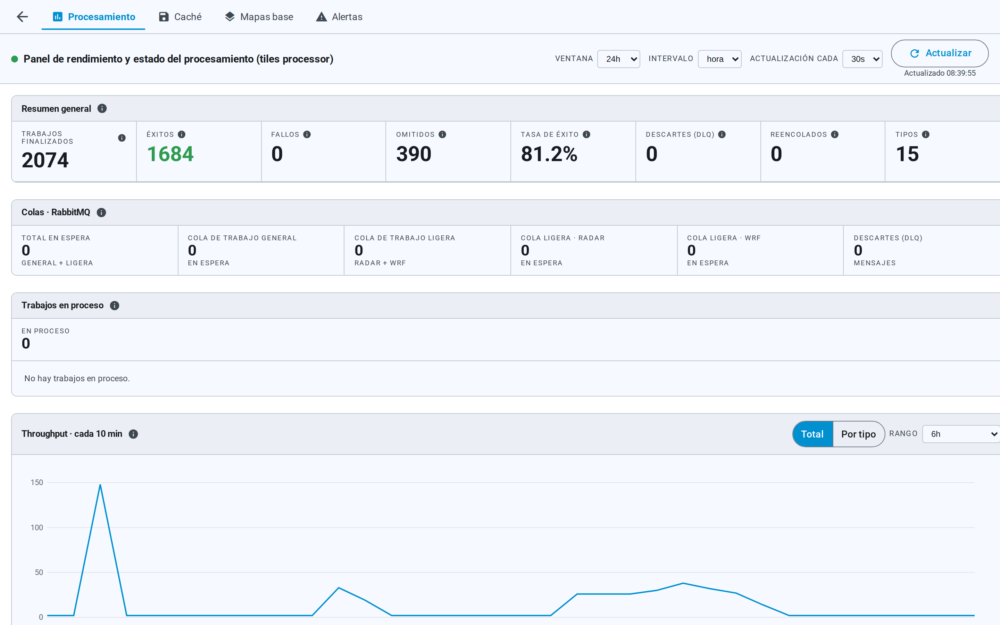
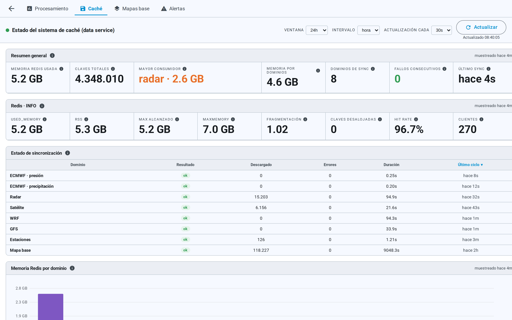
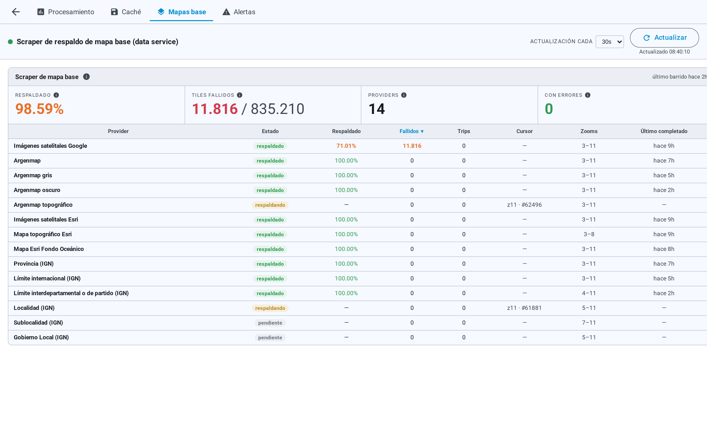
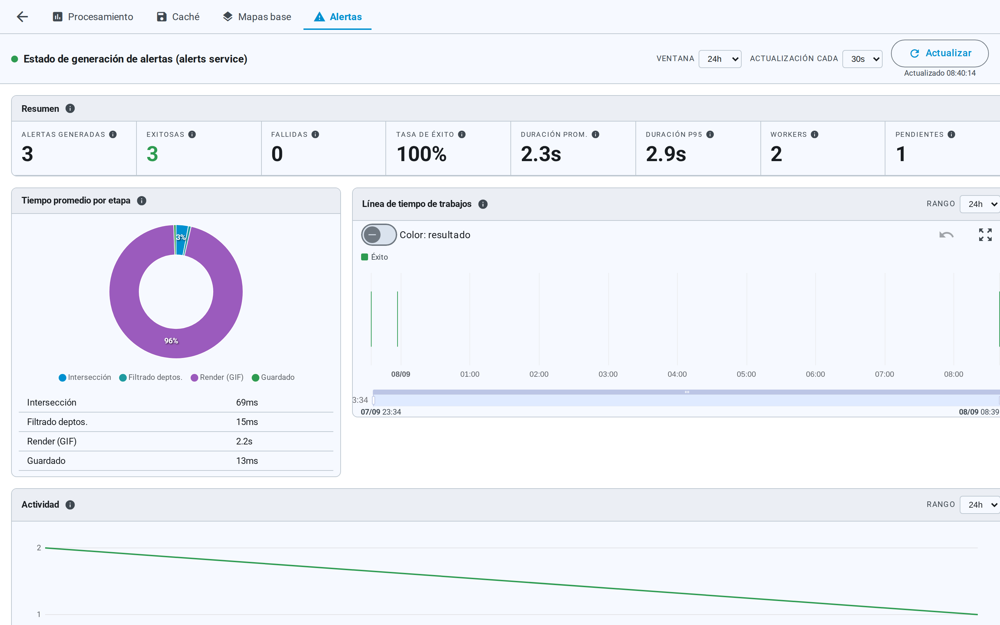

# 7. El panel de estado

El acceso **Rendimiento y estado** de la barra lateral abre una sección donde el sistema se reporta a
sí mismo. **Responde una sola pregunta: ¿lo que estoy viendo está actualizado?** **Es la primera
parada cuando una capa no aparece**, cuando los datos parecen viejos o cuando un aviso tarda.

{ .diagram loading=lazy }

**Cuatro pestañas informan sobre tres partes del sistema.** **Procesamiento mira a quien fabrica las
imágenes.** Caché y Mapas base miran a quien las sirve al mapa. Alertas mira a quien genera el aviso.

{ .doc-figure loading=lazy }

## Los controles comunes

**Cada pestaña se refresca sola cada 30 segundos.** El selector **Actualización cada** permite
elegir 10, 30 o 60 segundos, o ninguna. Al lado, **Actualizar** fuerza una consulta y muestra la
hora de la última.

| Control | Opciones | Dónde está |
|---|---|---|
| **Ventana** | 24 h, 7 días o todo | Procesamiento, Caché y Alertas |
| **Intervalo** | Por hora o por día | Procesamiento y Caché |
| **Actualización cada** | No, 10, 30 o 60 segundos | Las cuatro |

**Las pestañas son enlaces**: podés abrir una en otra pestaña del navegador. **La flecha de la
esquina vuelve al mapa.**

## Procesamiento

Es la vista del proceso que genera las imágenes. **Muestra, por tipo de trabajo, cuántos terminaron
bien, cuántos con error y cuántos se descartaron**, con la tasa de error y los tiempos. **También
muestra cuánto trabajo hay en espera y qué se está procesando ahora.**

**Errores sostenidos en un tipo de trabajo explican por qué una capa no tiene imágenes nuevas.**
**Trabajo acumulado en espera explica una capa que llega con demora.** **Un clic en un trabajo reciente
abre su desglose por etapa.**

## Caché

{ .doc-figure loading=lazy }

Tiene dos mitades. **La primera muestra, por familia de producto, el último ciclo de
sincronización**: cuánto tardó, cuántos elementos procesó y cómo terminó. **La segunda muestra la
memoria que ocupa cada familia**, y cómo evolucionó.

**Una familia que hace mucho no completa un ciclo es una capa desactualizada.** **Ahí está la
explicación antes que en tu conexión.**

## Mapas base

{ .doc-figure loading=lazy }

Es el estado de la copia propia de los fondos de mapa, proveedor por proveedor. Muestra **por dónde va
el recorrido, cuándo terminó la última pasada y la tasa de error.** También **si el sistema dejó de
insistir con un proveedor** por acumular fallas. **Sólo tiene el selector de refresco**, sin ventana ni intervalo.

## Alertas

{ .doc-figure loading=lazy }

Es la vista de la generación de avisos. **Muestra, por cada aviso, cuánto tardó cada etapa**, cómo
terminó y las fallas por motivo. **También muestra cuánto trabajo hay en cola**, cuántos procesadores
están ocupados y cuántos avisos siguen pendientes. **Un clic en un trabajo abre su detalle, con las
dos imágenes.**

**Una cola con trabajo acumulado y todos los procesadores ocupados significa esperar y reintentar.**

## Cuando una parte no responde

**Si una parte del sistema no contesta, la pestaña conserva los últimos datos y lo avisa** con un
cartel y un botón para reintentar. **El punto junto al título cambia de color.** **La primera carga
muestra un indicador de espera**; **las siguientes atenúan el contenido mientras llega el nuevo**.

!!! note "Dejarlo abierto en segundo plano sigue consultando"
    **El panel no deja de actualizarse por cambiar a otra pestaña del navegador.** Sí se detiene si
    cambiás a otra de las cuatro pestañas del propio panel, porque la vista anterior se cierra.
