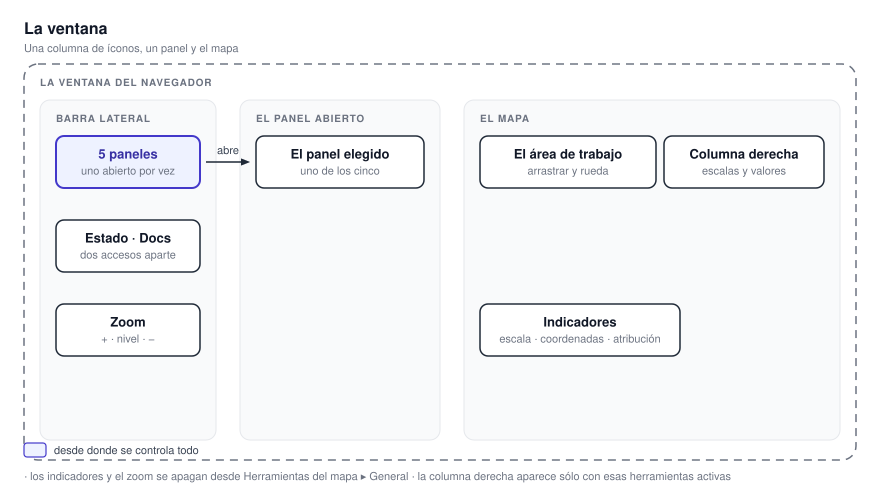
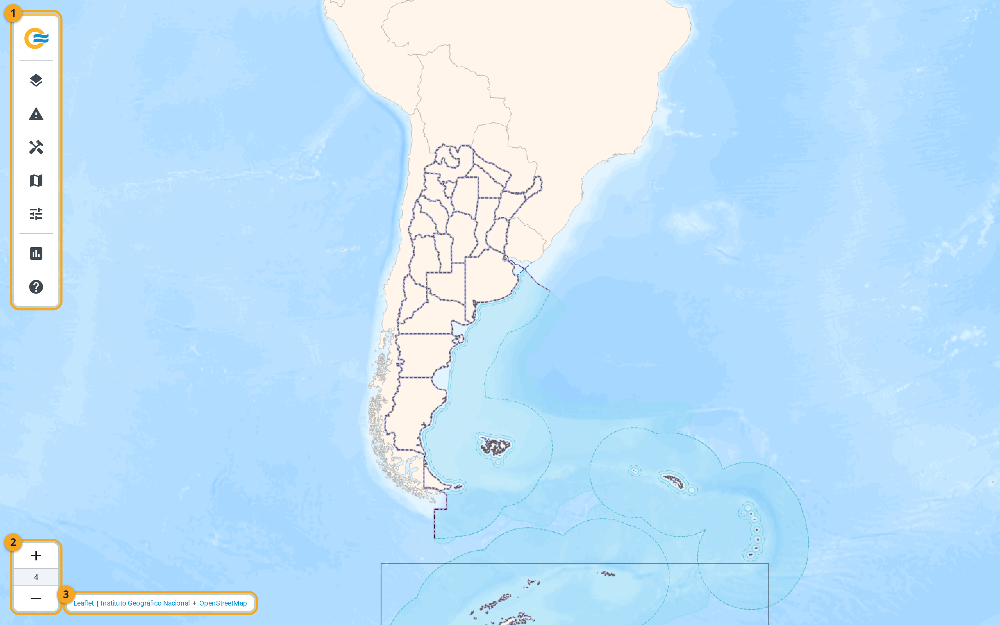
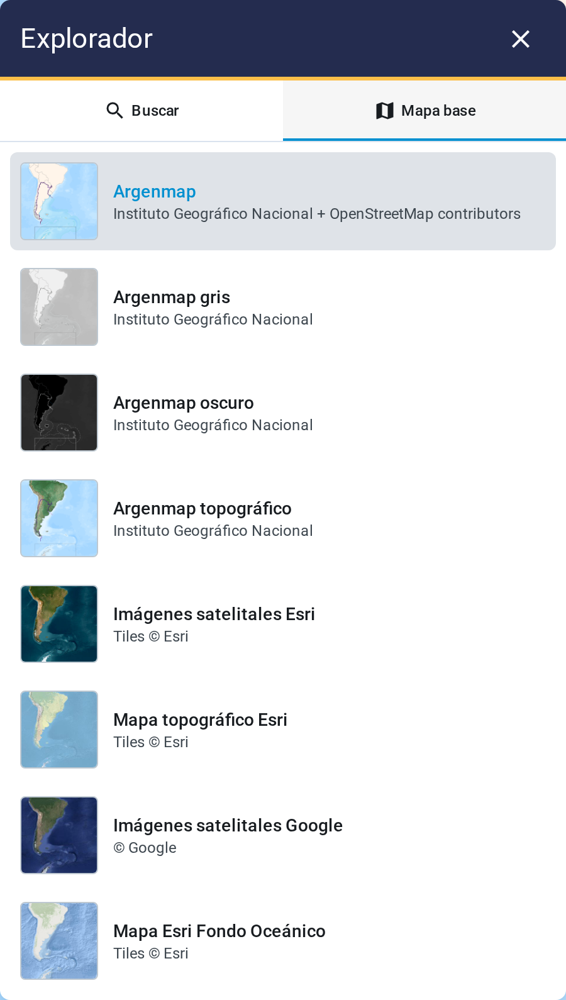
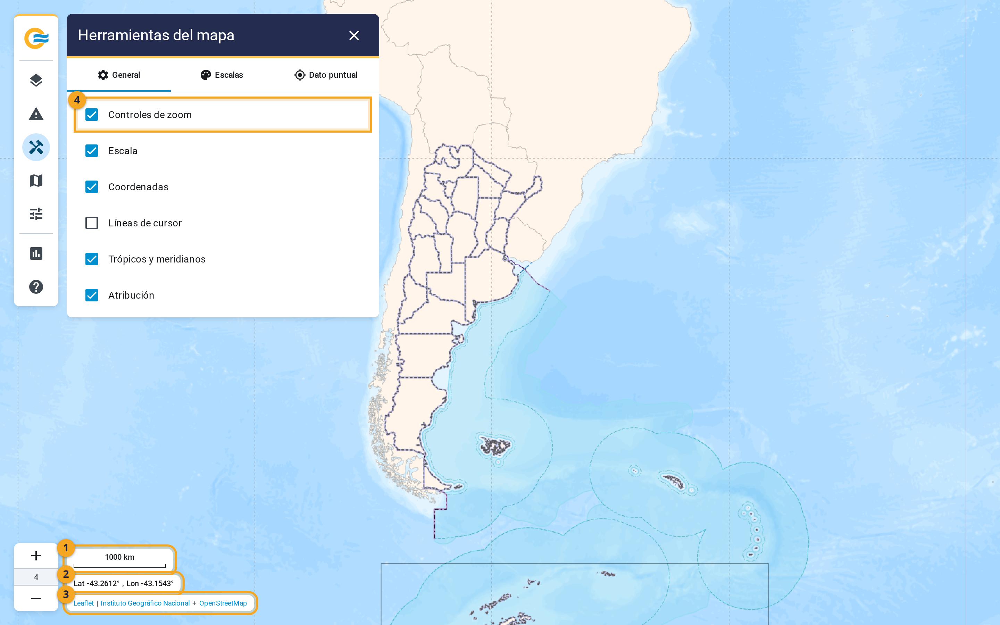
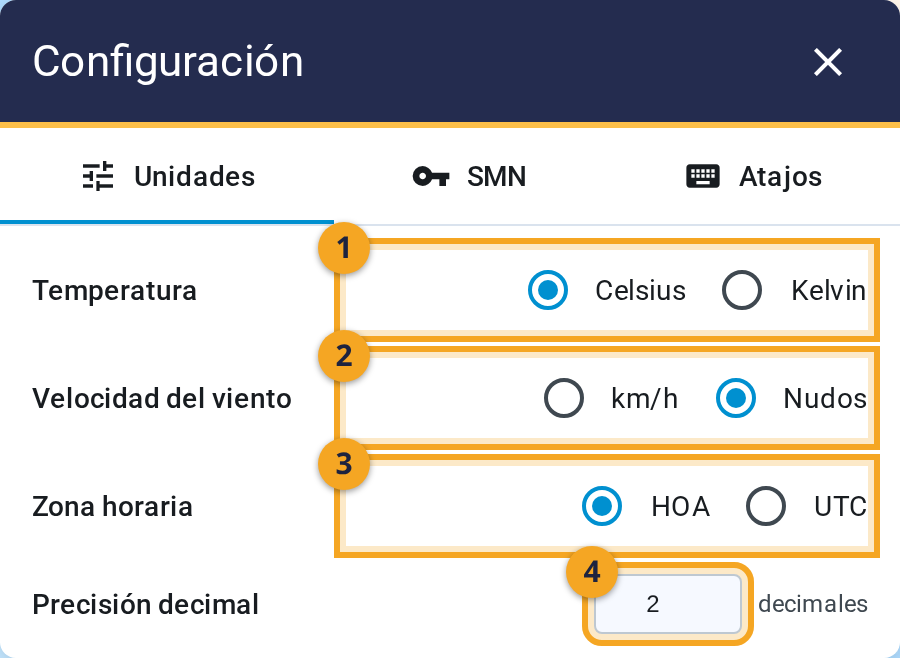

# 2. Primeros pasos

Al abrir la aplicación ves un mapa a pantalla completa y, a la izquierda, una columna de íconos.
**El mapa es el área de trabajo.** **La columna es desde donde se controla todo.**

{ .diagram loading=lazy }

{ .doc-figure loading=lazy }

## La barra de la izquierda

**Cada ícono abre un panel.** **Sólo hay un panel abierto por vez.** **Se cierra con la cruz del panel, o
con otro clic sobre su ícono.**

| Ícono | Panel | Para qué sirve |
|---|---|---|
| Capas | **Capas del mapa** | Elegir qué se ve: satélite, radar, modelos, estaciones y referencia. |
| Triángulo | **Avisos a corto plazo** | Dibujar el área afectada y emitir un aviso. |
| Herramientas | **Herramientas del mapa** | Indicadores, escalas de color y consulta puntual. |
| Mapa | **Explorador** | Buscar un lugar y elegir el mapa de fondo. |
| Ajustes | **Configuración** | Unidades, zona horaria y la clave de las estaciones. |

Más abajo, separados por una línea, hay dos accesos. **Rendimiento y estado** abre el
[panel de estado](panel-de-estado.md). **Documentación** abre estas páginas.

Al pie de la columna están los botones de zoom. **El número entre el más y el menos es el nivel
actual.**

{ .doc-figure loading=lazy }

## Moverse por el mapa

- **Acercar y alejar**: la rueda del mouse, o los botones de zoom.
- **Desplazarse**: arrastrar con el botón izquierdo.
- **Ir a un lugar**: el panel Explorador, pestaña **Buscar**.

**La aplicación abre siempre en la misma vista**, centrada en Argentina con nivel 4 de zoom. **La
posición del mapa no se recuerda entre sesiones.**

### Buscar un lugar

**Escribí al menos tres letras de una localidad, un departamento o una provincia.** **Los resultados
vienen del IGN.** El engranaje del buscador permite cambiar la fuente a OpenStreetMap, y elegir si
un área se muestra como polígono o como marcador. **Un clic en un resultado lleva el mapa hasta
ahí.** **La marca se quita con el botón derecho sobre ella.**

## El mapa de fondo

El fondo es la cartografía sobre la que se dibuja todo. **No es una capa**: no aparece en el panel
de capas y no cambia lo que pongas encima. Se elige en **Explorador ▸ Mapa base**, una grilla de
tarjetas con vista previa. **Un clic cambia el fondo, y la elección se recuerda.**

{ .doc-figure loading=lazy }

<video preload="none" loop muted playsinline title="Cambiar el mapa de fondo"
       width="100%" poster="../../videos/02-cambiar-mapa-base-poster.webp"
       style="max-height: 500px">
  <source src="../../videos/02-cambiar-mapa-base.webm" type="video/webm" />
  Tu navegador no soporta este video.
</video>

| Fondo | Proveedor | Detalle máximo |
|---|---|---|
| Argenmap | IGN | Todo el rango de zoom |
| Argenmap gris | IGN | Todo el rango |
| Argenmap oscuro | IGN | Todo el rango |
| Argenmap topográfico | IGN | Todo el rango |
| Imágenes satelitales Esri | Esri | Hasta el nivel 17 |
| Mapa topográfico Esri | Esri | Hasta el nivel 8 |
| Imágenes satelitales Google | Google | Todo el rango |
| Mapa Esri Fondo Oceánico | Esri | Hasta el nivel 16 |

**Por defecto se usa Argenmap.** Pasado el detalle máximo de un fondo, la aplicación agranda la
última imagen disponible en vez de traer más. **El mapa llega hasta el nivel 18**, así que tres
fondos se ven borrosos en los últimos niveles.

**Las imágenes del fondo se piden primero al proveedor.** **Si una no llega, se usa la copia que
guarda el sistema.** Si el fondo queda en blanco, probá con otra tarjeta. **Es la forma más rápida de
saber si el problema es de un proveedor.**

## Los indicadores del mapa

Sobre el mapa hay seis ayudas visuales. **Cada una se prende y se apaga desde Herramientas del
mapa ▸ General.**

{ .doc-figure loading=lazy }

| Indicador | De fábrica |
|---|---|
| Controles de zoom | Prendido |
| Escala | Apagado |
| Coordenadas | Apagado |
| Líneas de cursor | Apagado |
| Trópicos y meridianos | Apagado |
| Atribución | Prendido |

**La escala, las coordenadas y la atribución también se cierran con su propia cruz.** Las líneas de
cursor y los trópicos y meridianos no tienen cruz: se apagan sólo desde la casilla.

## Configuración

El panel tiene tres pestañas: **Unidades**, **SMN** y **Atajos**.

{ .doc-figure loading=lazy }

1. **Temperatura**: Celsius o Kelvin. De fábrica, Celsius.
2. **Velocidad del viento**: kilómetros por hora o nudos. De fábrica, nudos.
3. **Zona horaria**: HOA o UTC. De fábrica, HOA.
4. **Precisión decimal**: de 0 a 3. De fábrica, 2. Un valor fuera de rango vuelve al anterior.

!!! warning "HOA no es la hora de tu computadora"
    **HOA es la hora oficial argentina, fija en UTC−3**, sin horario de verano. **La aplicación no usa
    la zona horaria del navegador.** **Toda hora que veas lleva el sufijo HOA o UTC** según esta
    elección.

**La pestaña SMN guarda la clave de acceso a las estaciones.** Su botón abre un diálogo que valida
la clave contra el servicio antes de guardarla. **Con una clave cargada aparecen dos botones**: cambiarla
o borrarla. **Sin clave, las capas de estaciones no se pueden encender.** El detalle está en el
[capítulo 4.4](productos/estaciones.md).

**La pestaña Atajos todavía no tiene contenido.** Muestra el cartel «A desarrollar».

## Lo que la aplicación recuerda

**La aplicación guarda tu estado en el navegador** y lo recupera al volver a entrar:

- Las capas activas, con su opacidad, su orden, sus elevaciones y sus corridas.
- El mapa de fondo.
- Los indicadores que dejaste prendidos.
- Las unidades, la zona horaria y la clave de acceso.
- Los polígonos dibujados y el nivel de detalle.
- La configuración de la consulta puntual, de las escalas y del buscador.
- Qué avisos emitidos dejaste ocultos.

**No guarda la posición del mapa.** **Cada apertura arranca en la vista inicial.**

!!! note "Si el mapa arranca raro"
    **Suele ser una capa que quedó activa la vez anterior.** **Abrí Capas del mapa ▸ Activas** y mirá
    qué hay prendido.

**Esa memoria es de esa computadora y ese navegador.** **Desde otra máquina encontrás la configuración
de fábrica**: sólo la capa Provincia encendida, sobre Argenmap.
