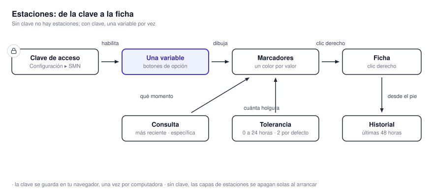
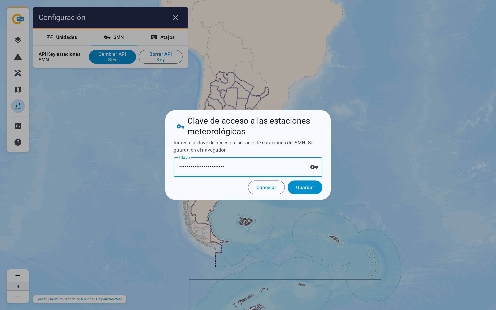

# 4.4 Estaciones de superficie

El grupo Estaciones meteorológicas tiene un solo subgrupo, **Estaciones convencionales**, con siete
variables. **Se muestra una variable por vez.** Cada estación es un marcador, coloreado según su
valor.

{ .diagram loading=lazy }

## Hace falta una clave

**Sin clave, las capas de estaciones no se pueden encender.** Al arrancar sin clave, la aplicación
las apaga y las muestra grises. La clave se carga en **Configuración ▸ SMN**. El diálogo la valida
contra el servicio antes de guardarla, y **queda guardada en tu navegador.**

{ .doc-figure loading=lazy }

**Si la clave deja de ser válida, la aplicación te la vuelve a pedir una vez.** Si sigue fallando,
muestra «No se pudieron cargar las estaciones meteorológicas: tu clave no es válida.»

## Las siete variables

| Capa | Unidad de la escala | Rango de la escala |
|---|---|---|
| **Temperatura** | K, mostrada en °C o K | 228.15 a 323.15 |
| **Punto de rocío** | K, mostrada en °C o K | La misma que temperatura |
| **Sensación térmica** | K, mostrada en °C o K | Hasta 333.15 |
| **Humedad** | % | 0 a 100 |
| **Presión** | hPa | 600 a 1050 |
| **Visibilidad** | km | 0 a 50 |
| **Viento** | km/h, mostrada en km/h o nudos | 0 a 150 |

**La temperatura y el viento siguen a Configuración ▸ Unidades**, igual que la cantidad de
decimales. **Las siete capas comparten opacidad y posición**: cambiarla en una las cambia a todas.

## Qué instante se muestra

En la fila de la capa hay un control **Consulta** con dos opciones:

- **Más reciente**: la última observación de cada estación. Es la opción de fábrica.
- **Específico**: la observación de un instante elegido con el deslizador de Período.

Con Específico, un botón despliega dos ajustes más. **Tolerancia es cuántas horas de holgura acepta
la aplicación** alrededor del instante: de 0 a 24, en horas enteras, y 2 de fábrica. **Con
tolerancia 0 sólo entran observaciones de esa hora exacta.** La casilla **Mostrar estaciones sin
observación** deja en el mapa las que no reportaron.

**El Período de las estaciones es de 6, 12 o 24 instantes, y arranca en 6.** Las observaciones
nuevas llegan al sistema cada cinco minutos.

## La ficha de una estación

**Un clic derecho sobre un marcador abre su ficha.** Muestra el nombre, el identificador, las
coordenadas y la provincia, con dos pestañas: **Actual**, con todos los valores y la hora de
actualización, y **Gráfico**, con las últimas 48 horas de la variable.

Al pie de la ficha, **Ver todas las variables y gráficos** abre una vista a pantalla completa con
tres secciones: **Gráficos**, **Resumen** y **Observaciones**, siempre sobre las últimas 48 horas.
**Si la estación no reportó en ese lapso, la vista lo dice** en lugar de mostrar un gráfico vacío.
