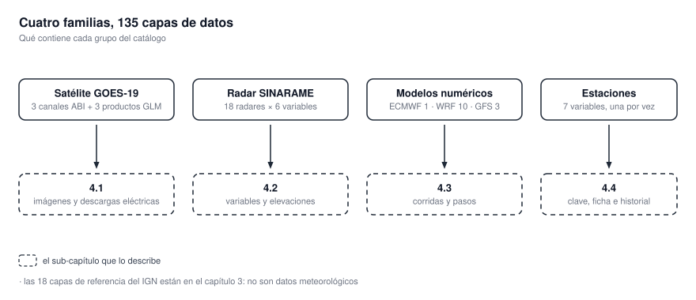
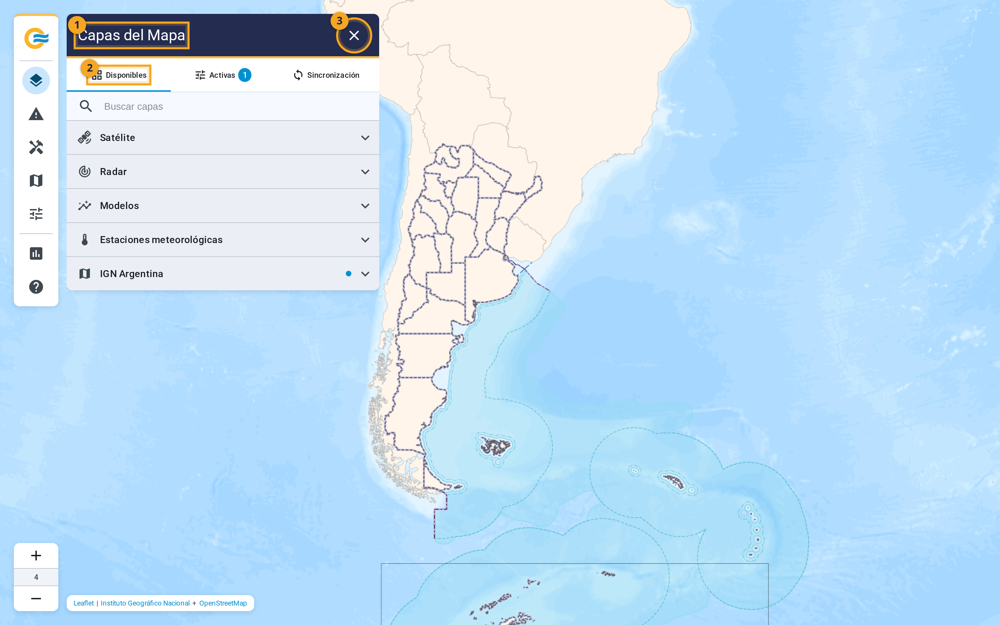

# 4. Qué muestra cada producto

Este capítulo dice **qué capa es qué producto**. A qué canal, variable o corrida corresponde. En qué
unidad está y cómo es su escala. A qué hora refiere su marca de tiempo. **No explica qué significa
el dato.**

{ .diagram loading=lazy }

| Familia | Capas | Dónde se describe |
|---|---|---|
| **Satélite GOES-19** | 6 | [4.1 Satélite GOES-19](satelite.md) |
| **Radar SINARAME** | 108 | [4.2 Radar SINARAME](radar.md) |
| **Modelos numéricos** | 14 | [4.3 Modelos numéricos](modelos.md) |
| **Estaciones de superficie** | 7 | [4.4 Estaciones de superficie](estaciones.md) |

Las dieciocho capas del IGN no son datos meteorológicos. **Están en el
[capítulo 3](../capas.md#las-capas-de-referencia-del-ign).**

{ .doc-figure loading=lazy }

En la captura: el título del panel (1), la pestaña Disponibles (2) y la cruz que lo cierra (3).

## Lo que comparten todas las capas de datos

- **La hora de cada imagen es la del dato, no la de llegada.** Sale del nombre con que se publicó, y
  se muestra en HOA o UTC según [Configuración](../primeros-pasos.md#configuración).
- **Cada capa guarda una ventana limitada de imágenes.** **El tamaño se elige en Período**, y las
  opciones dependen de la familia.
- **Las imágenes existen en un rango fijo de niveles de zoom.** **Más cerca, la aplicación agranda la
  última disponible.**
- **El sistema busca datos nuevos cada cinco minutos**, y **la aplicación renueva la lista de cada
  capa activa cada diez segundos**.
- **Una capa gris con «Sin datos» no tiene imágenes recientes.** **No es un error de tu computadora.**
