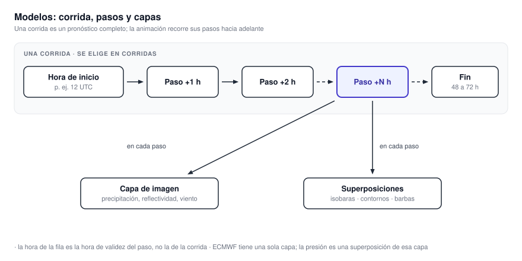
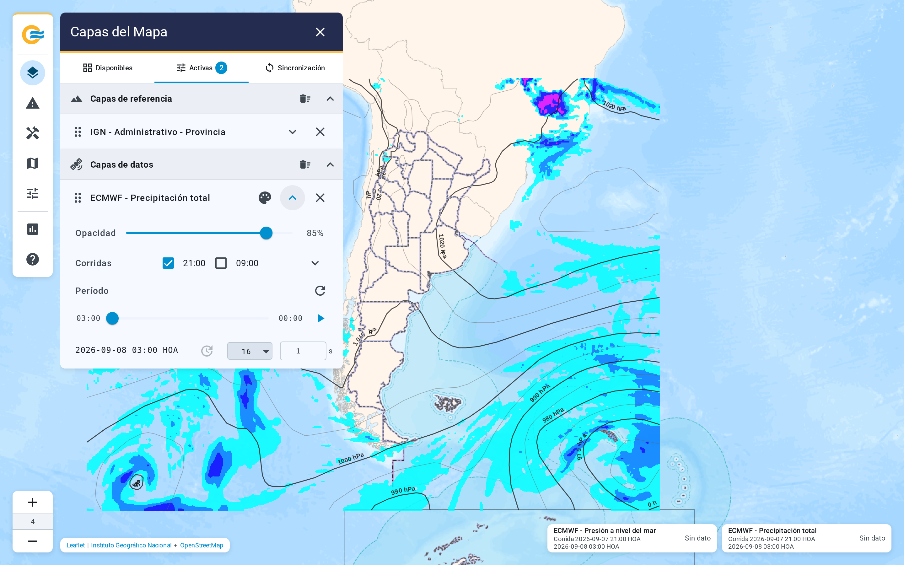
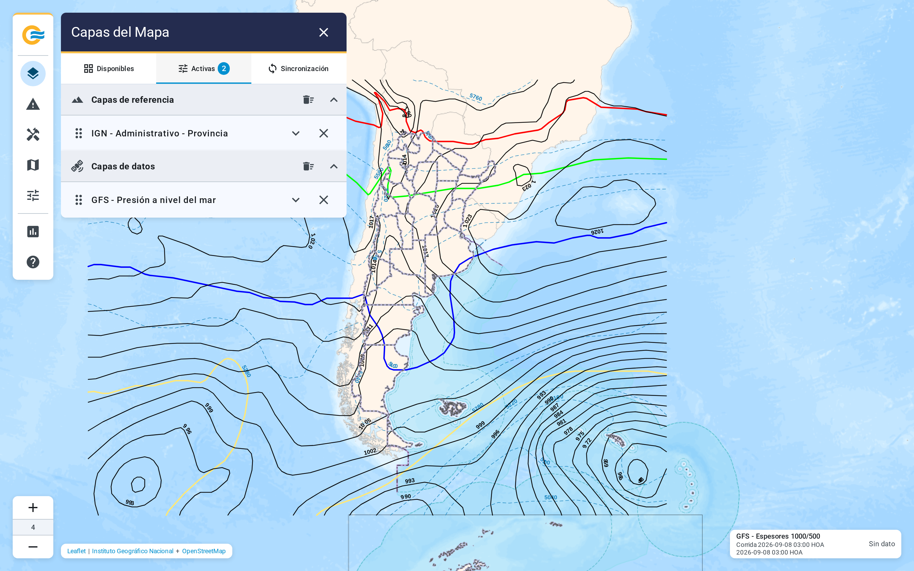

# 4.3 Modelos numéricos

El grupo Modelos contiene los pronósticos de ECMWF IFS, WRF-ARG4K y GFS. ECMWF aporta una capa,
WRF diez y GFS tres. A diferencia de una observación, cada modelo publica corridas formadas por
varios pasos futuros. La animación comienza en el inicio de la corrida y avanza con el pronóstico.

{ .diagram loading=lazy }

{ .doc-figure loading=lazy }

## Corridas y pasos

Una corrida es un pronóstico completo, identificado por su hora de inicio. Cada corrida tiene
pasos: un campo por cada hora de validez. En Corridas elegís qué corridas mostrar. Podés
marcar varias a la vez, cada una con su opacidad. Dentro de cada corrida podés apagar la imagen o
cada superposición por separado.

La hora de la fila es la hora de validez del paso, no la de la corrida. El selector de corridas
muestra la hora de inicio como mes, día y hora. La animación recorre los primeros pasos de la
corrida, en la cantidad que elijas en Período.

## ECMWF

Una sola capa: Precipitación total, en mm, con escala discreta de 0.5 a 250. Las isobaras de
presión a nivel del mar son una superposición de esa capa, con etiqueta cada 10 hPa. Se prenden
juntas, y dentro de la corrida podés apagar una u otra.

| Ventana | Arranca en | Niveles de zoom |
|---|---|---|
| 8, 16, 32 o 48 pasos | 48 | 3 a 7 |

## WRF

| Capa | Unidad | Rango de la escala | Superposiciones |
|---|---|---|---|
| Colmax | dBZ | -18 a 76.5 | No tiene |
| Ráfagas en superficie | kt | 25 a 80, con marca en 35 | Barbas y contorno de umbral de ráfaga |
| Humedad específica 900 hPa | g/kg | 0 a 19 | Barbas |
| Precipitación 1h | mm | 0.1 a 260 | Barbas e isobaras |
| MUCAPE | J/kg | 100 a 3500 | Contornos de cortante 850-500 hPa |
| Agua precipitable | mm | 20 a 70 | No tiene |
| Jet capas bajas | kt | -48 a -24 | Barbas y contornos de cortante 850-700 hPa |
| Cortante niveles bajos | kt | 10 a 50 | Barbas |
| CAPE-BRN | J/kg | 100 a 3500 | Contornos de BRN en 10 y 45 |
| Granizo | Índice SHIP, sin unidad | 0.1 a 4 | Contornos de diámetro máximo en 0.5, 3 y 5 cm |

Jet capas bajas dibuja la componente meridional del viento en 850 hPa, por eso su escala es
negativa. Granizo es un índice, no un tamaño: el tamaño está en sus contornos, y la consulta
puntual lo devuelve en cm.

| Ventana | Arranca en | Niveles de zoom |
|---|---|---|
| 6, 12, 24, 48 o 72 pasos | 72 | 4 a 6 |

La hora de cada paso es la de inicio de la corrida más las horas del paso.

## GFS

{ .doc-figure loading=lazy }

| Capa | Imagen de fondo | Unidad y rango | Superposiciones |
|---|---|---|---|
| Presión a nivel del mar | No tiene | No corresponde | Isobaras cada 3 hPa y espesor 1000-500 hPa cada 60 m |
| 500 hPa | Intensidad del viento | kt, 80 a 220 | Isotermas cada 5 °C, alturas cada 60 m y barbas |
| 250 hPa | Intensidad del viento | kt, 80 a 210 | Alturas cada 60 m |

Presión a nivel del mar no tiene escala de colores. Es sólo líneas, y se superpone a cualquier
otra capa sin taparla. La consulta puntual sí devuelve su valor.

| Ventana | Arranca en | Pasos | Niveles de zoom |
|---|---|---|---|
| 8, 17, 25 o 33 pasos | 33 | Cada 3 horas hasta +48, cada 6 después | 3 a 7 |

!!! note "Corridas vacías"
    Si un subgrupo aparece gris, el servicio no tiene ninguna corrida publicada. El botón de
    volver a verificar consulta de nuevo. La aplicación lo hace sola cada minuto.
