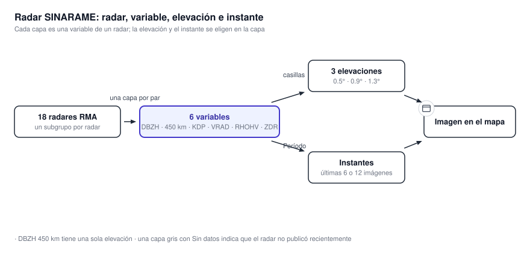
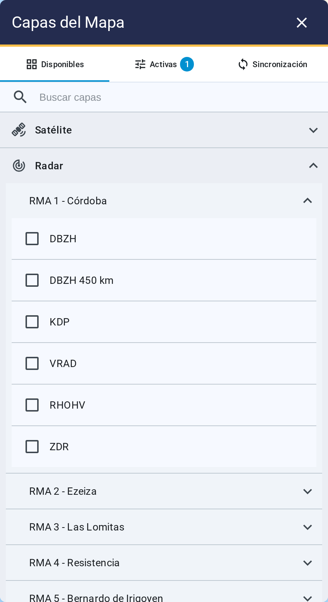

# 4.2 Radar

El grupo Radar reúne dos redes: los 19 equipos de **SINARAME**, con seis variables cada uno, y los
tres del **INTA**, con cuatro. Son 126 capas en total. La capa identifica la variable y permite
elegir la elevación y el instante que se representarán.

{ .diagram loading=lazy }

{ .doc-figure loading=lazy }

## Los radares

Cada subgrupo se llama por su número y su ubicación.

| Radar | Ubicación | Radar | Ubicación | Radar | Ubicación |
|---|---|---|---|---|---|
| RMA 1 | Córdoba | RMA 7 | Neuquén | RMA 13 | Ituzaingó |
| RMA 2 | Ezeiza | RMA 8 | Mercedes | RMA 14 | Bolívar |
| RMA 3 | Las Lomitas | RMA 9 | Río Grande | RMA 15 | Patquía |
| RMA 4 | Resistencia | RMA 10 | Bahía Blanca | RMA 16 | Villa Reynolds |
| RMA 5 | Bernardo de Irigoyen | RMA 11 | Termas de Río Hondo | RMA 17 | Alejandro Roca |
| RMA 6 | Mar del Plata | RMA 12 | Las Grutas | RMA 18 | Santa Isabel |
| | | | | RMA 20 | Las Lajitas |

### Los radares del INTA

Aparecen a continuación de los RMA, nombrados por su ubicación.

| Radar | Ubicación |
|---|---|
| INTA Paraná | Paraná, Entre Ríos |
| INTA Anguil | Anguil, La Pampa |
| INTA Pergamino | Pergamino, Buenos Aires |

Miden lo mismo que los RMA y se usan igual. Publican cuatro variables — DBZH, ZDR, RHOHV y KDP —
y no tienen DBZH 450 km ni VRAD. No todas están disponibles en los tres equipos: Pergamino hoy
sólo publica DBZH.

## Las variables

Aparecen en este orden dentro de cada radar. Los del INTA publican las cuatro marcadas.

| Capa | Variable | Unidad | Rango de la escala | INTA |
|---|---|---|---|---|
| DBZH | Reflectividad horizontal | dBZ | -18 a 76.5 | sí |
| DBZH 450 km | Reflectividad, barrido de largo alcance | dBZ | -18 a 76.5 | — |
| KDP | Fase diferencial específica | °/km | -1 a 6 | sí |
| VRAD | Velocidad radial | m/s | -40 a 40 | — |
| RHOHV | Coeficiente de correlación | ρhv | 0.225 a 1.048 | sí |
| ZDR | Reflectividad diferencial | dB | -3 a 7 | sí |

DBZH 450 km cubre unos 450 km en lugar de 240, con menos resolución. Es la única con una sola
elevación.

## Las elevaciones

Cada capa tiene tres elevaciones: 0.5°, 0.9° y 1.3°, en las dos redes. Aparecen como casillas en la fila de la
capa. Sólo la de 0.5° viene marcada. Podés marcar varias a la vez, y cada elevación tiene su
propia opacidad. DBZH 450 km tiene únicamente la de 0.5°.

## Tiempo y animación

- La hora de cada imagen sale del nombre con que se publicó, en HOA o UTC según Configuración.
- La ventana es de 6 o 12 imágenes, y arranca en 12. La animación recorre las últimas.
- Las imágenes existen entre los niveles 4 y 9 de zoom. Más cerca, se agrandan.
- La disponibilidad se comprueba con la elevación de 0.5°. Si esa no tiene datos, toda la capa
  aparece gris.

!!! note "Un radar gris no es un error de tu computadora"
    Una capa con "Sin datos" significa que ese radar no publicó nada recientemente. Los demás
    radares siguen funcionando por separado.
