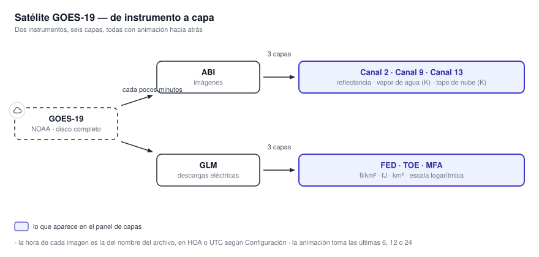
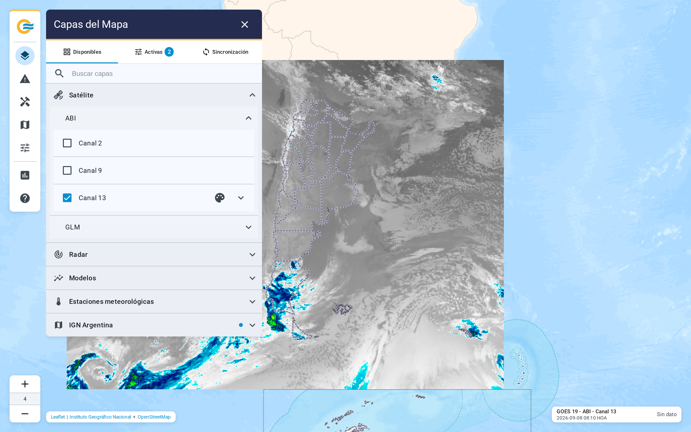
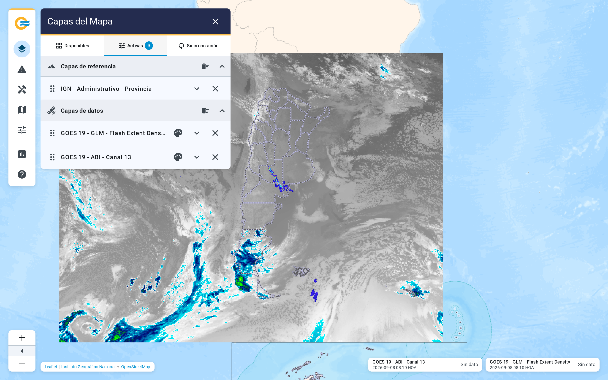

# 4.1 Satélite GOES-19

El grupo Satélite separa los dos instrumentos de GOES-19. ABI aporta tres canales de imágenes y GLM
aporta tres productos derivados de la actividad eléctrica. Las seis capas muestran observaciones y,
por lo tanto, su animación recorre los últimos instantes disponibles hasta llegar al más reciente.

{ .diagram loading=lazy }

{ .doc-figure loading=lazy }

## ABI: los tres canales

| Capa | Producto | Unidad de la escala | Rango de la escala |
|---|---|---|---|
| Canal 2 | Reflectancia, 0.64 μm | Reflectancia | 0 a 1, en grises |
| Canal 9 | Temperatura de brillo, 6.9 μm | K | 183.15 a 323.15 |
| Canal 13 | Temperatura de brillo, 10.3 μm | K | 183.15 a 323.15 |

Las escalas son fijas: no se reajustan con cada imagen. El Canal 9 recibe valores entre 161 y
330 K, pero su escala recorta lo que queda fuera de 183.15 a 323.15 K. La consulta puntual
devuelve el valor real, no el recortado.

## GLM: la actividad eléctrica

{ .doc-figure loading=lazy }

| Capa | Unidad | Rango de la escala |
|---|---|---|
| Flash Extent Density | fl/km² | 1 a 128 |
| Total Optical Energy | fJ | 0.01 a 1500 |
| Minimum Flash Area | km² | 64 a 2500 |

Las tres escalas son logarítmicas. Las marcas de la leyenda no están a distancia pareja, ya que cada
una es un múltiplo de la anterior.

## Tiempo y animación

- La hora de cada imagen sale del nombre con que se publicó. Se muestra en HOA o UTC según
  Configuración.
- La ventana es de 6, 12 o 24 imágenes, y arranca en 24. La animación recorre las últimas.
- Las imágenes existen entre los niveles 3 y 7 de zoom. Más cerca, se agrandan.
- El sistema busca imágenes nuevas cada cinco minutos. La lista de la capa se renueva cada diez
  segundos sin que hagas nada.

!!! note "Los seis productos comparten disponibilidad"
    Si un canal aparece gris con "Sin datos", la fuente no publicó nada reciente. El botón de
    volver a verificar del subgrupo consulta de nuevo. La aplicación lo hace sola cada minuto.
