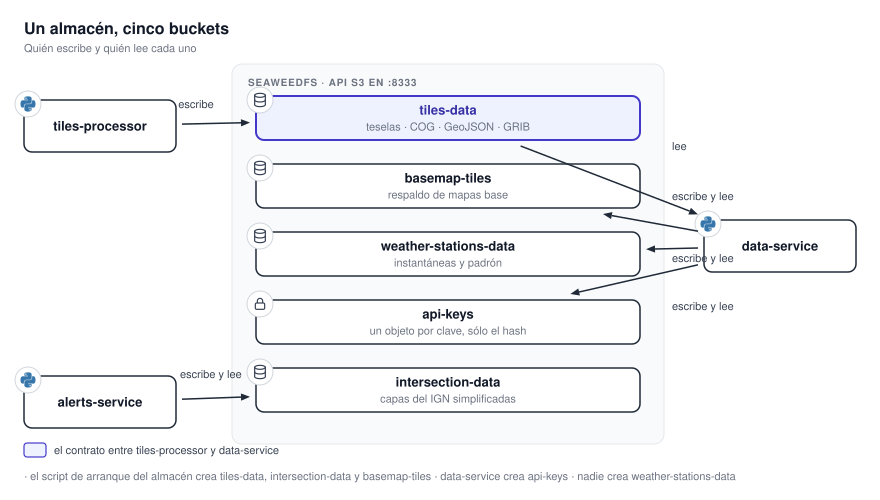

# Almacenamiento y colas

Los servicios no comparten base de datos. Se comunican por un almacén de objetos compatible con S3 y,
dentro de `tiles-processor`, por colas de RabbitMQ. Esta página es la referencia de ambos, y el lugar
donde se describe una sola vez el trazado de claves que las otras páginas enlazan.

{ .diagram loading=lazy }

## El almacén de objetos

El almacén desplegado es **SeaweedFS**, expuesto por su puerta de enlace S3 en el puerto `8333` del
contenedor. El código está escrito contra la API de S3, así que el almacén concreto es
intercambiable, y algunos comentarios del repositorio nombran otras implementaciones compatibles
como alternativa posible. Lo que corre es SeaweedFS.

Un script de arranque crea los buckets y las identidades por servicio: `tiles-processor` escribe,
`data-service` lee, y `alerts-service` tiene su propio bucket.

### Los buckets

| Bucket | Escribe | Lee | Contenido |
|---|---|---|---|
| `tiles-data` | `tiles-processor` | `data-service` | Todos los productos meteorológicos |
| `basemap-tiles` | `data-service` | `data-service` | Respaldo de mapas base de terceros |
| `weather-stations-data` | `data-service` | `data-service` | Instantáneas y registro de estaciones |
| `api-keys` | `data-service` | `data-service` | Un objeto por clave, nombrado por su hash |
| `intersection-data` | `alerts-service` | `alerts-service` | Capas del IGN simplificadas |

### Trazado de claves de `tiles-data`

| Producto | Plantilla de clave |
|---|---|
| Tiles del ABI | `tiles/band_{13,9,2}/{stem}/{z}/{x}/{y}.webp` |
| COG del ABI | `cog/band_{13,9,2}/{image_id}.tif` |
| Tiles de GLM | `tiles/glm_{fed,toe,mfa}/{stem}/{z}/{x}/{y}.webp` |
| COG de GLM | `cog/glm_{fed,toe,mfa}/{image_id}.tif` |
| Tiles de radar | `tiles/radar/{radar_id}/{variable}/elev{N}/{timestamp}/{z}/{x}/{y}.webp` |
| COG de radar | `cog/radar/{radar_id}/{variable}/elev{N}/{timestamp}.tif` |
| Tiles de WRF | `tiles/wrf/{product_id}/{init_tag}/{fxxx}/{z}/{x}/{y}.webp` |
| COG primario de WRF | `cog/wrf/{product_id}/{init_tag}/{fxxx}.tif` |
| COG secundario de WRF | `cog/wrf/{product_id}/{init_tag}/{fxxx}.{variable}.tif` |
| GeoJSON de WRF | `geojson/wrf/{product_id}/{init_tag}/{fxxx}/{layer}.json` |
| Barbas de WRF | `geojson/wrf/{product_id}/{init_tag}/{fxxx}/barbs/{z}/{x}/{y}.json` |
| Tiles de ECMWF | `tiles/models/ecmwf/total_precipitation/{forecast_ts}/{image_id}/{z}/{x}/{y}.webp` |
| COG de ECMWF | `cog/models/ecmwf/{total_precipitation,mean_sea_level_pressure}/{forecast_ts}/{...}.tif` |
| Isobaras de ECMWF | `geojson/models/ecmwf/mean_sea_level_pressure/{forecast_ts}/{image_id}.json` |
| Tiles de GFS | `tiles/models/gfs/{seg}/{cycle}/{cycle}_{fxxx}/{z}/{x}/{y}.webp` |
| COG primario de GFS | `cog/models/gfs/{seg}/{cycle}/{cycle}_{fxxx}.tif` |
| COG secundario de GFS | `cog/models/gfs/{seg}/{cycle}/{variable}/{cycle}_{fxxx}.tif` |
| GeoJSON de GFS | `geojson/models/gfs/{seg}/{cycle}/{cycle}_{fxxx}_{layer}.json` |
| Barbas de GFS | `geojson/models/gfs/{seg}/{cycle}/{cycle}_{fxxx}_barbs/{z}/{x}/{y}.json` |
| GRIB cacheado | `grib/models/ecmwf/{product}/{forecast_ts}.grib`, `grib/models/gfs/{cycle_ts}/{image_id}.grib2` |

`{seg}` toma los valores `mean_sea_level_pressure`, `500hpa` y `250hpa`.

!!! warning "Los prefijos están duplicados a mano en los dos lados"
    `tiles-processor` declara los prefijos en su modelo de ciclo de vida y `data-service` los repite
    como literales en su cliente S3. No hay paquete compartido: cambiar uno sin cambiar el otro deja
    de romper de forma visible —el productor sigue escribiendo y el lector sigue devolviendo
    respuestas— pero el lector deja de encontrar los objetos nuevos.

!!! note "WRF y GFS no nombran igual sus COG secundarios"
    WRF usa un sufijo con punto, `{fxxx}.{variable}.tif`. GFS usa un subprefijo,
    `{cycle}/{variable}/{cycle}_{fxxx}.tif`. Además los objetos de GFS se llaman `{cycle}_{fxxx}`
    **anidados dentro** de `{cycle}`, mientras que la API HTTP los separa en segmentos distintos de
    la ruta: hay un único punto del código de `data-service` que vuelve a unirlos.

### Otros buckets

| Bucket | Plantilla |
|---|---|
| `basemap-tiles` | `basemap/{provider_id}/{z}/{x}/{y}.png` |
| `weather-stations-data` | `weather-stations/snapshots/{AAAA}/{MM}/{DD}/{HH}/{marca}.json` más un `.meta.json` hermano; registro en `weather-stations/stations.json` |
| `api-keys` | `keys/{sha256 del secreto}.json` |
| `intersection-data` | `pais_simple_L{nivel}_T{tolerancia}_{AAAAMMDD}.geojson`, `departamentos_simple_T0p005_{AAAAMMDD}.geojson` |

Las claves de `intersection-data` son planas, sin jerarquía de prefijos, y la tolerancia se escribe
con `p` en lugar del punto decimal.

### Retención

La expiración se aplica como reglas de ciclo de vida de S3, una por prefijo. Ver
[Tiles Processor](../servicios/tiles-processor.md) para la tabla de días por prefijo. No existe una
regla comodín sobre el prefijo vacío: cada prefijo tiene la suya o no expira.

## Las colas

RabbitMQ es interno a `tiles-processor`. Ningún otro servicio lo usa.

{ .diagram loading=lazy }

| Cola | Contenido |
|---|---|
| `tiles_work_queue` | Trabajo pesado: ABI, GLM, ECMWF, GFS |
| `tiles_radar_light_queue` | Todos los productos de radar |
| `tiles_wrf_light_queue` | Todos los productos de WRF |
| `tiles_dead_letter_queue` | Unidades que agotaron sus reintentos |

Las tres colas de trabajo son durables y se declaran con el intercambio de mensajes muertos
`tiles_dlx`, un `direct` durable cuya clave de ruteo es el nombre de la cola de descarte. La
publicación normal usa el intercambio por defecto con la clave de ruteo igual al nombre de la cola, y
mensajes persistentes.

### El mensaje

| Campo | Contenido |
|---|---|
| `work_unit_id` | UUID de la unidad |
| `image_id` | Identificador de la imagen de origen |
| `data_source_id` | Fuente que la descubrió |
| `source_uri` | De dónde se descarga |
| `output_prefix` | Prefijo de destino en el bucket |
| `bounds` | Recuadro de recorte |
| `processor_id` | Qué procesador la atiende |
| `band_id` | Banda o producto |
| `created_at` | Marca de creación |
| `retry_count` | Intento actual, arranca en 0 |
| `max_retries` | 3 por defecto |

!!! note "Nadie consume la cola de mensajes muertos"
    No hay ningún consumidor de `tiles_dead_letter_queue` en el repositorio. Es un depósito para
    inspección manual desde el panel de RabbitMQ, no una cola de reprocesamiento automático.

## Bases locales

Ninguna es compartida entre servicios; todas viven en el volumen del contenedor que las usa.

| Base | Servicio | Tablas | Esquema |
|---|---|---|---|
| `progress_tracker.db` | tiles-processor | `processed_images` | Alembic |
| `metrics.db` | tiles-processor | `job_metrics` | Alembic |
| SQLite de métricas | data-service | `sync_cycles`, `redis_memory_samples`, `redis_info_samples` | Alembic |
| `jobs.sqlite` | alerts-service | `alert_jobs` | Alembic |
| `metrics.sqlite` | alerts-service | `processor_samples` | Alembic |
| `history.db` | alerts-service | `job_runs` | Creada por el adaptador |
| `aviso_gempak` | alerts-service | `taviso_temporal`, `taviso`, `departamentos`, `provincia` | Alembic, sólo si `MANAGE_DB_SCHEMAS` |

!!! note "SQLite exige volumen local"
    Las bases usan WAL, que no funciona sobre NFS ni SMB. Además todos los procesos que las tocan
    tienen que estar en el mismo host, porque el bloqueo entre migraciones concurrentes se hace con
    un `flock` sobre el sistema de archivos.
