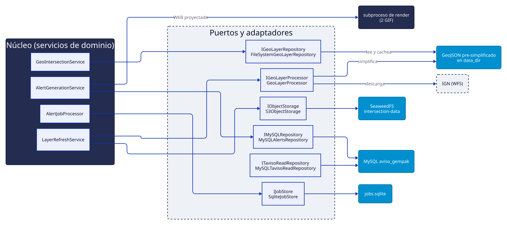
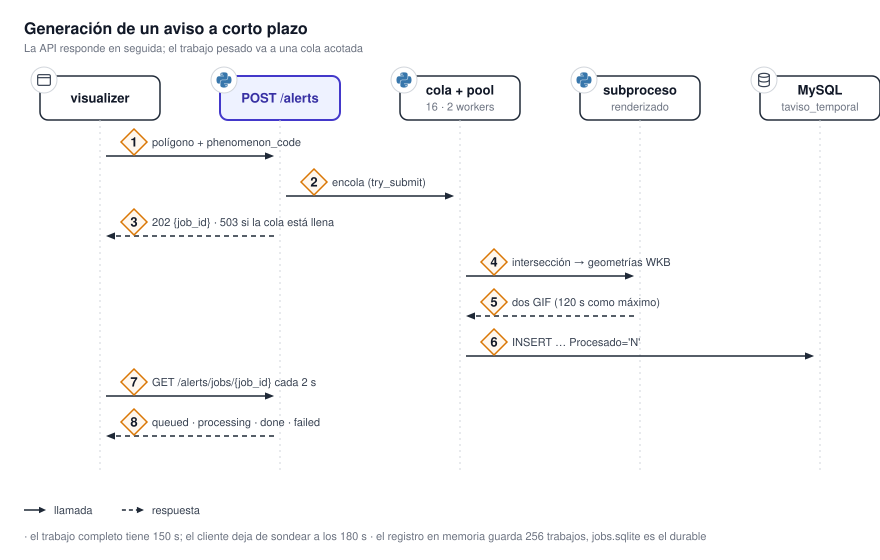
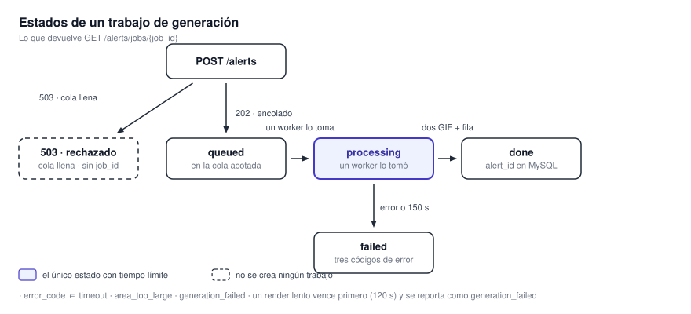

# Alerts Service

`alerts-service` cierra el ciclo operativo. Tiene dos responsabilidades: calcular la intersección
geográfica de un polígono contra el territorio argentino y sus departamentos, y generar el ACP
—Aviso a Corto Plazo— en un formato listo para emitir, con sus dos visualizaciones oficiales. Está
implementado con arquitectura hexagonal: ocho puertos abstractos, un adaptador por puerto.

{ .diagram loading=lazy }

!!! note "El servicio no emite el aviso"
    Escribe los datos del ACP en una tabla intermedia de una base MySQL del SMN. Un servicio externo
    del propio organismo lee esa tabla, completa el aviso con los campos del formulario de emisión y
    lo difunde por sus canales. El alcance de este servicio termina en esa tabla.

## Puertos y adaptadores

| Puerto | Adaptador | Contra qué habla |
|---|---|---|
| `IGeoLayerRepository` | `FileSystemGeoLayerRepository` | GeoJSON ya simplificado en disco |
| `IGeoLayerProcessor` | `GeoLayerProcessor` | WFS del IGN y el subproceso de simplificación |
| `IObjectStorage` | `S3ObjectStorage` | Bucket `intersection-data` |
| `IMySQLRepository` | `MySQLAlertsRepository` | Base `aviso_gempak` |
| `ITavisoReadRepository` | `MySQLTavisoReadRepository` | Tabla externa `taviso`, sólo lectura |
| `IHistoryRepository` | `SqliteHistoryRepository` | `history.db` |
| `IJobStore` | `SqliteJobStore` | `jobs.sqlite` |
| `IProcessorMetricsRepository` | `SqliteProcessorMetricsRepository` | `metrics.sqlite` |

Los servicios de dominio no tienen puerto propio: son clases concretas a las que se les inyectan los
puertos.

## Niveles de detalle

Las capas de referencia del IGN se pre-simplifican por nivel de detalle y se versionan por fecha y
tolerancia. La API acepta `detail_level` de 1 a 5; existe además un nivel 7 de uso interno, que el
programador de tareas emplea al construir su caché de arranque y que no se expone por HTTP.

| Nivel | Tolerancia | Uso |
|---|---|---|
| 1 | 0.2 | API |
| 2 | 0.1 | API |
| 3 | 0.05 | API |
| 4 | 0.025 | API |
| 5 | 0.01 | API, valor por defecto |
| 7 | 0.005 | Interno, caché de arranque |

Los departamentos tienen una sola tolerancia, `0.005`, sin niveles. Los archivos quedan nombrados
`pais_simple_L{nivel}_T{tolerancia}_{AAAAMMDD}.geojson` y
`departamentos_simple_T0p005_{AAAAMMDD}.geojson`, con el punto decimal escrito como `p`.

!!! warning "Las capas se simplifican de antemano, nunca por pedido"
    La simplificación sólo corre desde el refresco semanal y desde la reconciliación de arranque, y
    siempre en un **subproceso**. El camino de la petición lee un archivo ya simplificado y nada más.
    La razón declarada es la memoria: GeoPandas infla las arenas de glibc y no las devuelve, así que
    terminar el proceso es la única forma de recuperarlas. Los subprocesos además fijan en 1 todos
    los contadores de hilos de BLAS y OpenMP, para que un renderizado no acapare la máquina y deje
    sin CPU al bucle de eventos de FastAPI.

Cada capa se carga una sola vez en una caché en memoria —un GeoDataFrame por nivel— con expiración
por inactividad a los 30 minutos. La entrada se valida contra la ruta resuelta, así que la aparición
de un archivo con fecha más nueva la invalida sola.

## Generación de un ACP

{ .diagram loading=lazy }

Generar un aviso es caro —intersección, filtrado, renderizado y escritura en base—, así que la API no
bloquea. El endpoint de creación valida sincrónicamente sólo lo barato: que el fenómeno exista y que
el polígono entre en la columna de la base. Después encola el trabajo y responde `202` con un
identificador.

{ .diagram loading=lazy }

La cola es acotada y la atiende un pool de workers en segundo plano. El renderizado corre en un
subproceso detrás de un semáforo que limita los renders concurrentes, y produce **dos** GIF: uno con
acercamiento al área afectada, con municipios y cabeceras etiquetados, y otro general de todo el
país. Ambos siguen la plantilla oficial del SMN.

!!! warning "Cola llena devuelve 503, no 429"
    Si la cola está saturada, la creación falla con `503` y el texto
    `Alert generation queue is full, try again later`. El trabajo no se crea: no hay identificador
    que consultar después.

!!! note "Dos tiempos límite encimados"
    El subproceso de renderizado tiene 120 s y el trabajo completo 150 s. El del subproceso vence
    primero, así que un render lento se reporta como `generation_failed` y no como `timeout`.

De los GIF se persisten **solamente los nombres de archivo**, tanto en MySQL como en `jobs.sqlite`.
Los archivos se escriben en disco y se sirven como estáticos bajo `/alerts/`; el cliente arma la URL
a partir del nombre. El almacén de objetos queda reservado para el respaldo de las capas
geográficas, no para las imágenes.

## Catálogo de fenómenos

El catálogo está **en código**, no en la base ni en `settings.json`: un diccionario de 28 entradas
con códigos dispersos —1 a 11, 21 a 31, 40, 41, 50, 90, 91 y 92—. El código 50 no tiene texto
asociado, así que 27 son utilizables y una petición con el código 50 se rechaza como fenómeno
inválido. El rango «1 a 92» que sugiere el contrato HTTP es sólo el intervalo numérico de las
claves, no un rango denso.

## Arranque

El arranque hace bastante antes de contestar, y por eso el healthcheck declara ocho minutos de
gracia. En orden: limpieza de temporales huérfanos, reconciliación entre disco y el bucket,
regeneración de los niveles faltantes, construcción de los índices de departamentos y provincias,
construcción de la caché de capas del IGN pre-proyectada a Mercator, y rasterizado del recuadro de
referencia.

!!! warning "La reconciliación borra"
    Cualquier archivo local o clave S3 cuyo nombre no coincida con el canónico para esa capa y
    tolerancia se elimina. Si ni el disco ni el bucket tienen un archivo con la tolerancia correcta,
    se purga todo lo de ese nivel y se lo marca para regenerar. Cambiar una tolerancia en
    `settings.json` dispara una purga completa y una nueva descarga desde el IGN.

## Tareas programadas

Hay **una sola** tarea de APScheduler: el refresco de capas, con el cron `0 3 * * 0`, es decir los
domingos a las 03:00 UTC. Descarga del IGN, simplifica en todos los niveles y sube al bucket.

Aparte corren tres bucles periódicos que no son de APScheduler: el muestreador de métricas cada 60 s,
el supervisor de workers cada 30 s, y la expiración de la caché de geometrías cada 30 minutos.

## Bases de datos

| Base | Motor | Contenido | Gestión del esquema |
|---|---|---|---|
| `aviso_gempak` | MySQL | `taviso_temporal` (nuestra), `taviso` (del cliente), `departamentos`, `provincia` | Alembic, detrás de `MANAGE_DB_SCHEMAS` |
| `jobs.sqlite` | SQLite | `alert_jobs`: historial durable de trabajos | Alembic |
| `metrics.sqlite` | SQLite | `processor_samples` | Alembic |
| `history.db` | SQLite | `job_runs`: una fila por refresco semanal | **Ninguna**: la crea el adaptador |

!!! warning "En producción las migraciones MySQL no corren"
    Todo el árbol está detrás de `MANAGE_DB_SCHEMAS`. Sin esa variable, `alembic upgrade head` es una
    operación vacía y el esquema pertenece al DBA del SMN. Es deliberado: una de las revisiones
    trunca tablas de correo con las comprobaciones de clave foránea desactivadas, y no es algo que
    deba ejecutarse sobre la base operativa del organismo.

## Comandos

| Comando | Qué hace |
|---|---|
| `make up` / `make prod` | Compose de desarrollo / producción |
| `make down` / `make clean` | Baja los stacks / borra volúmenes |
| `make test` | Construye `Dockerfile.run_test` y corre pytest adentro |
| `make precommit` | `pre-commit run --all-files` |

!!! warning "Sin verificar"
    El directorio `/app/data_alerts`, del que el proceso de renderizado lee shapefiles, tipografías y
    el recuadro de referencia, no es poblado por ningún paso visible en los repositorios. Se
    desconoce si se monta desde el host o se incorpora a la imagen por una vía no versionada.
