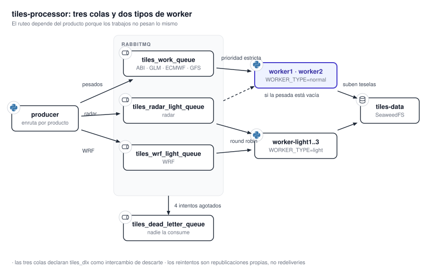
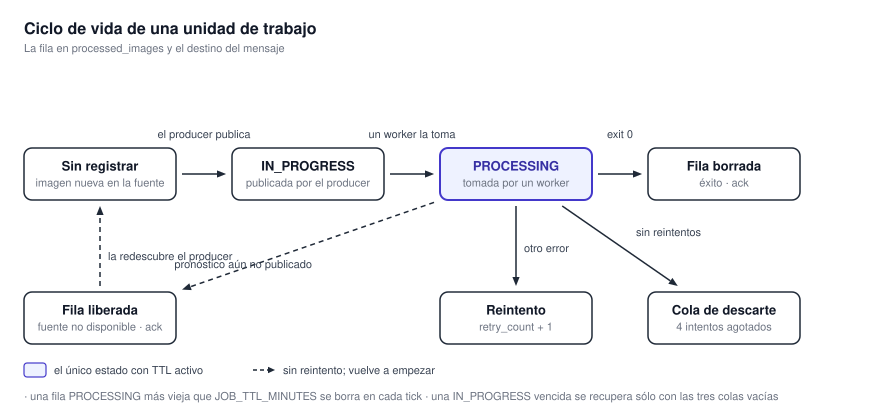

# Tiles Processor

`tiles-processor` es el motor de generación del sistema: descarga datos meteorológicos crudos de
fuentes heterogéneas, les aplica las transformaciones geográficas y científicas de cada producto, y
deposita tiles WebP, GeoTIFF optimizados para la nube (COG) y capas GeoJSON en el almacén de objetos.
Es un sistema distribuido productor-consumidor y el componente que más recursos consume.

{ .diagram loading=lazy }

## Modos de ejecución

Un solo punto de entrada, `src/main.py`, despacha sobre el primer argumento.

| Comando | Qué levanta |
|---|---|
| `python3 src/main.py producer` | El scheduler de descubrimiento |
| `python3 src/main.py worker` | Un worker; el tipo lo decide `WORKER_TYPE` |
| `python3 src/main.py metrics-api` | La API de métricas de FastAPI en el puerto `6020` |
| `python3 src/main.py migrate` | Aplica las migraciones y termina |

!!! warning "El `CMD` por defecto de la imagen es un modo inexistente"
    El `Dockerfile` termina con `CMD ["python3", "src/main.py", "process_band_13"]`, y ese modo ya no
    existe: `main.py` sólo conoce los cuatro de arriba. Nunca se nota porque todos los servicios de
    la compose sobreescriben `command:`, pero correr la imagen sin argumentos imprime el uso y sale
    con código 1.

## Anatomía de un procesador

El contrato del framework es más delgado de lo que sugiere el tamaño del catálogo. La clase base
`ImageProcessor` declara **un solo** método abstracto:

```python
async def process(self, downloaded_file_path, work_unit)
```

Todo lo demás que ofrece la base es infraestructura: el chequeo de apagado entre etapas, el
cronómetro por etapa, el volcado de métricas, el directorio de trabajo por intento y su limpieza.

El verdadero método plantilla vive un nivel más abajo, en las clases por familia. `GoesProcessor` es
el caso de referencia y define la secuencia que reutilizan sus variantes: georreferenciación,
conversión a temperatura de brillo, reproyección y recorte, escritura del COG, coloreado a GeoTIFF
RGBA, generación de la pirámide con `gdal2tiles`, subida y limpieza. Cada uno de esos pasos es un
punto de extensión que una subclase puede reemplazar sin reescribir `process`.

!!! note "Los nombres de clase no son los identificadores del registro"
    `Band13Processor` y `Band9Processor` existen en el código pero **no están registrados**: tanto
    `goes_band_13` como `goes_band_9` resuelven a `GoesProcessor` a secas. El comportamiento por
    banda viene enteramente de `BandConfig` —rango de valores, paleta, prefijos S3—, no de la
    subclase. La única banda del ABI con subclase propia es `goes_band_2`.

## El catálogo

Once identificadores de procesador están registrados. Los que producen tiles y los que no:

| `processor_id` | Entrada | Transformación | Salidas |
|---|---|---|---|
| `goes_band_13` | ABI L1b NetCDF | Radiancia a temperatura de brillo por Planck, paleta de topes nubosos | Tiles + COG |
| `goes_band_9` | ABI L1b NetCDF | Igual, con paleta de vapor de agua | Tiles + COG |
| `goes_band_2` | ABI L1b NetCDF, malla de 500 m | Reflectancia desde el coeficiente de calibración | Tiles + COG |
| `glm_fed` | Directorio de archivos GLM de un minuto | Agregación de la ventana y coloreado logarítmico | Tiles + COG de FED, TOE y MFA |
| `radar` | HDF5 de SINARAME | Lectura con PyART, mapeo polar a cartesiano por vecino más cercano | Tiles + COG por radar, variable, elevación e instante |
| `wrf` | NetCDF de WRF-ARG4K | Variable primaria, conversión de unidades, reproyección con GCP | Tiles, COG primario y secundarios, contornos y barbas |
| `ecmwf_tp_processor` | GRIB de ECMWF | Diferencial de acumulación de 6 h, metros a milímetros | Tiles + COG |
| `ecmwf_mslp_processor` | GRIB de ECMWF | Pascales a hectopascales, suavizado e isobaras cada 5 hPa | **COG + GeoJSON, sin tiles** |
| `gfs_mslp` | GRIB2 de GFS | MSLET y espesor 1000/500 hPa | **COG + GeoJSON, sin tiles** |
| `gfs_upper_level` | GRIB2 de GFS | Velocidad del viento, contornos de geopotencial, isotermas y barbas en 500 hPa | Tiles + COG + GeoJSON |
| Descargadores de GRIB | Endpoints de ECMWF y NOMADS | Sólo descarga y reparto | GRIB cacheado en el bucket |

### Variables de radar

| Producto | Campo PyART | Subvolumen | Unidad |
|---|---|---|---|
| `DBZH` | `reflectivity` | 01 | dBZ |
| `ZH` | `reflectivity` | 01 | dBZ |
| `TH` | `total_power` | 01 | dBZ |
| `VRAD` | `velocity` | **02** | m/s |
| `WRAD` | `spectrum_width` | **02** | m/s |
| `RHOHV` | `cross_correlation_ratio` | 01 | — |
| `ZDR` | `differential_reflectivity` | 01 | dB |
| `KDP` | `specific_differential_phase` | 01 | °/km |
| `PHIDP` | `differential_phase` | 01 | ° |

!!! note "Las tres elevaciones son índices, no ángulos"
    El procesador fija los barridos `(0, 1, 2)`, que son **índices** dentro del archivo. El ángulo
    real se lee de `fixed_angle` por archivo y sólo se registra en el log. El segmento de la ruta S3
    es `elev0`, `elev1`, `elev2`.

### Productos de WRF-ARG4K

| `product_id` | Variable primaria | Nivel | Unidad |
|---|---|---|---|
| `Colmax` | `mdbz` | — | dBZ |
| `Rafagas` | `gust10` | — | kt |
| `Campo900hPa` | `q` | 900 hPa | g/kg |
| `Precipitacion1h` | `pp01H` | — | mm |
| `MUCAPE` | `mcape` | — | J/kg |
| `AguaPrecipitable` | `pw` | — | mm |
| `JetCapasBajas` | `v` | 850 hPa | kt |
| `CortanteNivelesBajos` | `shear_s1_s2` | — | kt |
| `CAPE_BRN` | `mcape` | — | J/kg |
| `Granizo` | `ship` | — | — |

### Productos de GFS

| `product_id` | Segmento de prefijo | Procesador |
|---|---|---|
| `mslp` | `mean_sea_level_pressure` | `gfs_mslp` |
| `500` | `500hpa` | `gfs_upper_level` |
| `250` | `250hpa` | `gfs_upper_level` |

!!! note "Implementado no es lo mismo que habilitado"
    El catálogo de arriba describe lo que el código sabe hacer. Qué se genera en un despliegue
    concreto lo decide `settings.json`, mediante el interruptor `sources.<fuente>.products.<id>` de
    cada producto y, en el caso del radar, además la lista de estaciones. La configuración versionada
    tiene todos los productos habilitados, pero es habitual que un entorno la recorte para acotar el
    consumo de recursos: conviene mirar el archivo del despliegue, no dar por sentado el catálogo
    completo.

## Memoria: por qué existe la división de colas

!!! warning "La banda 2 es la que fuerza el diseño"
    La malla de disco completo de la banda 2 del ABI es de 21696 × 21696 píxeles, unos 470 millones
    de puntos. Decodificarla con las convenciones CF a float64 costaría del orden de 3,7 GB, y por eso
    el procesador la carga como enteros de 16 bits sin escalar, promedia en bloques de 4 × 4 y recién
    entonces aplica escala y offset; además baja `GDAL_PROCESSES` a 1. El pico queda cerca de 1,2 GB.
    Una subclase que llame a la función de módulo en vez del método sobreescrito se saltea la
    mitigación y se queda sin memoria.

Esa asimetría —unos pocos trabajos carísimos contra cientos de trabajos baratos— es la razón de las
colas livianas: sin ellas, el sistema tendría que limitar la concurrencia global al peor caso y no
alcanzaría a drenar el volumen de radar y WRF.

## Estado y deduplicación

{ .diagram loading=lazy }

Una base SQLite con la tabla `processed_images` evita encolar dos veces el mismo trabajo. El producer
marca `IN_PROGRESS` **antes** de publicar; el worker pasa la fila a `PROCESSING` al tomarla, lo que
rearma el TTL; al terminar bien, la fila se borra.

Dos limpiezas la mantienen sana, ambas a cargo del producer: las filas en `PROCESSING` más viejas que
`JOB_TTL_MINUTES` se borran en cada tick, y las filas en `IN_PROGRESS` vencidas se recuperan **sólo
si las tres colas están vacías**, para que un backlog de arranque en frío no se confunda con trabajo
huérfano. Si la lectura de profundidad de una cola falla, la recuperación no ocurre.

## Retención

La expiración se aplica como reglas de ciclo de vida de S3, una por prefijo, derivadas de
`settings.json` y aplicadas por cada worker al arrancar.

| Prefijo | Días |
|---|---|
| `tiles/band_`, `cog/band_` | 1 |
| `tiles/glm_`, `cog/glm_` | 1 |
| `tiles/radar`, `cog/radar` | 1 |
| `tiles/wrf`, `cog/wrf`, `geojson/wrf` | 2 |
| `tiles/models/ecmwf`, `cog/models/ecmwf`, `geojson/models/ecmwf` | 2 |
| `grib/models/ecmwf` | 1 |
| `tiles/models/gfs`, `cog/models/gfs`, `geojson/models/gfs`, `grib/models/gfs` | 1 |

!!! warning "Cambiar la retención no afecta lo ya escrito"
    SeaweedFS estampa el TTL en el momento de la escritura, así que modificar `retention_days` sólo
    alcanza a los objetos futuros. Los que ya están en disco conservan el que tenían, o ninguno.

## Comandos

| Comando | Qué hace |
|---|---|
| `make up` | Levanta la compose de desarrollo |
| `make prod` | Levanta la compose de producción |
| `make metrics-api` | Levanta sólo la API de métricas |
| `make test` | Corre pytest **en el host**, no en Docker |
| `make clean` | Borra los volúmenes del proyecto |
| `make precommit` | `pre-commit run --all-files` |
| `./scripts/generate-compose.sh [--dev] [--light N] <workers>` | Regenera las compose |

Ver también [Configuración y variables](../referencia/configuracion.md) y
[Almacenamiento y colas](../referencia/almacenamiento.md).

!!! warning "Sin verificar"
    Tres discrepancias del repositorio quedaron sin resolver, y conviene conocerlas antes de
    perseguirlas:

    - `migrations/README.md` describe un servicio `migrate` de un solo uso que condicionaría al resto
      de la compose. Ese servicio no existe en las compose generadas: cada modo aplica sus
      migraciones en proceso al arrancar. No pudo determinarse cuál de las dos descripciones es la
      vigente.
    - `scripts/seaweedfs_start.sh` menciona una variable `TILE_LIFECYCLE_RETENTION_DAYS` como origen
      de las reglas de retención. Esa variable no existe: la retención sale de `settings.json`.
      Parece un nombre que quedó viejo, pero no está confirmado.
    - `src/healthcheck.py` implementa una verificación por archivo de latido. Ningún `healthcheck` de
      las compose ni del `Dockerfile` lo invoca —todos usan una petición HTTP—, así que aparenta ser
      código muerto, pero no se confirmó si está reservado para algún uso.

!!! warning "Sin verificar"
    La poda de la base de métricas corre con el cron fijo `0 * * * *`, escrito en el código y no
    expuesto en `settings.json` junto al cron de descubrimiento. No pudo determinarse si la asimetría
    es deliberada.
