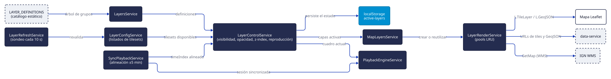

# Visualizer

`visualizer` es la aplicación con la que trabaja el pronosticador: una SPA de Angular 21 que dibuja
las capas sobre un mapa Leaflet, ofrece las herramientas de análisis, permite emitir avisos y aloja
tanto los tableros de estado como esta documentación.

{ .diagram loading=lazy }

## Rutas

| Ruta | Componente | Para qué |
|---|---|---|
| `/` | `HomeComponent` | El mapa y toda la interacción |
| `/docs`, `/docs/**` | `DocsComponent` | Esta documentación, embebida en un iframe |
| `/status/processing` | `DashboardComponent` | Métricas de `tiles-processor` |
| `/status/cache` | `DataDashboardComponent` | Métricas de `data-service` |
| `/status/basemap` | `BasemapDashboardComponent` | Estado del scraper de mapas base |
| `/status/alerts` | `AlertsDashboardComponent` | Métricas de `alerts-service` |

`/status` sin sufijo redirige a `processing`; cualquier ruta desconocida redirige a `/`.

## El modelo de capas

Una capa es una unión discriminada. Los valores reales del código:

- `LayerType`: `TILE`, `WMS`, `VECTOR`.
- `LayerCategory`: `GOES_19`, `RADAR`, `IGN_WMS`, `ECMWF_TP`, `WEATHER_STATIONS`, `WRF`.

!!! note "No existe una categoría GFS"
    Las capas de GFS usan `LayerCategory.WRF` con `modelId: 'gfs'`. Ambos modelos comparten un
    adaptador de pronóstico, de modo que un único camino de código construye sus URLs e interpreta
    sus etiquetas de corrida. La prueba correcta para «es una capa de modelo» es
    `isForecastModelLayer`, no la categoría.

La jerarquía es `LayerGroup` → `LayerSubgroup` → `Layer`. El catálogo tiene 135 definiciones
repartidas en cinco grupos: **Satélite**, **Radar**, **Modelos**, **Estaciones meteorológicas** e
**IGN Argentina**. Las 90 capas de radar salen de una plantilla: 18 estaciones RMA por 5 productos.

Una sola capa viene activa de fábrica: `ign-provincia`.

## Orden de dibujado

Hay **tres** bandas de z-index, no dos:

| Banda | Rango | Qué contiene |
|---|---|---|
| `BASE` | 1–1000 | Capas de datos: satélite, radar, ECMWF, WRF, GFS |
| `OVERLAY` | 1001–2000 | Capas de referencia: todas las del IGN |
| `POINTS` | 2001–3000 | Capas puntuales: estaciones meteorológicas |

El `zIndex` que guarda cada capa es **relativo dentro de su banda**; el absoluto se calcula sumando el
mínimo de la banda. Arrastrar reordena únicamente dentro de una banda: el orden entre bandas es fijo
y no se puede cambiar desde la interfaz.

## Línea de tiempo

Los cuadros salen del listado de tilesets del producto. Las capas de pronóstico toman los **primeros**
N cuadros y las históricas los **últimos** N. El control de intervalo es en segundos por cuadro, entre
0,1 y 10, con 1 por defecto. La cantidad de cuadros sale de la lista de períodos de cada capa.

La reproducción sincronizada elige como ancla la capa cuyo primer cuadro es más antiguo y alinea las
demás con una tolerancia de ±5 minutos; si no logra alinearlas, bloquea la reproducción en lugar de
mostrar cuadros desfasados.

!!! note "Los sellos de tiempo se muestran en hora local por defecto"
    Los identificadores de tileset **se interpretan** siempre como UTC, pero **se muestran** según la
    preferencia de zona horaria, que viene en «Hora local». UTC es una opción que el usuario activa en
    Configuración.

## Integración con Leaflet

`LayerRenderService` construye la clave de un pool a partir del identificador de la capa y el
tileset, entre otros. La opacidad y el z-index **no** entran en esa clave, y es deliberado: cambiar
sólo la opacidad o el orden reutiliza el mismo objeto Leaflet y se resuelve con `setOpacity` o
`setZIndex`, sin reconstruir nada. Los pools son LRU acotados.

Para que la reproducción sea fluida se agregan al mapa dos cuadros por delante del cursor con
opacidad 0.

Las capas activas se refrescan solas cada 10 segundos. Cinco errores de tile seguidos en una capa
reportan al servicio de salud y levantan una notificación, que se limpia con la primera carga
correcta.

## Persistencia en el navegador

Las claves de `localStorage` llevan la forma `mapasmn.<nombre>@<fecha>`. El sistema de capas escribe
dos: el estado de las capas visibles y los controles compartidos de estaciones. Otras partes de la
aplicación guardan el mapa base, la zona horaria, las unidades, las herramientas de escala y la clave
de API de estaciones.

!!! note "El estado guardado gana sobre el valor por defecto"
    Un usuario que ya usó la aplicación no arranca con `ign-provincia`: arranca con lo que tenía la
    última vez.

## Variables de entorno

!!! warning "Se hornean en la compilación, no se leen en tiempo de ejecución"
    Las variables llegan al bundle por el `DefinePlugin` de webpack. Cambiar
    `DATA_SERVICE_BASE_URL` exige **recompilar**, no reiniciar. Además, en la compose sólo los
    `args:` llegan al bundle de producción; los `environment:` no. Los valores de reserva del
    `custom-webpack.config.js` no coinciden con los de `.env.example`, así que una compilación sin
    variables definidas apunta a destinos distintos de los que sugiere el ejemplo.

Ver [Configuración y variables](../referencia/configuracion.md).

## Prefetch

Dos servicios calientan la caché del navegador para la ventana de animación: uno pide los tiles como
imágenes y otro las instantáneas de estaciones como JSON, descartando el cuerpo. Ninguno retiene
datos en memoria: la caché real es la del navegador. Al cambiar el zoom la cola se vacía, aunque las
descargas ya lanzadas no se pueden cancelar.

## Manejo de errores

No hay un `ErrorHandler` propio. Lo que ve el usuario se reduce a dos cosas: un aviso breve cuando se
cancela el pedido de la clave de estaciones, y un cartel de estado cuando `data-service` no responde,
sondeado cada 10 segundos.

## Documentación embebida

Este sitio se construye con MkDocs Material en la etapa `docs` del `Dockerfile`, se copia a
`public/docs-site` y lo sirve el propio nginx de la aplicación. La ruta `/docs` lo embebe en un
iframe. Como es del mismo origen, el componente mantiene sincronizada la URL de la aplicación
suscribiéndose al observable por página del propio Material, que también cubre las navegaciones
instantáneas; no se inyecta ningún script en la documentación.

## Comandos

| Comando | Qué hace |
|---|---|
| `npm start` | Servidor de desarrollo |
| `npm run build` | Compilación de producción |
| `npm test` | Pruebas unitarias con Vitest |
| `make docs` | Construye la documentación en `public/docs-site` |
| `make docs-serve` | Vista previa de la documentación con recarga en el puerto 8000 |
| `make diagrams` | Vuelve a renderizar los diagramas D2 a SVG |
| `make up` / `make prod` | Compose de desarrollo / producción |

!!! note "`make docs` antes de `npm start`"
    `public/docs-site` está en `.gitignore`. Sin haber corrido `make docs` al menos una vez, la ruta
    `/docs` devuelve 404 en desarrollo.

!!! warning "Sin verificar"
    `APP_HOST_PORT` se inyecta en el bundle junto con el resto de las variables y está declarada en
    los tipos, pero ninguna fuente TypeScript la lee. No pudo determinarse si quedó de una versión
    anterior o si se reserva para un uso futuro.
