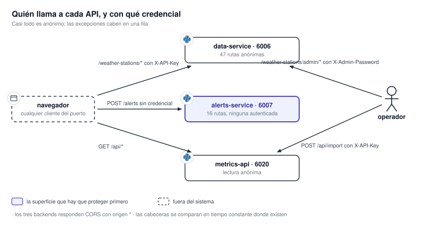

# 12.1 API HTTP

Tres servicios exponen HTTP y **el navegador es el único cliente de los tres**. Esta página lista las
rutas tal como están en el código, con parámetros, códigos de error y autenticación. Es una
referencia: **se consulta, no se lee de corrido**.

{ .diagram loading=lazy }

!!! warning "Tres rutas de resumen con el mismo nombre en tres hosts"
    `data-service` y `alerts-service` exponen `/metrics/summary`, y `tiles-processor` expone
    `/api/summary` en el puerto `6020`. **Son tres APIs distintas con esquemas distintos.** **Antes de
    depurar, confirmar contra qué host se habla.**

**Todas las rutas responden `422` ante una violación de validación.** Abajo sólo figuran los errores
propios de cada ruta. **Los tres servicios responden CORS con origen `*`**, sin credenciales.

## data-service

Base: `DATA_SERVICE_BASE_URL`, puerto `6006` en el ejemplo. **Todo es anónimo salvo las estaciones.**

### Generales

| Método | Ruta | Respuesta |
|---|---|---|
| `GET` | `/` | `{"status":"ok","service":"data-service"}` |
| `GET` | `/health` | `{"status":"running"}`. **No comprueba Redis ni el almacén.** |

### Satélite

**El router de satélite se queda con la ruta comodín `/products/{product_id}`.** El único producto es
`goes-19`, con los instrumentos `abi` y `glm`.

| Método | Ruta | Parámetros | Errores |
|---|---|---|---|
| `GET` | `/products/{product_id}` | — | `404` |
| `GET` | `/products/{product_id}/{instrument_id}` | — | `404` |
| `GET` | `/products/{product_id}/{instrument_id}/{channel_id}` | `If-None-Match` | `304`, `404` |
| `GET` | `/products/{p}/{i}/{c}/{tileset_id}/{z}/{x}/{y}.webp` | `If-None-Match` | `304`, `400` zoom fuera de rango, `404` tesela inexistente |
| `GET` | `/products/{p}/{i}/{c}/{tileset_id}/point` | `lat`, `lon` | `404` |

### Radar

| Método | Ruta | Parámetros | Errores |
|---|---|---|---|
| `GET` | `/products/radar` | — | — |
| `GET` | `/products/radar/{radar_id}` | — | — |
| `GET` | `/products/radar/{radar_id}/{variable_id}` | — | — |
| `GET` | `/products/radar/{radar_id}/{variable_id}/{elevation_id}` | — | — |
| `GET` | `/products/radar/{r}/{v}/{e}/{tileset_id}/{z}/{x}/{y}.webp` | `If-None-Match` | `304`; **una tesela ausente devuelve `200` transparente** |
| `GET` | `/products/radar/{r}/{v}/{e}/{tileset_id}/point` | `lat`, `lon` | `404` |

### ECMWF

| Método | Ruta | Parámetros | Errores |
|---|---|---|---|
| `GET` | `/products/ecmwf/total-precipitation` | `If-None-Match` | `304` |
| `GET` | `/products/ecmwf/total-precipitation/{forecast_ts}` | `If-None-Match` | `304`, `404` |
| `GET` | `/products/ecmwf/total-precipitation/{forecast_ts}/{period_ts}/{z}/{x}/{y}.webp` | `If-None-Match` | `304`, `400` zoom fuera de 3–7, `404` |
| `GET` | `/products/ecmwf/total-precipitation/{forecast_ts}/{period_ts}/point` | `lat`, `lon` | `404` |
| `GET` | `/products/ecmwf/mean-sea-level-pressure` | `If-None-Match` | `304` |
| `GET` | `/products/ecmwf/mean-sea-level-pressure/{forecast_ts}` | `If-None-Match` | `304`, `404` |
| `GET` | `/products/ecmwf/mean-sea-level-pressure/{forecast_ts}/{timestamp_ts}.json` | `If-None-Match` | `304`, `404` |
| `GET` | `/products/ecmwf/mean-sea-level-pressure/{forecast_ts}/{timestamp_ts}/point` | `lat`, `lon` | `404` |

**La presión a nivel del mar no tiene teselas**: son isobaras en GeoJSON.

### WRF

| Método | Ruta | Parámetros | Errores |
|---|---|---|---|
| `GET` | `/products/wrf/{product_id}` | `If-None-Match` | `304` |
| `GET` | `/products/wrf/{product_id}/{init_tag}` | `If-None-Match` | `304`, `404` |
| `GET` | `/products/wrf/{product_id}/{init_tag}/{fxxx}/point` | `lat`, `lon` | `404` |
| `GET` | `/products/wrf/{product_id}/{init_tag}/{fxxx}/secondary/{variable}/point` | `lat`, `lon` | `404` |
| `GET` | `/products/wrf/{product_id}/{init_tag}/{fxxx}/{layer}.json` | `If-None-Match` | `304`, `404` |
| `GET` | `/products/wrf/{product_id}/{init_tag}/{fxxx}/barbs/{z}/{x}/{y}.json` | `If-None-Match` | `304`, `400` si `z` no está en 2, 4, 6, 8, 10, 12; ausencia devuelve `200` con colección vacía |
| `GET` | `/products/wrf/{product_id}/{init_tag}/{fxxx}/{z}/{x}/{y}.webp` | `If-None-Match` | `304`, `400` zoom fuera de 4–9; ausencia devuelve `200` transparente |

### GFS

**Mismas formas que WRF, con `{cycle}` en lugar de `{init_tag}`.** Zoom de teselas de 3 a 7; barbas en
`z` 2, 4, 6 y 8.

| Método | Ruta | Errores |
|---|---|---|
| `GET` | `/products/gfs/{product_id}` | `304`, `404` |
| `GET` | `/products/gfs/{product_id}/{cycle}` | `304`, `404` |
| `GET` | `/products/gfs/{product_id}/{cycle}/{fxxx}/point` | `404` |
| `GET` | `/products/gfs/{product_id}/{cycle}/{fxxx}/secondary/{variable}/point` | `404` |
| `GET` | `/products/gfs/{product_id}/{cycle}/{fxxx}/{layer}.json` | `304`, `404` |
| `GET` | `/products/gfs/{product_id}/{cycle}/{fxxx}/barbs/{z}/{x}/{y}.json` | `304`, `400` |
| `GET` | `/products/gfs/{product_id}/{cycle}/{fxxx}/{z}/{x}/{y}.webp` | `304`, `400` |

!!! note "Las faltas llevan su propio ETag"
    Las teselas y barbas de radar, WRF, GFS y mapas base emiten **un ETag distinto para la falta**,
    con vida corta. Si acierto y falta compartieran ETag, **un cliente que cacheó un hueco lo
    revalidaría contra sí mismo y recibiría `304` para siempre**.

### Mapas base

| Método | Ruta | Errores |
|---|---|---|
| `GET` | `/basemap/providers` | — |
| `GET` | `/basemap/{provider_id}/{z}/{x}/{y}.png` | `304`, `404` proveedor desconocido, `503` sin configurar; ausencia devuelve `200` transparente |

**Esta ruta anónima escribe**: cada tesela traída del proveedor se guarda en Redis y en el bucket
`basemap-tiles`. Ver [19.1 Superficie expuesta](../seguridad/superficie.md).

### Estaciones meteorológicas

**Las cinco de lectura exigen la cabecera `X-API-Key`.**

| Método | Ruta | Parámetros | Errores |
|---|---|---|---|
| `GET` | `/weather-stations/latest` | — | `401`, `503` |
| `GET` | `/weather-stations/tilesets` | — | `401`, `503` |
| `GET` | `/weather-stations/stations` | — | `401`, `503` |
| `GET` | `/weather-stations/station/{station_id}/series` | `hours`; **el valor por defecto es también el máximo** | `401`, `422`, `503` |
| `GET` | `/weather-stations/{tileset_id}` | `grace_period_hours` (0–48) | `400`, `401`, `404`, `503` |

**Las cuatro de administración usan `X-Admin-Password`, comparada en tiempo constante**:

| Método | Ruta | Éxito | Errores |
|---|---|---|---|
| `POST` | `/weather-stations/admin/keys` | `201` con el secreto **una única vez** | `401`, `503`, `500` |
| `POST` | `/weather-stations/admin/keys/add-custom` | `201` | `401`, `409` secreto ya en uso, `503`, `500` |
| `GET` | `/weather-stations/admin/keys` | `200`, sin secretos | `401`, `503`, `500` |
| `DELETE` | `/weather-stations/admin/keys/{key_id}` | `204` | `401`, `404` |

### Métricas y sincronización

| Método | Ruta | Parámetros |
|---|---|---|
| `GET` | `/metrics/summary` | — |
| `GET` | `/metrics/sync/status` | — |
| `GET` | `/metrics/sync/history` | `hours` (24), `bucket` (`hour`, `day`, `10min`), `domain` |
| `GET` | `/metrics/sync/cycles` | `hours` (24), `domain`, `limit` (200, hasta 200000; `0` es sin límite), `since`, `before` |
| `GET` | `/metrics/redis/memory` | — |
| `GET` | `/metrics/redis/memory/history` | `hours` (168), `domain` |
| `GET` | `/metrics/redis/info` | `live` (falso) |
| `GET` | `/metrics/redis/info/history` | `hours` (168) |
| `GET` | `/metrics/basemap/providers` | — |
| `GET` | `/sync/status` | — |

!!! note "`/sync/status` es la que informa la sincronización"
    `/metrics/summary` y `/metrics/sync/status` leen una clave de Redis **que nadie escribe** y
    devuelven los valores por defecto de su modelo. **El estado real por dominio está en
    `/sync/status`.** Ver [18. Observabilidad](../operacion/observabilidad.md).

## alerts-service

Base: `ALERTS_SERVICE_BASE_URL`, puerto `6007` en el ejemplo. **Ninguna ruta pide credenciales.**

| Método | Ruta | Parámetros y cuerpo | Éxito | Errores |
|---|---|---|---|---|
| `GET` | `/` | — | `200` | — |
| `GET` | `/health` | — | `200` | — |
| `POST` | `/intersect/country` | `detail_level` 1–5 (5); cuerpo GeoJSON | `200` FeatureCollection | `400` geometría inválida, `500` capa ausente |
| `POST` | `/intersect/departments` | Cuerpo GeoJSON | `200` `{departments: [...]}` | `400`, `500` |
| `GET` | `/intersect/layer-refresh-history` | `limit` (20, 1–100) | `200` | — |
| `POST` | `/alerts` | `{phenomenon_code, geojson}` | **`202`** con `job_id` | `400` fenómeno inválido, `413` polígono demasiado grande, `503` cola llena |
| `GET` | `/alerts/jobs/{job_id}` | — | `200` con el estado | `404` |
| `GET` | `/alerts/phenomena` | — | `200`, 28 entradas | `500` |
| `GET` | `/alerts/limits` | — | `200` `{max_vertex_count}` | `500` |
| `GET` | `/alerts/pending` | `since_id`, `If-None-Match` | `200` con `ETag`, o `304` | `500` |
| `GET` | `/alerts` | `since_id`, `If-None-Match` | `200` con `ETag`, o `304` | `500` |
| `GET` | `/alerts/{filename}` | — | `200` GIF | `404` |
| `GET` | `/metrics/summary` | `hours` (24) | `200` | — |
| `GET` | `/metrics/jobs` | `hours` (24), `limit` (200, hasta 5000) | `200` | — |
| `GET` | `/metrics/jobs/history` | `hours` (168), `bucket` (`hour`, `day`) | `200` | — |
| `GET` | `/metrics/processor/history` | `hours` (168) | `200`; lista vacía si las métricas están apagadas | — |
| `GET` | `/metrics/layers` | `limit` (20, 1–200) | `200` | — |

`/alerts/{filename}` no es una ruta del router: es un **montaje de archivos estáticos** sobre el
directorio de salida, **registrado después del router, así que las rutas ganan**.

!!! warning "El cuerpo del `413` no tiene `detail`"
    Cuando el polígono excede el límite de vértices, la respuesta es literalmente
    `{"max_vertex_count": N}`. **Un cliente que busque `detail` no encontrará el mensaje.**

!!! note "Dos ETag con semánticas distintas"
    `/alerts/pending` calcula el suyo como `"<cantidad>-<id máximo>"` y **detecta altas y bajas**.
    `/alerts` usa sólo el id máximo: **no se invalida cuando un aviso vence**, sólo cuando aparece
    uno nuevo.

Los errores de intersección devuelven el texto de la excepción en `detail`, **incluida la ruta del
archivo ausente** en el caso `500`. Ver [19.1 Superficie expuesta](../seguridad/superficie.md).

## tiles-processor — API de métricas

Base: `METRICS_SERVICE_BASE_URL`, puerto `6020`. Ver [18. Observabilidad](../operacion/observabilidad.md).

| Método | Ruta | Parámetros | Autenticación |
|---|---|---|---|
| `GET` | `/` | — | — |
| `GET` | `/health` | — | — |
| `GET` | `/api/summary` | `hours` | — |
| `GET` | `/api/jobs` | `limit` (50, 0–1000), `offset`, `type`, `outcome`, `hours`, `since`, `before` | — |
| `GET` | `/api/throughput` | `bucket` (`hour`, `day`, `10min`), `hours` | — |
| `GET` | `/api/timeseries` | `bucket`, `hours` | — |
| `GET` | `/api/live` | — | — |
| `GET` | `/api/export` | `hours` | — |
| `POST` | `/api/import` | Cuerpo con un volcado | **`X-API-Key`** |

!!! warning "Sin `METRICS_API_KEY` la importación responde `503`, no `401`"
    Con la variable vacía, la ruta de escritura **falla cerrada**. **Sin clave configurada no hay
    forma de autorizar, así que la ruta se declara indisponible.**

**`/api/jobs?limit=0` significa «sin límite» sólo con una ventana temporal**; sin ella se recorta a 1000
filas. `/api/live` devuelve las profundidades de cola en `null` cuando el broker no responde.

## Documentación interactiva

**Los tres servicios publican `/docs` y `/openapi.json` sin restricción.** **Es el catálogo completo
de rutas para cualquiera que alcance el puerto.** Ver [19.3 Endurecimiento](../seguridad/endurecimiento.md).
