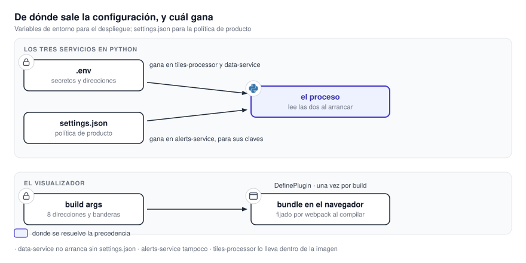

# 12.2 Configuración y variables

Los servicios combinan variables de entorno con archivos `settings.json`. Las variables contienen
credenciales, direcciones y valores propios de cada instalación. Los archivos definen los productos
y las decisiones de funcionamiento que se versionan con el código. La precedencia no es igual en
todos los componentes y se detalla a continuación.

{ .diagram loading=lazy }

!!! warning "Los `.env` reales no se leen ni se copian"
    Los repositorios contienen archivos `.env` con credenciales de verdad. La fuente de esta
    página es `.env.example` de cada uno. Ningún valor real aparece acá ni debe aparecer.

## Cómo se combinan las dos fuentes

| Servicio | `settings.json` | Precedencia | Si falta `settings.json` |
|---|---|---|---|
| `tiles-processor` | Dentro de la imagen | Cada clave admite una variable de entorno; la variable gana | No arranca |
| `data-service` | Dentro de la imagen, en `/settings.json` | Cada clave admite la variable con el mismo nombre en mayúsculas; la variable gana | No arranca: once claves no tienen valor por defecto en el código |
| `alerts-service` | Dentro de la imagen, en `/config/settings.json` | El archivo gana para sus claves; quince de ellas no tienen variable | No arranca |
| `visualizer` | No tiene | Ocho argumentos de construcción, fijados al compilar | No corresponde |

Un valor vacío no siempre es "sin definir". En `data-service`, una variable numérica vacía se
ignora; una de texto vacía se toma como valor. En `alerts-service`, una variable ausente vale cadena
vacía y ninguna es obligatoria por código.

## tiles-processor

Catorce variables son obligatorias: sin ellas el proceso aborta al arrancar.

| Variable | ¿Requerida? | Para qué |
|---|---|---|
| `LOG_LEVEL`, `DATA_DIR` | Sí | Nivel de registro; raíz de datos dentro del contenedor |
| `S3_TILES_DATA_ENDPOINT`, `S3_TILES_DATA_BUCKET_NAME` | Sí | Puerta S3 y bucket de salida. La plantilla de producción fija `seaweedfs:8333` a mano. |
| `S3_TILES_DATA_TILES_PROCESSOR_USER` / `_PASSWORD` | Sí | Identidad de escritura en el bucket |
| `RABBITMQ_HOST`, `RABBITMQ_PORT`, `RABBITMQ_USER`, `RABBITMQ_PASSWORD` | Sí | El broker. `RABBITMQ_HOST` falta en `.env.example`; la aporta la plantilla como `rabbitmq`. |
| `RABBITMQ_QUEUE`, `RABBITMQ_DLQ`, `RABBITMQ_DLX` | Sí | Cola pesada, cola e intercambio de descarte |
| `JOB_TTL_MINUTES` | Sí | Vencimiento de una unidad en curso |
| `S3_TILES_DATA_SECURE` | No (`false`) | HTTPS hacia el almacén |
| `RABBITMQ_RADAR_LIGHT_QUEUE`, `RABBITMQ_WRF_LIGHT_QUEUE` | No | Colas livianas; tienen nombre por defecto |
| `WORKER_TYPE` | No (`normal`) | `normal` o `light` |
| `WORKER_CONCURRENCY` | No (2) | Unidades simultáneas por worker |
| `WORKER_ID` | No (nombre del host) | Atribución en las métricas |
| `S3_UPLOAD_CONCURRENCY`, `S3_HEAVY_UPLOAD_CONCURRENCY`, `S3_LARGE_UPLOAD_CONCURRENCY` | No (32, 16, 4) | Carriles de subida al bucket |
| `S3_LARGE_OBJECT_THRESHOLD_MB`, `S3_HEAVY_READ_TIMEOUT_S` | No (6, 120) | Corte entre carriles y tiempo de espera de las subidas pesadas |
| `HEALTH_PORT`, `METRICS_API_PORT` | No (8080, 6020) | Puertos internos |
| `METRICS_API_KEY` | No | Clave de `POST /api/import`. Vacía, la ruta responde `503`. |
| `ECMWF_OPENDATA_SOURCES` | No (`ecmwf,azure,aws`) | Espejos en orden de preferencia |
| `ECMWF_TP_SMOOTHING_RESOLUTION_DEG`, `GFS_TILE_SMOOTHING_RESOLUTION_DEG` | No (0.01) | Remuestreo; `0` lo desactiva |
| `GFS_SUBSET_ENDPOINT` | Sí si GFS está activo | Endpoint de recorte GRIB de NOAA |
| `{GOES19_ABI,GOES19_GLM,RADAR_SINARAME,WRF_ARG4K,ECMWF_IFS,GFS}_S3_ACCESS_KEY` / `_SECRET_KEY` | No | Credenciales de los buckets de entrada. Sin definir, acceso anónimo; a medias, el arranque falla. |

Las siguientes no las lee el proceso: las consumen el script de arranque del almacén o la
plantilla. Todas menos las de Prometheus son obligatorias para que el almacén arranque.

| Variable | Quién la usa |
|---|---|
| `S3_ROOT_USER` / `_PASSWORD` | Identidad raíz del almacén y su panel de administración |
| `S3_TILES_DATA_DATA_SERVICE_USER` / `_PASSWORD` | Identidad que usa `data-service` para leer |
| `S3_INTERSECTION_DATA_BUCKET_NAME`, `S3_INTERSECTION_DATA_ALERTS_SERVICE_USER` / `_PASSWORD` | Bucket e identidad de `alerts-service` |
| `S3_BASEMAP_BUCKET_NAME` | Bucket de mapas base, creado por el almacén |
| `S3_TILES_DATA_PORT`, `RABBITMQ_MGMT_PORT` | Puertos publicados en el host |
| `SEAWEEDFS_METRICS_ADDRESS`, `PROMETHEUS_PUSHGATEWAY_HTTP_PROTO` / `_USER` / `_PASS` | Envío opcional de métricas del almacén a un Pushgateway |
| `GDAL_CACHEMAX`, `CPL_VSIL_CURL_CACHE_SIZE` | Cachés de GDAL en los workers, en megabytes y bytes |

### `settings.json`

| Clave | Controla |
|---|---|
| `timezone`, `bounds` | Zona del planificador; recuadro de recorte en EPSG:4326 |
| `scheduler.discovery_cron` | Cadencia del descubrimiento, `*/5 * * * *` |
| `metrics.enabled`, `metrics.max_rows` | Registro de métricas y tope de filas |
| `sources.<fuente>.products.<id>` | Qué productos se generan |
| `sources.<fuente>.input.mode` | `local` o `s3` |
| `sources.<fuente>.zoom_levels`, `retention_days` | Rango de zoom y días de retención por prefijo |
| `sources.{radar-sinarame,wrf-arg4k}.light_queue` | Qué productos van a las colas livianas |
| `sources.goes19-abi.max_hours_back`, `sources.gfs.max_steps_per_tick` | Cuánto mira hacia atrás; cuántos pasos por pasada |

## data-service

El proceso lee 122 nombres de variable. Casi todos son ajustes finos con valor por defecto. Los que
deciden si el servicio arranca y funciona:

| Variable | ¿Requerida? | Para qué |
|---|---|---|
| `S3_TILES_DATA_ENDPOINT`, `S3_TILES_DATA_ACCESS_KEY`, `S3_TILES_DATA_SECRET_KEY`, `S3_TILES_DATA_BUCKET_NAME` | Sí | Sin ellas no hay sincronización ni claves de estaciones. El ejemplo trae `host.docker.internal:9000`. |
| `REDIS_URL` | Sí | La caché. Sin ella, todo sale por el bucket. |
| `WEATHER_STATIONS_ADMIN_PASSWORD` | Sí con la autenticación de estaciones encendida | Cabecera `X-Admin-Password` |
| `SMN_API_USERNAME` / `_PASSWORD` | Sí con `WEATHER_STATIONS_SYNC_MODE=full` | Credenciales de la API del SMN |
| `WEB_CONCURRENCY` | Sí, como argumento de construcción | Procesos de uvicorn. Sin él, el comando queda con `--workers=` vacío. |
| `APP_ROLE` | No (`all`) | `web`, `worker` o `all`. Otro valor aborta. |
| `APP_ENV` | No | Sólo `production` acota la espera del almacén a 120 s. |
| `LOG_LEVEL` | No (`INFO`) | Nivel de registro |
| `SYNC_MODE` | No (`full` en `settings.json`) | Cualquier valor distinto de `full` apaga la sincronización sin avisar. |
| `S3_TILES_DATA_SECURE` | No (`false`) | HTTPS hacia el almacén |
| `S3_BASEMAP_BUCKET_NAME`, `S3_WEATHER_STATIONS_BUCKET_NAME`, `S3_API_KEYS_BUCKET_NAME` | No | Nombres de los tres buckets propios |
| `SMN_API_BASE_URL` | No | El valor por defecto es el entorno de prueba del SMN. |
| `SMN_STATIONS_REGISTRY_URL` | No | El padrón de estaciones, por HTTP plano |
| `SMN_API_LOG_REQUESTS` | No (`false`) | Diagnóstico ruidoso; las credenciales van redactadas |
| `BASEMAP_<PROVEEDOR>_URL` | Sí por proveedor XYZ habilitado | Ocho plantillas: `ARGENMAP`, `ARGENMAPGRIS`, `ARGENMAPOSCURO`, `ARGENMAPTOPOGRAFICO`, `SATELLITE`, `TOPOGRAPHIC`, `GOOGLESATELLITE`, `OCEANBASE`. Sin definir, el proveedor se salta. |
| `WEATHER_STATIONS_API_KEY_AUTH_ENABLED` | No (`true`) | En `false`, las cinco rutas de estaciones quedan abiertas. |
| `WEATHER_STATIONS_SYNC_MODE` | No (`full`) | `full` o `disabled` |
| `BASEMAP_SYNC_MODE` | No (`no_cache` en `settings.json`) | `full`, `on_demand`, `no_cache` o `relay_only` |

!!! warning "Las plantillas de los mapas del IGN son TMS, y no lo dicen"
    Los cuatro fondos del IGN usan el esquema TMS, con el eje Y invertido. La plantilla no lo
    expresa en la URL: la inversión la aplica una bandera aparte en la configuración de la capa.
    Copiar una de esas URL a otro cliente sin esa bandera produce un mapa con las filas dadas vuelta.

Los grupos de ajuste fino, todos con valor por defecto y ninguno en `.env.example`:

| Grupo | Variables | Qué ajustan |
|---|---|---|
| `S3_*` | 5 | Concurrencia de descargas, tiempos de espera, reintentos, teselas en vuelo |
| `SYNC_*`, `*_TILE_TTL`, `*_TO_KEEP`, `*_SYNC_INTERVAL_SECONDS`, `*_SYNC_TIMEOUT_SECONDS` | 26 | Cadencia de cada bucle, vencimientos en Redis, corridas retenidas |
| `BASEMAP_*` | 34 | Recorrido de respaldo: recuadro, concurrencia, retrocesos, cortacircuitos, vencimientos |
| `WEATHER_STATIONS_*` | 24 | Cadencia del padrón, tiempos de espera, vencimientos en Redis, ventana de series |
| `METRICS_*`, `REDIS_METRICS_*` | 9 | Retención y muestreo de métricas |
| `GDAL_*`, `CPL_*`, `VSI_*` | 5 | Cachés de lectura remota |

Cada clave de `settings.json` admite la variable con el mismo nombre en mayúsculas y guiones
bajos. El archivo versionado fija `sync.mode`, los vencimientos por dominio, `wrf.inits_to_keep: 3`,
`basemap.sync_mode: no_cache` y la lista de catorce proveedores de mapas base.

!!! note "Concurrencia del sincronizador"
    `WORKER_CONCURRENCY` en la plantilla de `data-service` sólo fija los procesos de uvicorn del
    sincronizador: no es la variable homónima de `tiles-processor`.

## alerts-service

Ninguna variable es obligatoria por código: una ausente vale cadena vacía. Lo que falta se nota
después, en la primera operación que la necesita.

| Variable | Para qué |
|---|---|
| `APP_ENV`, `LOG_LEVEL` | Entorno y nivel de registro |
| `SETTINGS_FILE` | Ruta del `settings.json`, `/config/settings.json` en la imagen. Si no existe, el arranque falla. |
| `DATA_DIR` | Raíz de las bases SQLite. `/app/data` por defecto; no está en el ejemplo ni en la plantilla. |
| `MYSQL_HOST`, `_PORT`, `_DATABASE`, `_USER`, `_PASSWORD` | La base donde escribe el aviso |
| `MYSQL_TAVISO_HOST`, `_PORT`, `_DATABASE`, `_USER`, `_PASSWORD` | La base de la que lee la tabla definitiva. En el ejemplo apunta al mismo contenedor. |
| `MANAGE_DB_SCHEMAS` | Habilita las migraciones MySQL. El ejemplo la trae en `true`. |
| `MYSQL_ROOT_HOST`, `MYSQL_ROOT_PASSWORD`, `MYSQL_READONLY_USER` / `_PASSWORD`, `MYSQL_READONLY_MAX_CONNECTIONS` / `_PER_HOUR` | Las consume el contenedor de MySQL, no el servicio |
| `S3_ENDPOINT`, `S3_ACCESS_KEY`, `S3_SECRET_KEY`, `S3_BUCKET_NAME`, `S3_SECURE` | Respaldo de capas. Con el endpoint vacío, desactivado. |
| `COUNTRY_GEOJSON_URL`, `DEPARTMENTS_GEOJSON_URL`, `PROVINCES_GEOJSON_URL` | Los tres WFS del IGN; tienen valor por defecto |
| `OUTPUT_DIR`, `ALERT_CACHE_DIR` | Dónde se escriben los GIF y los índices |
| `JOBS_DB_PATH`, `METRICS_DB_PATH` | Rutas de las bases SQLite; derivan de `DATA_DIR` |
| `APP_HOST_PORT` | El puerto publicado, sólo en la plantilla |

!!! danger "`MANAGE_DB_SCHEMAS` no va en producción"
    Activada, el arranque ejecuta el árbol completo de migraciones contra `MYSQL_HOST`, incluida una
    revisión que trunca `departamentos` y `provincia`. En producción el esquema pertenece al
    DBA del organismo. Ver [19.3 Endurecimiento](../seguridad/endurecimiento.md).

### `settings.json`

Las claves se agrupan por área y el servicio las aplana al cargarlas. Quince no tienen variable de
entorno; se cambian editando el archivo y reconstruyendo la imagen.

| Clave | Controla |
|---|---|
| `layer.update_cron`, `layer.cache_ttl_minutes` | Cron del refresco, `0 3 * * 0`; expiración de la caché de geometrías |
| `alerts.detail_level` | Nivel de la caché de arranque, `7` |
| `alerts.job.workers`, `queue_maxsize`, `timeout_seconds`, `shutdown_seconds` | 2, 16, 150 s y 160 s |
| `alerts.supervisor.interval_seconds` | Cadencia del supervisor, 30 s |
| `metrics.enabled`, `sample_interval_seconds`, `retention_days`, `max_rows` | Métricas del pool |
| `detail_level_tolerances`, `departments_simplify_tolerance`, `ign_simplify_tolerance` | Tolerancias de simplificación |

## visualizer

!!! warning "Son variables de compilación, no de ejecución"
    Llegan al paquete durante `npm run build`. Cambiar cualquiera obliga a reconstruir la
    imagen. En la plantilla sólo cuentan los `args:`; el bloque `environment:` con los mismos
    nombres no hace nada.

| Variable | Para qué | Valor de reserva |
|---|---|---|
| `DATA_SERVICE_BASE_URL` | Base de `data-service` | `https://data.mapasmn.com` |
| `ALERTS_SERVICE_BASE_URL` | Base de `alerts-service` | `http://localhost:8080` |
| `METRICS_SERVICE_BASE_URL` | Base de la API de métricas | `http://localhost:6020` |
| `DOCS_URL` | De dónde carga el marco de documentación | `/docs-site` |
| `SMN_API_PROMPT_FOR_TOKEN` | Si se pide la clave de estaciones al usuario | `true` |
| `APP_HOST_PORT` | El puerto publicado. Ninguna fuente de la aplicación la lee. | `4200` |
| `IGN_PLACE_SEARCH_URL`, `NOMINATIM_SEARCH_URL` | Buscadores de lugares | URL públicas |

Tres reservas discrepan del ejemplo: las bases de datos y avisos, y el puerto. Una compilación
sin variables no apunta a donde sugiere `.env.example`.

## El repositorio de orquestación

`mapasmn` incluye a los cuatro como submódulos y genera cada `.env` a partir de uno solo, con
plantillas por servicio. Es la fuente de configuración de [Beta-1](../operacion/beta-1.md):

- Sus plantillas siguen escribiendo `host.docker.internal:${S3_TILES_DATA_PORT}` para el almacén.
- `DOCS_URL=/docs-site` apunta a la documentación que viaja dentro del visualizador; no existe un
  contenedor ni un puerto de documentación separado.
- Las URL del visualizador se fijan al compilar y tienen que ser alcanzables desde el navegador. Los
  valores `localhost` sirven sólo si navegador y servicios corren en la misma máquina.
- Una revisión del meta-repositorio fija revisiones exactas de los cuatro submódulos. En operación se
  actualizan con `git submodule update --init --recursive`; `make update` avanza a las puntas remotas y
  se reserva para preparar una nueva versión integrada.
