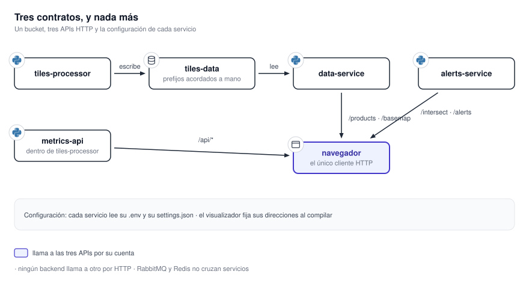

# 12. Contratos entre servicios

Los componentes se integran mediante rutas HTTP, archivos de configuración y nombres acordados para
el almacenamiento y las colas. No importan código de otro repositorio ni comparten una base de datos.
Esta sección registra esos contratos en un solo lugar para poder revisar un cambio antes de desplegar
dos componentes incompatibles.

{ .diagram loading=lazy }

| Sub-capítulo | El contrato | Quiénes lo firman |
|---|---|---|
| [12.1 API HTTP](api.md) | Todas las rutas, sus parámetros, sus errores y su autenticación | Los tres backends, del lado servidor; el navegador, del lado cliente |
| [12.2 Configuración y variables](configuracion.md) | Qué hay que definir, con qué nombre y qué gana cuando hay dos fuentes | Cada servicio con quien lo despliega |
| [12.3 Almacenamiento y colas](almacenamiento.md) | Buckets, prefijos, colas, mensajes y bases locales | `tiles-processor` escribe, `data-service` lee; el resto es interno |

Un cambio en cualquiera de los tres exige coordinar dos repositorios. El más frágil es el trazado
de claves del bucket, porque está duplicado a mano en los dos lados y un desajuste no rompe
nada de forma visible: el productor sigue escribiendo y el lector deja de encontrar lo nuevo.
