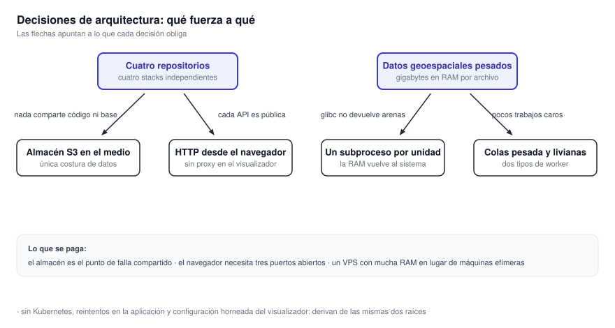

# 9. Decisiones de arquitectura

Por qué el sistema está armado como está. **Casi todas las decisiones derivan de dos raíces**: cuatro
servicios independientes, y datos geoespaciales que pesan gigabytes en memoria. Este capítulo sigue
esas dos raíces hasta sus consecuencias. Conviene leerlo antes de proponer un cambio estructural.

{ .diagram loading=lazy }

## Cuatro servicios independientes

**Contexto.** Los componentes tienen ritmos distintos. Uno procesa archivos pesados por lotes. Otro
atiende peticiones cortas. Otro hace cálculo geométrico bajo demanda. Otro corre en el navegador.

**Decisión.** Cuatro repositorios, cuatro imágenes, cuatro despliegues. **No comparten base de datos
ni código.**

**Consecuencia.** Cada uno escala y se despliega solo. Un problema de memoria en el procesamiento no
afecta la latencia de la API. A cambio, **un cambio de contrato exige coordinar dos repositorios**, y
hay infraestructura duplicada a propósito.

## Un almacén de objetos como costura

**Contexto.** La generación es asíncrona y periódica. El consumo es sincrónico y bajo demanda.

**Decisión.** Un almacén compatible con S3 en el medio. El procesador escribe cuando termina. El
servicio de datos lee cuando alguien mira el mapa.

**Consecuencia.** Los dos ritmos quedan desacoplados sin compartir disco ni base. El costo es que
**el almacén es el único punto de falla compartido**. Su disponibilidad condiciona el arranque del
servicio de datos, que lo comprueba antes de responder.

Lo que corre es SeaweedFS. **El código habla la API de S3**, así que el almacén es reemplazable por
otro compatible. Ver [12.3 Almacenamiento y colas](contratos/almacenamiento.md).

## El broker es interno a un solo servicio

**Contexto.** Sería tentador usar el broker como bus entre los cuatro servicios.

**Decisión.** RabbitMQ existe **solamente dentro de** `tiles-processor`, para su esquema
productor-consumidor. Nadie más publica ni consume.

**Consecuencia.** El contrato entre servicios vive en dos lugares: el almacén y HTTP. **Son fáciles
de inspeccionar y de reemplazar.** El broker es un detalle de un servicio, no una pieza del sistema.

## HTTP directo desde el navegador

**Contexto.** El visualizador se sirve como archivos estáticos.

**Decisión.** El navegador llama directamente al servicio de datos, al de avisos y al de métricas.
**El servidor web del visualizador no hace de proxy.**

**Consecuencia.** No hay un componente extra en el camino de cada tesela. El costo es operativo:
**hay que publicar tres puertos además del visualizador**, y las direcciones se fijan al compilar.

## Un subproceso por unidad de trabajo

**Contexto.** Las bibliotecas geoespaciales fragmentan el montículo. **El proceso no devuelve esa
memoria al sistema operativo.** Un worker de larga vida crecería sin fin, aun sin fugas propias.

**Decisión.** Cada unidad de trabajo corre en un subproceso con tiempo límite. **El proceso se
descarta al terminar.**

**Consecuencia.** La memoria vuelve de verdad. Una unidad que revienta no se lleva al worker. El costo
es arrancar un proceso por unidad, despreciable frente al procesamiento.

Es la decisión menos evidente del sistema. **No hay que deshacerla sin entender el motivo.** Hay una
excepción documentada: los descargadores de GRIB corren en el proceso principal, porque sólo
descargan. Ver [11.1 Tiles Processor](servicios/tiles-processor.md).

## Colas pesadas y colas livianas

**Contexto.** Una captura de la banda visible del satélite cuesta gigabytes. Un producto de radar
cuesta poco y hay cientos por hora.

**Decisión.** Tres colas de trabajo y dos tipos de worker. **Los trabajos caros van a una cola
propia**, que sólo atienden los workers pesados.

**Consecuencia.** El sistema no tiene que limitar la concurrencia global al peor caso. Sin las colas
livianas, no alcanzaría a drenar el volumen de radar y WRF.

## Los workers toman trabajo, no lo reciben

**Contexto.** Una unidad puede tardar minutos, con memoria muy dispar.

**Decisión.** Cada worker pide un mensaje cuando está listo. **No hay ventana de mensajes en vuelo
configurada** en el broker.

**Consecuencia.** Nadie acapara trabajo que no puede procesar. A cambio, **el broker no frena nada**:
la concurrencia la fija la cantidad de workers y su paralelismo interno.

## Reintentos en la aplicación, no en el broker

**Contexto.** La reentrega del broker no deja rastro de cuántas veces reintentó.

**Decisión.** Un fallo vuelve a publicar el mensaje con su contador incrementado. Agotado el
contador, el mensaje va a una cola de descarte.

**Consecuencia.** **La cantidad de intentos es visible** y el descarte es explícito. El panel de estado
puede contar cuántos trabajos se descartaron.

## Una imagen con dos roles

**Contexto.** El servicio de datos tiene que responder con baja latencia y, a la vez, sincronizar.

**Decisión.** Una sola imagen, dos contenedores. `APP_ROLE=web` atiende HTTP. `APP_ROLE=worker`
sincroniza.

**Consecuencia.** La latencia no compite con la CPU de la sincronización. **Los dos roles pueden
estar en máquinas distintas** sin cambiar la imagen. Ver [15. Distribuir el sistema](operacion/distribucion.md).

## El aviso no se escribe en el registro definitivo

**Contexto.** La base donde vive el aviso pertenece al SMN.

**Decisión.** El servicio escribe en una tabla intermedia, marcada como no procesada. Un proceso del
organismo la promueve al registro definitivo.

**Consecuencia.** **Este sistema propone; el organismo dispone.** Es también la razón por la que el
sistema no difunde avisos.

!!! danger "Lo que hay que verificar antes de exponer nada"
    Esa separación protege **sólo si la promoción no es desatendida**. La ruta que crea el aviso
    no pide credencial alguna. Si la promoción es automática, una petición anónima equivale a un
    aviso oficial. Es la primera pregunta de [19.3 Endurecimiento](seguridad/endurecimiento.md).

## La configuración del visualizador se hornea al compilar

**Contexto.** El visualizador es una aplicación de navegador servida como estáticos.

**Decisión.** Las direcciones de los servicios se incrustan en el paquete durante la compilación.

**Consecuencia.** No hace falta un servicio de configuración. **Ningún secreto puede terminar en el
navegador**, porque sólo se inyectan direcciones. El costo sorprende a quien despliega por primera
vez: **cambiar una dirección obliga a reconstruir la imagen.**

## Docker Compose sobre un VPS, sin Kubernetes

**Contexto.** Cuatro stacks, un puñado de contenedores, un equipo chico. Y un requisito duro: **mucha
RAM, siempre encendida**. Una máquina efímera no sirve para este procesamiento.

**Decisión.** Compose sobre un servidor virtual siempre activo, detrás de un proxy inverso, con
despliegue por webhook desde integración continua.

**Consecuencia.** La operación cabe en una persona. **No hay reprogramación automática ni escalado
horizontal**: si el host cae, hay que intervenir. Las plantillas nacieron para una máquina; el
capítulo 15 explica qué cuesta repartirlas.

## Las plantillas del procesador son generadas

**Contexto.** La cantidad de workers cambia entre despliegues, y cada worker es un bloque casi
idéntico.

**Decisión.** Un script genera las plantillas a partir de esa cantidad.

**Consecuencia.** Cambiar el dimensionamiento es un comando. El costo: **una edición manual se pierde
en la próxima regeneración**. Hoy la plantilla versionada de producción **difiere** de lo que el
script produce. Ver [11.1 Tiles Processor](servicios/tiles-processor.md).

## La documentación viaja dentro de la aplicación

**Contexto.** Este sitio tiene que estar junto a la aplicación, sin infraestructura extra.

**Decisión.** Se compila dentro de la imagen del visualizador y se sirve desde el mismo servidor web,
en el mismo origen, embebido en un marco.

**Consecuencia.** Un solo artefacto para desplegar. **La documentación nunca queda desfasada** de la
versión de la aplicación. El costo: el contenido del sitio queda dentro del límite de confianza de la
aplicación. Ver [19.1 Superficie expuesta](seguridad/superficie.md).

## Los diagramas se versionan renderizados

**Contexto.** Los diagramas se escriben como texto y necesitan una herramienta para renderizarse.

**Decisión.** Cada diagrama es un archivo fuente colocado a mano, más su SVG y su PNG versionados.
**La compilación del sitio no depende de la herramienta.**

**Consecuencia.** Ni la integración continua ni la imagen del visualizador instalan nada extra. El
costo es acordarse de regenerar al editar, con un objetivo del Makefile que lo hace de una vez.
