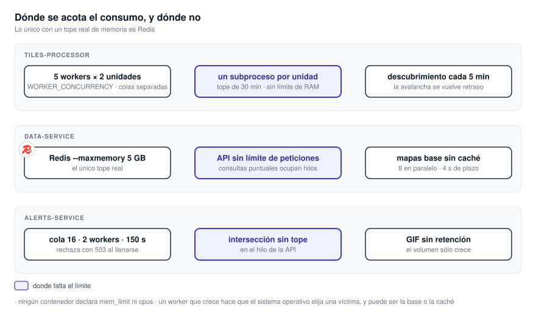

# 16. Capacidad y dimensionamiento

Qué acota el consumo de cada servicio, qué pasa cuando algo se satura y **qué hay que medir antes de
fijar límites**. El perfil [Beta-1](beta-1.md) fue medido por el equipo por debajo de 8 GB; esta página
explica qué sostiene esa selección y qué puede hacer que deje de entrar.

{ .diagram loading=lazy }

!!! warning "Ningún contenedor tiene límite de recursos"
    Es el hecho estructural de esta página. **No hay `mem_limit` ni `cpus` en ninguna plantilla.**
    El único tope real es `--maxmemory` de Redis. La consecuencia: **los servicios no están
    aislados entre sí.** Un worker que crece no falla él; hace que el sistema operativo elija una
    víctima, y esa víctima puede ser la base de datos o la caché.

## Procesador de mosaicos

**Es el que más consume, porque abre y reproyecta archivos geoespaciales enteros.**

| Mecanismo | Valor | Efecto |
|---|---|---|
| Workers de producción completa | 5: dos pesados, tres livianos | Colas separadas por costo del producto |
| Workers de Beta-1 | 2: uno pesado, uno liviano | Conserva ambas clases con menos trabajos simultáneos |
| Unidades simultáneas por worker | 2, `WORKER_CONCURRENCY` | Diez unidades en vuelo en producción; cuatro en Beta-1 |
| Un subproceso por unidad | Tope de 30 minutos, **fijo en el código** | La memoria vuelve al sistema al terminar |
| Carriles de subida al bucket | 32, 16 y 4 según tamaño | Acotan las transferencias simultáneas |
| Descarga en flujo a disco | — | Los archivos grandes no se cargan enteros |

**El subproceso por unidad es la estrategia de recuperación de memoria del sistema.** Las bibliotecas
geoespaciales fragmentan el montículo y no lo devuelven; **descartar el proceso es lo que lo devuelve**.
**Un worker de larga vida no crece sin fin gracias a eso, y a nada más.**

### Cuánto pesa el peor caso

**La banda 2 del satélite es el trabajo más caro.** **Su malla completa tiene unos 470 millones de
puntos.** El procesador la carga como enteros de 16 bits y la promedia en bloques de 4 × 4 antes de
aplicar escala. **No hay una medición detallada y reproducible del pico de memoria versionada**: el
número hay que volver a obtener en cada despliegue. La banda 2 está activa en la configuración de
producción completa y **apagada en Beta-1**.

### Qué pasa si aparecen muchos datos de golpe

**No hay estampida.** **El descubrimiento corre cada cinco minutos**, y cada fuente mira hacia atrás una
ventana acotada: cinco horas para el satélite, doce pasos por pasada para GFS. Un origen con miles de
objetos nuevos produce **retraso**, no un pico de memoria. **Lo que no llega a tiempo expira.**

El riesgo real es **un archivo patológico**: uno solo, mal formado o enorme, puede inflar la memoria
hasta agotar el host. **El límite de memoria por contenedor es la protección que falta.**

!!! note "El broker no frena nada"
    Los workers toman mensajes de a uno, por consulta explícita. **No hay ventana de mensajes en
    vuelo configurada.** **La concurrencia la fija la cantidad de workers y su paralelismo**, no el
    broker.

### Para dimensionar

1. **Medir el pico de memoria residente de un worker procesando el producto más pesado habilitado.**
2. Multiplicar por `WORKER_CONCURRENCY`.
3. Dejar margen y fijar ahí el límite del contenedor.
4. Repetir para los workers livianos, que pueden ir bastante más ajustados.

En la producción completa, la cantidad de workers se cambia regenerando la plantilla. Beta-1 tiene
su topología congelada en un archivo propio. Ver [11.1 Tiles Processor](../servicios/tiles-processor.md).

## Servicio de datos

**Es el que recibe el tráfico de los usuarios.**

| Aspecto | Estado |
|---|---|
| Límite de peticiones por cliente | **No hay** |
| Costo de una falta en caché | Una consulta a Redis más una al bucket |
| Descargas simultáneas del bucket | 5 por cliente, `S3_MAX_CONCURRENT_DOWNLOADS` |
| Crecimiento de Redis | Acotado por `--maxmemory`: 5 GB en la plantilla todo en uno, 7 GB en la repartida |

**Los mapas base no pasan por Redis.** El navegador pide al proveedor y, ante una falta, el servicio
de datos hace de relevo: **un plazo de 4 s, ocho peticiones en paralelo y agrupación de peticiones
idénticas**. **Es la ruta que más tráfico saliente genera por usuario**, y la única anónima que
escribe en el bucket.

**Las consultas de valor puntual ocupan un hilo** mientras leen por rango el archivo remoto, sin
tiempo límite en la biblioteca geoespacial. **Es la ruta con más potencial de acumular peticiones si
el almacén se pone lento.**

!!! note "Redis caída se degrada; el almacén caído, no"
    **Una falta en Redis cae al bucket y cuesta latencia.** **El almacén ausente al arrancar bloquea el
    servicio** y, en producción, lo aborta a los 120 s.

## Servicio de avisos

Es el único con **control de admisión explícito**, y conviene entenderlo porque es visible para el
usuario.

| Parámetro | Valor | Configurable |
|---|---|---|
| Workers de generación | 2 | `settings.json` |
| Tamaño de la cola | 16 | `settings.json` |
| Tiempo límite por trabajo | 150 s | `settings.json` |
| Renders simultáneos | 2 | **No** |
| Tiempo límite del render | 120 s | **No** |

**Con la cola llena, el servicio rechaza en el acto con `503`** en lugar de bloquear. **Esos números
definen cuántos avisos simultáneos tolera el sistema en un evento severo.**

!!! warning "El control de admisión no cubre la intersección"
    Las rutas de consulta de departamentos **corren en el mismo hilo que atiende las peticiones y
    sin límite de tamaño de entrada**. **Es a la vez el punto de saturación más fácil de alcanzar y el
    que ningún parámetro de la tabla acota.**

### Disco

**Las imágenes generadas no se borran nunca.** **No hay retención, tope ni tarea de limpieza**; el
volumen `alerts_output` crece con cada aviso y los archivos se sirven públicamente. Además, los
nombres derivan del reloj con resolución de un segundo y hay dos workers: **dos avisos en el mismo
segundo pueden pisarse.**

## Almacenamiento

El almacén crece con **los productos habilitados y la retención por prefijo**. **El catálogo es más
amplio que lo que un despliegue genera**. La producción completa mantiene el catálogo general; Beta-1
apaga la banda visible, dos productos de descargas, ocho de WRF y varios de modelos, y restringe el
radar a RMA1, RMA2 y RMA8. **Antes de estimar disco hay que responder qué perfil se va a usar.** La tabla de días está en
[11.1 Tiles Processor](../servicios/tiles-processor.md).

**Respaldar el almacén exige dos volúmenes a la vez**: los datos y el índice. **Por separado no sirven.**

## Qué medir para dimensionar de verdad

Beta-1 cuenta con la observación del equipo de que el conjunto permanece por debajo de 8 GB, pero
**no hay una medición de referencia reproducible versionada** con picos por producto, duración,
entrada y margen. Lo mínimo a obtener del propio despliegue:

1. Pico de memoria de un worker por tipo de producto habilitado.
2. Duración de una unidad de trabajo por tipo de producto.
3. Tasa de aciertos de Redis, que determina cuánto tráfico llega al almacén.
4. Crecimiento diario del almacén con la configuración elegida.
5. Peticiones simultáneas en el pico operativo, que en esta aplicación **coincide con el evento
   severo**.

**Los tres primeros salen de las métricas que el sistema ya expone.** Ver
[18. Observabilidad y verificación](observabilidad.md). Dónde poner cada cosa cuando hay más de una
máquina está en [15. Distribuir el sistema](distribucion.md).
