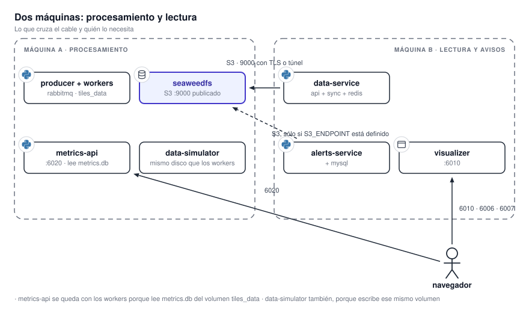
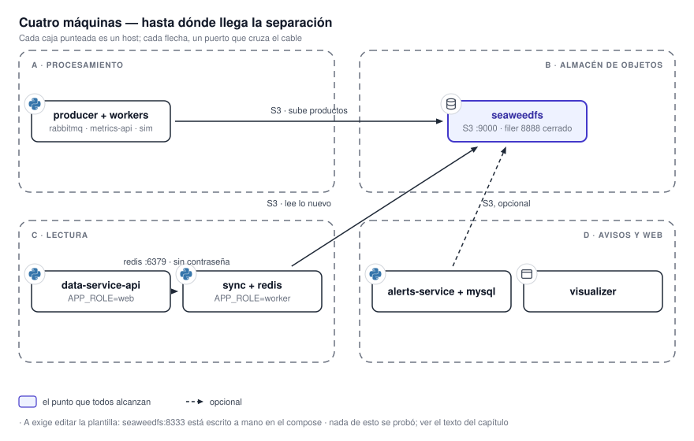

# 15. Distribuir el sistema en varias máquinas

Toda la documentación describe un sistema que corre en **una sola máquina**, porque así corre hoy.
¿Tiene que ser así? **No, pero casi nada del reparto está probado.**

{ .diagram loading=lazy }

## Qué fuerza la co-ubicación hoy

**Cuatro cosas, y sólo la primera es una decisión de diseño.** Las otras tres son hechos del disco y de
las plantillas.

| Atadura | Dónde está | Qué implica |
|---|---|---|
| **El servicio de datos llega al almacén por el propio host.** `S3_TILES_DATA_ENDPOINT` vale `host.docker.internal:9000`, y la plantilla agrega el alias `host-gateway`. | `.env.example` y plantilla de `data-service` | El puerto `9000` se resuelve **en la máquina donde corre `data-service`**. Si el almacén está en otra, ese valor tiene que cambiar. Filtrar el puerto rompe el arranque. Ver [13. Topología de red](topologia.md). |
| **Los feeds locales escriben en el almacenamiento del procesador.** | `radar-sinarame`, `goes19-glm` y `wrf-arg4k` bajo su raíz de datos | Es un acoplamiento de disco, no una API. El proceso institucional —o `data-simulator` en laboratorio— necesita acceso a esa raíz. |
| **Productor, workers y API de métricas comparten un volumen local.** Las bases SQLite usan WAL y un `flock` entre migraciones. | `tiles_data` en las siete unidades del procesador | **No se pueden repartir** sin reemplazar el volumen, y WAL no funciona sobre NFS ni SMB. Es la atadura más dura. |
| **Las direcciones internas del procesador están escritas a mano.** `seaweedfs:8333` y `rabbitmq` son literales en la plantilla, no variables. | Plantilla de producción de `tiles-processor` | Mover el almacén o el broker fuera del stack exige **editar la plantilla y el script que la genera**. |

Hay una quinta que no ata máquinas pero sí nombres: **el navegador llama a tres backends por
direcciones fijadas al compilar**. Cualquier reparto que mueva `data-service`, `alerts-service` o la
API de métricas obliga a **reconstruir el visualizador**.

## Qué exige cada costura para cruzar el cable

| Costura | Hoy | Para separarla |
|---|---|---|
| `data-service` → almacén | `host.docker.internal:9000`, en claro | Una dirección enrutable en `S3_TILES_DATA_ENDPOINT`. Publicar o tunelizar `9000`. **Hoy va sin TLS** (`S3_TILES_DATA_SECURE=false`); en otra máquina, poner TLS delante o un túnel. |
| `alerts-service` → almacén | `S3_ENDPOINT`, vacío por defecto | Lo mismo, si se quiere el respaldo. Es opcional. |
| `data-service` → Redis | `redis://redis:6379/0` por nombre de servicio | La plantilla `docker-compose.redis.yaml` **ya está escrita para esto**: publica `6379` y sólo cambia `REDIS_URL`. El costo es **un viaje de red por tesela**, sin contraseña ni TLS. Ponerle contraseña antes. |
| Broker ↔ workers | `rabbitmq` por nombre, dentro del stack | Mantener el broker con los workers. Separarlo cuesta editar la plantilla y aceptar un viaje de red por mensaje. |
| `alerts-service` → base de referencia | Por defecto, el mismo contenedor | Una ruta y credenciales al MySQL del organismo en `MYSQL_TAVISO_*`. |
| Navegador → tres backends | `localhost` en el ejemplo | Nombres resolubles por los usuarios y **una recompilación del visualizador**. |

## Lo que ya está preparado para separarse

- **El servicio de datos ya se despliega en dos capas.** Tres plantillas y `APP_ROLE=web|worker`:
  la API y el sincronizador pueden estar en máquinas distintas, cada uno con su `REDIS_URL`. **Un
  solo sincronizador**; dos harían lo mismo dos veces.
- **La API del servicio de datos escala horizontalmente.** **Es sin estado; varias réplicas pueden
  compartir un Redis.**
- **El visualizador escala sin límite.** Es un servidor de archivos.
- **Productor y workers están separados por una cola**, que es la costura de escalado horizontal de
  manual. **Pero comparten un volumen local** y sus bases SQLite exigen disco local. **Hoy la cola
  separa procesos, no máquinas.**

!!! warning "Sin verificar: cuál de las tres plantillas está desplegada"
    `data-service` versiona una plantilla todo en uno y dos repartidas. El repositorio no dice cuál
    usa el despliegue actual, y la diferencia importa: la repartida publica Redis sin contraseña.
    **Es una pregunta para quien administra el servidor.**

## Topologías por escala

### Una máquina

**Es lo que hay.** Todos los stacks en un servidor virtual, las cuatro redes de compose separadas, la
costura del almacén por el host. **Es la única topología probada.** Lo que compra: una sola máquina que
mantener, una sola lista de puertos que filtrar. Lo que cuesta: **ningún límite de recursos entre
servicios**, así que el procesamiento puede quedarse con la RAM de la caché o de la base.

### Dos máquinas: procesamiento y lectura

La máquina **A** corre `tiles-processor` completo, con su almacén, su broker, la API de métricas y la
entrada de feeds locales. La máquina **B** corre `data-service`, `alerts-service` y `visualizer`.

| Cruza el cable | De | A | Notas |
|---|---|---|---|
| `9000`, API S3 | B | A | Con TLS o túnel. Es **lo único que B necesita de A**. |
| `6020`, métricas | Navegador | A | La única razón por la que A queda expuesta al navegador. |
| `6006`, `6007`, `6010` | Navegador | B | Como hoy. |

**Qué compra:** el procesamiento deja de competir por RAM con la caché y la base de datos. Es la
separación que resuelve el problema estructural de [16. Capacidad](capacidad.md).

**Qué agrega:** si A cae, B sigue sirviendo lo que Redis ya tiene, y el servicio de datos **no
arranca** hasta que A vuelva. Si el cable se corta, cada tesela ausente en Redis cuesta un error de
lectura remoto en vez de uno local.

**Qué hay que tocar:** `S3_TILES_DATA_ENDPOINT` en B y el firewall de A. Nada más. **No se probó.**

### Cuatro máquinas

{ .diagram loading=lazy }

**A** procesa: productor, workers, broker, API de métricas y entrada de feeds, sobre la misma raíz de datos.
**B** es el almacén de objetos. **C** lee: la API del servicio de datos, su sincronizador y Redis.
**D** atiende avisos y web: `alerts-service` con su MySQL, y `visualizer`.

| Cruza el cable | De | A | Notas |
|---|---|---|---|
| `9000` | A y C | B | A **sube**; C **lee**. A exige editar `seaweedfs:8333` en la plantilla. |
| `6379` | C, si la API y el sincronizador se separan | Redis | Sin contraseña en la plantilla actual. |
| `9000`, opcional | D | B | Sólo con `S3_ENDPOINT` definido. |
| `6020` | Navegador | A | |
| `6006` | Navegador | C | |
| `6007`, `6010` | Navegador | D | |

**Qué compra:** el almacén deja de morir con el procesamiento, y se puede respaldar y dimensionar
solo. **Qué agrega:** dos puntos más de falla en el camino de una tesela, y el broker sigue atado a
los workers. **Qué hay que tocar:** las dos plantillas del procesador, el `.env` de C y D, TLS en B.
**No se probó ninguna parte de esto.**

### Lo que no se puede repartir sin cambiar el sistema

- **Productor y workers entre máquinas.** Comparten `tiles_data`, y sus bases SQLite exigen disco
  local. Haría falta un almacén de estado en red y otro mecanismo de bloqueo.
- **La API de métricas lejos de los workers.** Lee `metrics.db` del mismo volumen.
- **La entrada de feeds lejos del productor.** El proceso que recibe o replica los datos tiene que
  escribir en la raíz que observa el productor.

## Dónde vive el estado

Una máquina es desechable cuando no tiene nada de esta tabla. **Todo lo demás se reconstruye desde
las imágenes y los repositorios.**

| Estado | Volumen | Máquina en la topología de cuatro |
|---|---|---|
| Todas las teselas, COG y GeoJSON, y el índice del almacén | `s3_data` + `seaweedfs_filerldb2`, **respaldados juntos** | B |
| Los avisos generados y las capas de referencia | `mysql_data` | D |
| Historial, trabajos, métricas y GIF del servicio de avisos | `alerts_service_data`, `alerts_output` | D |
| Crudos pendientes y métricas del procesador | `tiles_data` | A |
| Métricas y cursor de mapas base del servicio de datos | `dataservice_data` | C |
| Mensajes en cola | `rabbitmq_data` | A; se regenera solo |
| La caché | `redis_data` | C; se regenera sola |

## Qué está limitado por RAM

Dos caminos corren en subprocesos **específicamente para devolver memoria al sistema**: la
decodificación de la banda 2 del satélite en los workers, y la intersección con GeoPandas en el
servicio de avisos. Son los dos que quieren máquina propia, y son la razón por la que se eligió un
servidor virtual siempre encendido en lugar de máquinas efímeras. **Los números están en
[16. Capacidad y dimensionamiento](capacidad.md)**; este capítulo sólo dice dónde ponerlos.

## Resumen: posible, probado, imposible

| | Estado |
|---|---|
| Todo en una máquina | **Probado.** Es el despliegue actual. |
| API y sincronizador del servicio de datos en máquinas distintas | **Preparado, no probado.** Las plantillas existen. |
| Redis en otra máquina | **Preparado, no probado.** Plantilla propia, sin contraseña. |
| Procesamiento y lectura en dos máquinas | **Posible con un cambio de configuración, no probado.** |
| Almacén de objetos en máquina propia | **Posible editando las plantillas del procesador, no probado.** |
| Productor y workers en máquinas distintas | **Imposible sin cambiar el sistema.** |
