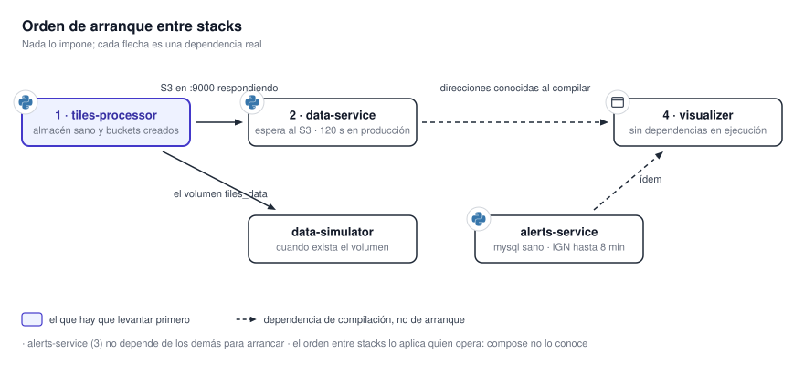

# 14. Puesta en marcha

La primera instalación puede realizarse mediante Beta-1 o mediante los cuatro despliegues
independientes. Beta-1 reúne los componentes en una VM de 8 GB y es el procedimiento recomendado
para comenzar. El segundo camino conserva un ciclo de despliegue para cada repositorio y requiere
coordinar el orden de arranque.

{ .diagram loading=lazy }

!!! danger "Levantarlo y exponerlo son dos decisiones distintas"
    Las plantillas publican en todas las interfaces varios puertos que no deberían salir del host, y
    ningún servicio autentica al llamante. Antes de abrir un puerto a una red, leer
    [19.3 Endurecimiento](../seguridad/endurecimiento.md).

## Qué hay que decidir antes

| Decisión | Dónde impacta |
|---|---|
| Beta-1 o despliegues independientes | Beta-1 prioriza una VM y una versión integrada. Los stacks separados priorizan ciclos de entrega autónomos. |
| Qué productos se van a generar | Es lo que más mueve CPU, RAM y disco. El catálogo es más amplio que lo que un despliegue suele activar. |
| Una o varias máquinas | Hoy todo está pensado para una. Ver [15. Distribuir el sistema](distribucion.md). |
| Si se despliega el servicio de avisos | Necesita acceso a su base operativa. `data-service` necesita por separado credenciales de la API del SMN para las estaciones. Sin avisos, el mapa funciona igual. |
| Cuántos workers de procesamiento | Se fija regenerando la plantilla, no editándola. |
| De dónde salen radar, WRF y descargas | Son fuentes locales. Sin un feed, hace falta el replicador de datos. |

## Requisitos

| Herramienta | Para qué |
|---|---|
| Docker y Docker Compose 2.20 o posterior | Construir y correr los contenedores; `mapasmn` usa `include:` |
| Git, `make`, shell POSIX y `envsubst` | Clonar submódulos, ejecutar los atajos y generar la configuración integrada |
| Python 3.12 y 3.13, Poetry 2.3.2 | Sólo para trabajar sobre los servicios fuera de contenedor |
| Node 24 y npm 11 | Ídem para el visualizador |

## Variables de entorno

En Beta-1, el `.env.example` de `mapasmn` es la fuente de verdad: `make setup` crea el `.env` raíz y
deriva los cuatro archivos internos. Sólo se edita el de la raíz. En despliegues independientes, cada
repositorio trae su propio `.env.example`. La lista completa está en
[12.2 Configuración y variables](../contratos/configuracion.md).

!!! danger "El ejemplo del servicio de avisos está pensado para desarrollo"
    Trae `MANAGE_DB_SCHEMAS=true`. Apuntado a la base del SMN, el arranque ejecutaría migraciones
    destructivas sobre un sistema ajeno. Revisar esa línea antes de copiar el archivo, y sobre
    todo darle al usuario de base de datos un permiso sin DDL.

## Camino recomendado: Beta-1

Beta-1 conserva los cuatro componentes, usa un worker normal y uno liviano, y recorta los productos
activos para operar con datos reales en una VM de 8 GB.

```sh
git clone --recurse-submodules git@github.com:fiuba-tp-g153-smn/mapasmn.git
cd mapasmn
make setup
# Editar .env, conectar los feeds vivos y volver a ejecutar make setup.
make beta1
```

Las direcciones de datos, avisos y métricas del `.env` tienen que ser alcanzables desde el navegador.
En una VM remota no pueden quedar en `localhost`. También se debe revisar el modo de entrada de cada
fuente en `settings-beta-1.json`. La configuración inicial utiliza carpetas para radar, GLM y WRF,
S3 público para GOES-19 ABI y proveedores públicos para ECMWF IFS y GFS. Cada instalación puede
reemplazar estas decisiones por buckets o carpetas propios. Sólo las fuentes en modo `local`
requieren una variable `*_INPUT_DIR` y un mount en el Compose.

La explicación completa, incluidos el espíritu del perfil, los directorios de los feeds y la
verificación, está en [14.1 Beta-1](beta-1.md).

## Camino independiente: orden de arranque

Cuando cada repositorio se despliega como un stack separado, el orden importa y nada lo impone:
Compose sólo conoce las dependencias dentro de cada uno.

1. `tiles-processor`. Levanta el broker, el almacén, el productor, los workers y la API de
   métricas. Va primero porque el almacén crea los buckets y los demás dependen de que existan.
2. `data-service`. Comprueba el almacén al arrancar y, en producción, aborta a los 120 s si
   no responde. Si queda en ciclo de reinicio, empezar por ahí.
3. `alerts-service`. Independiente de los anteriores. El primer arranque tarda hasta ocho
   minutos.
4. `visualizer`. No depende de nadie para arrancar. Sin los otros carga igual, vacío.
5. `data-simulator`, si no hay feeds. Necesita la ruta del volumen `tiles_data` en el host.

## Levantar cada stack por separado

### tiles-processor

```
make prod
```

El panel del broker queda en `15672` y la API de métricas en `6020`. La plantilla de desarrollo
versionada, igual que la producción completa, levanta dos workers normales y tres livianos. El
perfil que usa uno de cada tipo es Beta-1.

Para cambiar la cantidad de workers se regenera la plantilla:

```
./scripts/generate-compose.sh --light 3 2
```

!!! warning "Regenerar la plantilla de producción pierde ediciones manuales"
    La plantilla versionada difiere de lo que el script produce: fija versiones de imagen más
    nuevas, publica puertos extra del almacén, monta el volumen del índice y pasa credenciales de
    entrada. Comparar antes y después de regenerar. Ver [11.1 Tiles Processor](../servicios/tiles-processor.md).

### data-service

```
docker network create data_service_network
make prod
```

Levanta la caché y los dos contenedores de la aplicación. La API queda en `6006`. La red externa se
crea una sola vez y nada la crea por sí solo.

La variante repartida, para correr la caché en otra máquina:

```
make redis
make data
```

!!! warning "La variante repartida publica la caché sin contraseña"
    Publica `6379` en todas las interfaces y no aplica `--requirepass`. El propio archivo lo
    advierte. Ponerle contraseña y filtrar el puerto antes de levantarla.

### alerts-service

```
make prod
```

Levanta la base y la aplicación, en `6007`.

!!! warning "El primer arranque tarda varios minutos"
    Antes de responder, descarga las capas del IGN, las simplifica en todos los niveles y construye
    tres cachés. Su comprobación de salud declara ocho minutos de gracia. Un contenedor que
    parece colgado en el primer arranque está simplificando geometrías.

### visualizer

```
make prod
```

Sirve el paquete compilado con nginx en `6010`. En desarrollo, `make up` levanta un contenedor con
recarga en caliente en `4200`, precedido por uno de un solo uso que compila la documentación.

!!! warning "Las direcciones se hornean en la compilación"
    El visualizador no lee configuración en ejecución. Cambiar cualquiera de las direcciones
    obliga a reconstruir la imagen. Es el error de despliegue más frecuente: editar el `.env` y
    reiniciar no cambia nada.

### data-simulator

```
make up
```

Necesita tres carpetas maestras de sólo lectura y `TILES_DATA_DIR`, la ruta del volumen del
procesador en el host. Compose se niega a arrancar si falta cualquiera de las cuatro.

## Verificar que quedó bien

En orden, y sin usar la aplicación:

1. El almacén responde en `9000` desde el host, y el panel del broker en `15672` muestra las
   cuatro colas.
2. `GET /api/summary` en `6020` devuelve trabajos, y su cantidad crece con el tiempo. En cero
   después de un ciclo completo, el productor no descubre datos.
3. `GET /sync/status` en `6006` muestra ciclos completados por dominio.
4. `GET /health` en `6007` responde, pasada la ventana de simplificación.
5. El visualizador carga y las cuatro pestañas de su panel de estado traen datos.

Ese panel es la verificación de extremo a extremo más rápida. Cómo leerlo está en el
[manual](../../manual/panel-de-estado.md).

## Fallas frecuentes

| Síntoma | Causa habitual |
|---|---|
| El servicio de datos reinicia en ciclo | No alcanza el almacén. Lo alcanza saliendo al host, así que una regla de firewall lo rompe aunque los dos stacks estén en la misma máquina. |
| El servicio de datos no levanta y la red no existe | La red externa se crea a mano antes del primer arranque. |
| Las primeras lecturas de una capa son lentas | Con `SYNC_PREFETCH=false` no hay precarga en segundo plano. La primera lectura busca en Redis, luego en el bucket, y recalienta la caché. |
| El servicio de avisos parece colgado varios minutos | Está simplificando las capas del IGN. Esperable en el primer arranque. |
| El mapa carga vacío | El navegador no alcanza al servicio de datos. El visualizador no hace de proxy. |
| Cambié una variable del visualizador y no pasa nada | Hay que reconstruir la imagen. |
| Las capas de radar y WRF aparecen atenuadas | No hay archivos en el volumen: el replicador no corre, o no apunta al volumen correcto. |
| Un contenedor muere sin dejar rastro | Lo mató el sistema operativo por memoria. No hay límites declarados. Ver [16. Capacidad](capacidad.md). |

## Trabajar sobre esta documentación

Desde el repositorio del visualizador:

```
make docs-serve
```

Vista previa con recarga en `8000`. La compilación real es `make docs`, dentro de la imagen fijada
de MkDocs Material. No hay entorno virtual de Python para la documentación y no debe agregarse.

```
make docs-check
```

Compila y rastrea el sitio: páginas huérfanas, anclas rotas y rutas de video rotas, que la
compilación estricta no detecta. Los diagramas se compilan desde sus fuentes con `make diagrams`;
las imágenes y clips del manual se recapturan con `make docs-media`, que necesita un navegador y un
servicio de datos alcanzable.
