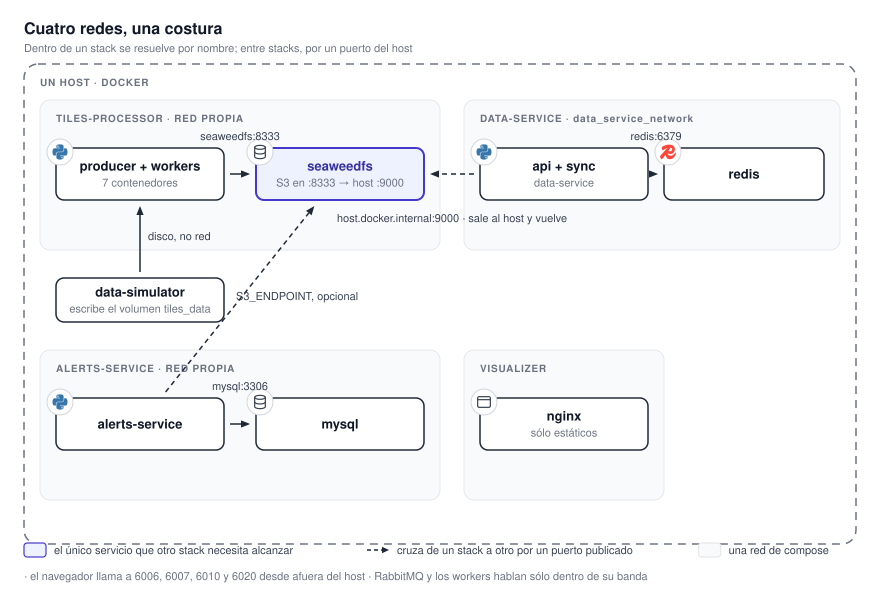

# 13. Topología de red

Cómo están cableados los cuatro stacks entre sí. **Es lo primero que hay que entender para decidir
dónde va un firewall**, y tiene una particularidad: **no hay una red compartida entre los stacks.**
**Cada uno vive en su propia red de compose**, y lo que cruza de uno a otro lo hace **por un puerto
publicado en el host** o por el disco.

{ .diagram loading=lazy }

## Las redes

| Stack | Red | Quién la crea |
|---|---|---|
| `tiles-processor` | La red por defecto del proyecto | Compose, al levantar |
| `data-service` | `data_service_network`, declarada **externa** | **Nadie del stack.** Hay que crearla a mano una vez: `docker network create data_service_network` |
| `alerts-service` | `alerts_service_network`, propia del proyecto | Compose, al levantar |
| `visualizer` | La red por defecto del proyecto | Compose, al levantar |

**Dentro de un stack, los contenedores se alcanzan por nombre de servicio**: `rabbitmq`, `seaweedfs`,
`redis`, `mysql`. **Entre stacks, no.** **Un contenedor de `data-service` no puede resolver `seaweedfs`.**

!!! note "El repositorio de orquestación no cambia esto"
    `mapasmn` incluye las cuatro plantillas en **un solo proyecto** de Compose; Beta-1 usa ese modelo.
    `tiles-processor` y `visualizer` comparten la red por defecto del proyecto, pero `data-service` y
    `alerts-service` siguen en las suyas. **La costura de abajo existe igual.**

## La costura: el tráfico entre stacks pasa por el host

**El servicio de datos alcanza el almacén saliendo al host y volviendo a entrar** por el puerto
publicado `9000`, usando el nombre `host.docker.internal`, que resuelve a la puerta de enlace del
host. Es el único mecanismo del sistema que **asume una sola máquina**, y tiene tres consecuencias:

1. **El puerto `9000` tiene que estar publicado**, aunque los dos stacks corran en la misma máquina.
   **No es una exposición decorativa.**
2. **Filtrarlo rompe el arranque, no sólo el tráfico.** `data-service` comprueba el almacén al
   arrancar y, en producción, aborta a los 120 s. **El resultado es un contenedor en ciclo de
   reinicio, no un servicio degradado.**
3. **El filtrado tiene que ser por dirección de origen**, no por cierre del puerto: permitir al host y
   bloquear el resto.

`alerts-service` usa el mismo camino para su respaldo, **sólo si `S3_ENDPOINT` está definido**. **La
alternativa limpia es una red de compose común**, con el servicio de datos apuntando a `seaweedfs:8333`.
**Es un cambio de configuración.** Lo que costaría repartir los stacks en más de una máquina está en
[15. Distribuir el sistema](distribucion.md).

## La otra costura: el disco

Tres de las fuentes del procesador, radar, WRF y descargas eléctricas, están configuradas como
**locales**: el productor mira directorios dentro de su raíz de datos. **El procesador no ofrece una
API de ingreso para esos archivos.** En Beta-1, los feeds vivos del organismo deben escribir en los
bind mounts `tiles-processor/data/{radar_h5,wrf_nc,glm_h5}`. En un laboratorio sin esos feeds,
`data-simulator` puede montar la misma raíz y depositar capturas históricas con marcas actuales.

Para el firewall, esto significa **ningún puerto extra**. Para la topología, significa que **el
proceso que escribe el feed o el replicador necesita acceso al almacenamiento de entrada del
procesador. La guía específica está en [14.1 Beta-1](beta-1.md).

## Puertos

El mapa completo, con autenticación y recomendación por puerto, está en
[19.1 Superficie expuesta](../seguridad/superficie.md). El resumen operativo:

| Deben ser alcanzables desde el navegador | Sólo desde el host, o desde la máquina del servicio de datos | No deberían salir del host |
|---|---|---|
| `6010` visualizador, `6006` datos, `6007` avisos, `6020` métricas | `9000`, la API S3 del almacén | `8888`, `9333`, `23646` del almacén; `5672`, `15672` del broker; `3306` de MySQL; `6379` de Redis en la variante repartida |

!!! warning "Publicar sólo el visualizador no alcanza"
    **El servidor web del visualizador no hace de proxy.** **El navegador llama por su cuenta al
    servicio de datos, al de avisos y al de métricas.** Con sólo el puerto del visualizador abierto,
    la aplicación carga y queda vacía. Una única entrada exige un proxy inverso delante de los
    cuatro puertos y recompilar el visualizador con esas rutas.

!!! danger "Las reglas de Docker se evalúan antes que las del firewall del host"
    Ninguna plantilla declara dirección de escucha: **todo se publica en `0.0.0.0`**. **Docker
    inserta sus propias reglas de redirección**, y un puerto publicado puede quedar accesible aunque
    el firewall del host parezca cerrarlo. El control efectivo va en el firewall del proveedor, en
    el borde, o en la cadena `DOCKER-USER`.

## Orden de arranque

**Dentro de un stack, Compose respeta las dependencias.** En despliegues independientes no hay
coordinación entre stacks: primero va el procesador, después datos, avisos cuando se quiera y el
visualizador en cualquier momento. Beta-1 inicia los cuatro desde un solo comando; los servicios
mantienen sus propias esperas y comprobaciones. Ver [14. Puesta en marcha](puesta-en-marcha.md).

## Volúmenes

| Volumen | Contiene | Se puede regenerar |
|---|---|---|
| `s3_data` + `seaweedfs_filerldb2` | Todas las teselas y el índice del almacén | Reprocesando, pero **los crudos ya expiraron**. Respaldar los dos juntos. |
| `mysql_data` | Los avisos y las capas de referencia | **No** |
| `alerts_service_data`, `alerts_output` | Historial, trabajos, métricas y los GIF | **No** |
| `tiles_data` | Crudos pendientes y las métricas del procesador | Los crudos vuelven a llegar; las métricas, no |
| `dataservice_data` | Métricas y el cursor del respaldo de mapas base | No las métricas |
| `redis_data` | La caché | **Sí**, sola, desde el bucket |

## Despliegue mínimo y completo

**Mínimo, sólo el mapa:** `tiles-processor` con su almacén y su broker, `data-service` con su caché, y
`visualizer`. **Se puede prescindir de `metrics-api`, de todo `alerts-service` y de cualquier fuente**
apagando sus productos en `settings.json`.

**Completo:** agrega `alerts-service` con su MySQL, el acceso a la base operativa y a la API del SMN,
y conecta los feeds vivos. El replicador de datos sólo hace falta en un laboratorio que no los tenga.

**El visualizador degrada bien sin el servicio de avisos**: el panel correspondiente queda inutilizable y
el resto funciona. **Lo que no tolera es la falta del servicio de datos.**

## Tareas programadas

**No hay cron del sistema ni temporizadores de systemd.** **Toda la programación es interna a cada
proceso**: si el contenedor está caído, el tick no ocurre.

| Qué | Cada cuánto | Dónde corre |
|---|---|---|
| Descubrimiento de datos nuevos | 5 minutos | Productor del procesador |
| Poda de la base de métricas del procesador | 1 hora, cron fijo | Productor |
| Sincronización de teselas a Redis | 60 s, por dominio | Sincronizador del servicio de datos |
| Respaldo de mapas base | 7 días | Sincronizador |
| Padrón y observaciones de estaciones | 5 minutos | Sincronizador |
| Refresco de capas del IGN | Domingos 03:00 UTC | Servicio de avisos |
| Simulación de radar, WRF y descargas, **sólo en laboratorio** | 10 minutos; WRF cada 6 horas | `data-simulator` |
