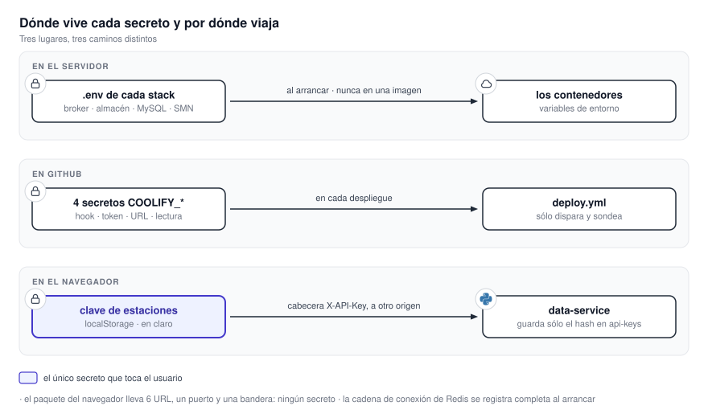

# 19.2 Datos y secretos

MapaSMN almacena productos meteorológicos, credenciales, polígonos de aviso y datos de operación.
Este capítulo indica dónde queda cada grupo de información, qué componente puede leerlo y qué
conexiones lo trasladan fuera de la máquina.

{ .diagram loading=lazy }

## Clasificación de los datos

| Dato | Sensibilidad | Dónde vive |
|---|---|---|
| Productos meteorológicos procesados | Pública | Almacén de objetos |
| Observaciones de estaciones | Pública, detrás de una clave del organismo | Caché y almacén |
| Avisos emitidos | Integridad crítica | Base de datos del SMN |
| Borradores de polígonos | Baja | Navegador del usuario |
| Métricas operativas | Baja; útil para reconocimiento | Bases locales de cada servicio |
| Credenciales de infraestructura | Alta | Variables de entorno |
| Clave de estaciones del usuario | Media | Almacenamiento del navegador, en claro |

El sistema no maneja datos personales. No hay usuarios ni cuentas. Eso simplifica el análisis de
privacidad, y a la vez impide saber quién generó un aviso.

## La clave de estaciones

Es la única credencial que el sistema le pide al usuario:

- La escribe el usuario en Configuración ▸ SMN. No viene compilada ni se obtiene de un servidor.
- Se guarda en el almacenamiento del navegador en claro.
- Viaja en cada petición como cabecera `X-API-Key`, a un origen distinto del de la aplicación.
- Es por navegador y por máquina. No hay distribución central ni rotación.
- Cualquier script del origen de la aplicación puede leerla, incluido este sitio.

Del lado del servidor sólo se guarda el hash: un objeto por clave en el bucket `api-keys`,
nombrado con el SHA-256 del secreto. El secreto se devuelve una única vez al crearlo.

## Inventario de credenciales

Sólo nombres. Todos los valores del archivo de ejemplo son marcadores de reemplazo; ningún
repositorio trae una contraseña real.

| Credencial | Variables | Quién la usa | Alcance |
|---|---|---|---|
| Broker | `RABBITMQ_USER` / `_PASSWORD` | Productor, los cinco workers y la API de métricas | La misma para todos |
| Raíz del almacén | `S3_ROOT_USER` / `_PASSWORD` | Arranque del almacén y su panel | Total |
| Escritura en `tiles-data` | `S3_TILES_DATA_TILES_PROCESSOR_USER` / `_PASSWORD` | Workers | Un bucket |
| Lectura del almacén | `S3_TILES_DATA_DATA_SERVICE_USER` / `_PASSWORD` | Servicio de datos | Ver abajo |
| Respaldo de capas | `S3_INTERSECTION_DATA_ALERTS_SERVICE_USER` / `_PASSWORD` | Servicio de avisos | Un bucket |
| Importación de métricas | `METRICS_API_KEY` | Sólo `POST /api/import` | Escritura de métricas |
| Administración de estaciones | `WEATHER_STATIONS_ADMIN_PASSWORD` | Cuatro rutas | Alta y baja de claves |
| Base de avisos | `MYSQL_USER` / `_PASSWORD`, `MYSQL_TAVISO_USER` / `_PASSWORD` | Servicio de avisos | Ver abajo |
| API del SMN | `SMN_API_USERNAME` / `_PASSWORD` | Servicio de datos | Lectura de observaciones |
| Entrega continua | `COOLIFY_DEPLOY_HOOK`, `_DEPLOY_TOKEN`, `_BASE_URL`, `_READ_TOKEN` | Sólo los workflows | Disparar y consultar despliegues |

### Dos alcances más amplios de lo que parecen

La identidad de lectura del servicio de datos lleva la acción global `Admin`. El script del
almacén la documenta como de sólo lectura. La configura con permisos de administrador, más lectura
y escritura sobre `tiles-data` y `basemap-tiles`. Lo que manda es la configuración. El
contenedor que atiende peticiones públicas puede escribir y borrar el bucket donde guarda las claves
que usa para autenticar.

Las dos conexiones a MySQL apuntan por defecto al mismo contenedor. En un despliegue real, la de
`MYSQL_TAVISO_*` lee la base del organismo. Nada en el código las distingue. Son dos capacidades,
escribir la tabla intermedia y leer la definitiva, que deberían ser dos usuarios.

### El permiso de esquema sobre la base del SMN

`MANAGE_DB_SCHEMAS` es el único guardián entre este sistema y las operaciones destructivas. Activada,
el arranque ejecuta el árbol completo de migraciones: una revisión vacía `departamentos` y
`provincia` con las comprobaciones de clave foránea apagadas, y otra renombra `taviso` a
`taviso_temporal`. Ninguna revisión elimina la tabla de avisos en el camino de subida; las
eliminaciones están sólo en el camino de bajada, que el arranque no ejecuta.

!!! danger "El archivo de ejemplo la trae activada"
    Está pensado para desarrollo y lo dice en sus comentarios. Copiarlo a producción apuntando a la
    base del organismo ejecuta DDL sobre un sistema ajeno. La protección correcta no es recordar
    apagarla: es que el usuario de base de datos no tenga permisos de esquema.

## Registro de eventos

- La cadena de conexión de Redis se registra completa al arrancar, en dos contenedores. Hoy no
  lleva contraseña porque Redis no tiene. El día que se le ponga, quedará en el registro.
- El script de arranque del almacén pasa credenciales como argumentos de línea de comandos, y lo
  mismo hace el envío opcional a Prometheus con usuario y contraseña en la URL.
- El servicio de avisos registra el polígono completo del usuario, y el texto de la excepción de
  un trabajo fallido queda legible desde `/metrics/jobs`, que es pública.
- `SMN_API_LOG_REQUESTS` registra las peticiones a la API del SMN con las credenciales
  redactadas. Viene apagada.
- La clave de la API de métricas se registra sólo como "configurada" o "sin configurar".

## Persistencia y copias de respaldo

| Volumen | Contiene | Si se pierde |
|---|---|---|
| `s3_data` + `seaweedfs_filerldb2` | Todas las teselas y el índice | Se regenera reprocesando, pero los crudos ya expiraron. Respaldar los dos juntos. |
| `mysql_data` | Los avisos y las capas de referencia | Definitiva |
| `alerts_service_data`, `alerts_output` | Historial, trabajos, métricas y GIF | Definitiva |
| `tiles_data` | Crudos pendientes y métricas del procesador | Los crudos vuelven; las métricas no |
| `redis_data` | La caché | Se repuebla sola |

!!! warning "Nada tiene respaldo automático"
    No hay ninguna tarea de copia de respaldo en los repositorios. Los volúmenes nombrados
    sobreviven a un redespliegue, pero eso no protege contra el borrado del volumen ni contra la
    corrupción.

## Salidas hacia afuera

Sin estos destinos el sistema no funciona.

| Desde los servidores | Para qué |
|---|---|
| Bucket público `noaa-goes19` en AWS | Satélite y descargas eléctricas, acceso anónimo |
| Espejos de ECMWF y NOMADS de NOAA | Modelos globales |
| API del SMN, por HTTPS | Observaciones de estaciones |
| Padrón de estaciones del SMN, por HTTP plano | El catálogo de estaciones, sin credencial |
| Servicios del IGN | Capas de referencia y mapas base |
| Esri y Google | Respaldo de mapas base |
| Base de datos del SMN | Escritura del aviso y lectura de referencia |
| Registros de imágenes, PyPI, npm, GitHub | Sólo al construir y desplegar |

| Desde el navegador del usuario | Para qué |
|---|---|
| Servicio de datos, de avisos y de métricas | Todos los datos, directo y sin proxy |
| IGN, Esri y Google | Los mapas base, directo al proveedor |
| IGN y Nominatim | El buscador de lugares |
| Fuentes tipográficas de Google | Tipografía |

Si el puesto de trabajo tiene egreso restringido, hay que permitir todos esos destinos. No hay
analítica ni scripts de terceros.

!!! note "Valores por defecto que hay que revisar"
    `SMN_API_BASE_URL` apunta al entorno de prueba del organismo. Las direcciones del servicio de
    avisos y del de métricas valen `http://localhost` si no se definen; en producción tienen que ser
    HTTPS o el navegador bloqueará esas peticiones por contenido mixto.

## Imágenes de contenedor

El archivo que excluye contenido del contexto de compilación del visualizador tiene comentadas las
líneas que excluirían los archivos `.env`. Un `.env` presente al compilar termina copiado en una capa
intermedia. No llega a la imagen final, que sólo lleva el paquete y la configuración de nginx. Destapar esas
líneas elimina la clase de error entera. Los otros tres repositorios sí excluyen `.env`.
