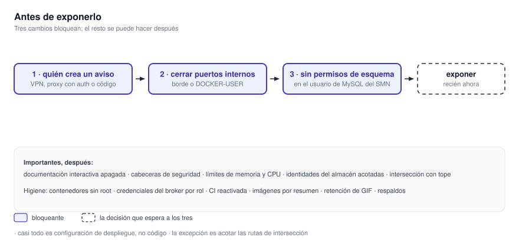

# 19.3 Endurecimiento

Las medidas se ordenan según el riesgo que reducen. Cada punto describe el comportamiento actual,
la modificación requerida y el lugar donde debe aplicarse. Los tres primeros cambios condicionan
cualquier despliegue expuesto y deben resolverse antes de habilitar el acceso desde una red no
confiable.

{ .diagram loading=lazy }

## Bloqueantes

### 1. Resolver quién puede crear un aviso

Hoy: `POST /alerts` no pide credencial y termina insertando una fila en la base que apunte
`MYSQL_HOST`.

Antes que nada, responder una pregunta que no se puede contestar desde los repositorios: ¿la
promoción de esa fila al registro definitivo es desatendida? Si lo es, una petición anónima
equivale a un aviso oficial y el puerto no puede publicarse en ninguna condición.

Qué hacer, en orden de preferencia:

1. No publicar `6007` en internet. Dejarlo accesible sólo desde la red de los pronosticadores, por VPN
   o por lista de direcciones.
2. Poner autenticación delante, en el proxy inverso. Es lo más rápido y no toca el código.
3. Agregar autenticación al servicio. Es lo correcto a mediano plazo, y exige restringir el origen
   cruzado antes.

*Tipo de cambio: despliegue, o código en la tercera opción.*

### 2. Cerrar los puertos de infraestructura

Hoy: el almacén publica su filer y su coordinador sin autenticación, el broker publica su
panel, MySQL publica `3306`, y la plantilla repartida publica Redis sin contraseña.

Qué hacer:

- Quitar los mapeos que no hacen falta: `3306`, `15672`, `8888`, `9333`, `23646`.
- Los que sí tienen que salir, publicarlos con dirección de escucha explícita.
- Ponerle contraseña a Redis y a la vez corregir el registro de la cadena de conexión.
- Filtrar en el firewall del proveedor o en `DOCKER-USER`, no en el del host: las reglas de Docker
  se evalúan antes.

*Tipo de cambio: configuración de despliegue.*

### 3. Quitarle a la base del SMN los permisos de esquema

Hoy: con `MANAGE_DB_SCHEMAS` activada, el arranque ejecuta migraciones que vacían tablas y renombran
la de avisos. El archivo de ejemplo la trae activada.

Qué hacer: crear el usuario de base de datos sin permisos de DDL. Así la operación destructiva
no puede ejecutarse aunque la variable quede mal. Apagar la variable es necesario pero no suficiente.

*Tipo de cambio: permisos de base de datos, del lado del organismo.*

## Importantes

### 4. Desactivar la documentación interactiva en producción

Hoy: los tres servicios publican `/docs` y `/openapi.json`, y uno nombra la variable de la que sale
su contraseña de administración. Qué hacer: desactivarla cuando el entorno es de producción.
*Una línea por servicio.*

### 5. Agregar cabeceras de seguridad

Hoy: nginx sólo emite cabeceras de caché. Qué hacer: política de contenido, control de
enmarcado, bloqueo de adivinación de tipo, política de referente, política de permisos y transporte
estricto; desactivar la firma de versión. La política de contenido tiene que contemplar los destinos
externos del navegador listados en [19.2 Datos y secretos](datos-y-secretos.md).
*Configuración del servidor web.*

### 6. Poner límites de recursos a los contenedores

Hoy: ninguno declara límite de memoria ni de CPU. Un worker con un archivo patológico puede
hacer que el sistema operativo mate a la base o a la caché. Qué hacer: declarar memoria y CPU por
contenedor, empezando por los workers. Los valores se miden según [16. Capacidad](../operacion/capacidad.md).
*Configuración de despliegue.*

### 7. Acotar las credenciales del almacén

Hoy: la identidad del servicio de datos lleva `Admin` global, y puede escribir y borrar el bucket
de claves con el que se autentica. Qué hacer: una identidad de sólo lectura para servir teselas y
otra acotada al bucket de claves. *Configuración del almacén.*

### 8. Acotar las rutas de intersección

Hoy: dos rutas aceptan un polígono sin límite y calculan en el hilo de atención; sus errores
devuelven rutas internas. Qué hacer: limitar la cantidad de vértices, como ya hace la ruta de
creación, mover el cálculo fuera del hilo y devolver errores genéricos. *Código.*

### 9. Acotar la ruta de mapas base

Hoy: una ruta anónima escribe en Redis y en el bucket por cada tesela nueva que recorre un
llamante. Qué hacer: limitar el zoom y la tasa de peticiones en el borde, o restringir la
escritura al recorrido de respaldo. *Configuración de despliegue o código.*

## Higiene

### 10. Ejecutar los contenedores sin privilegios

Ninguna imagen cambia de usuario: todo corre como `root`. Agregar un usuario sin privilegios a
cada imagen, y sistema de archivos de sólo lectura donde se pueda.

### 11. Separar las credenciales del broker

Productor, workers y API de métricas comparten el mismo usuario y contraseña. Una identidad por
rol, acotada a las colas que cada uno necesita.

### 12. Reactivar las verificaciones de integración continua

En el procesador, lint, tipos y pruebas están desactivados con una marca temporal sin fecha, y la
compuerta los da por aprobados. Trivy no bloquea en ningún repositorio. Reactivar los tres
trabajos, poner el escaneo en las dependencias del despliegue y renovar las excepciones vencidas.

### 13. Fijar las imágenes base

Las imágenes están fijadas por etiqueta, no por resumen. Dos se mueven solas. Hay además dos
dependencias del procesador fuera del archivo de bloqueo: una siempre en su última versión y otra
tomada de la punta de un repositorio.

### 14. Cerrar los detalles menores

- Destapar las líneas que excluyen `.env` del contexto de compilación del visualizador.
- Dejar de registrar el polígono completo, y de exponer el texto de las excepciones en `/metrics/jobs`.
- Poner retención a las imágenes generadas: hoy no se borran nunca.
- Descargar el padrón de estaciones por HTTPS.
- Revisar que `SMN_API_BASE_URL` no siga apuntando al entorno de prueba.
- Agregar `restart:` a los servicios de larga vida de las plantillas de desarrollo.
- Programar copias de respaldo de los volúmenes de estado, con el almacén y su índice juntos.

## Lista de verificación

- [ ] Se determinó si la promoción de un aviso a registro definitivo es desatendida
- [ ] `6007` no es alcanzable desde internet, o tiene autenticación delante
- [ ] `8888`, `9333` y `23646` no salen del host
- [ ] `15672` y `3306` no salen del host
- [ ] Redis tiene contraseña, y la cadena de conexión ya no se registra completa
- [ ] El filtrado está en el firewall del proveedor o en `DOCKER-USER`
- [ ] El usuario de base de datos del SMN no tiene permisos de esquema
- [ ] `MANAGE_DB_SCHEMAS` está sin definir en producción
- [ ] La documentación interactiva de las tres APIs está desactivada
- [ ] nginx emite las cabeceras de seguridad
- [ ] Todos los contenedores tienen límite de memoria y de CPU
- [ ] Las identidades del almacén están acotadas por bucket y por operación
- [ ] Hay respaldo de `s3_data` y `seaweedfs_filerldb2`, tomados juntos
- [ ] Hay respaldo de `mysql_data` y de las bases locales del servicio de avisos
- [ ] Está definida la retención de las imágenes generadas
- [ ] La lista de egreso permite todos los destinos, incluidos los del navegador
