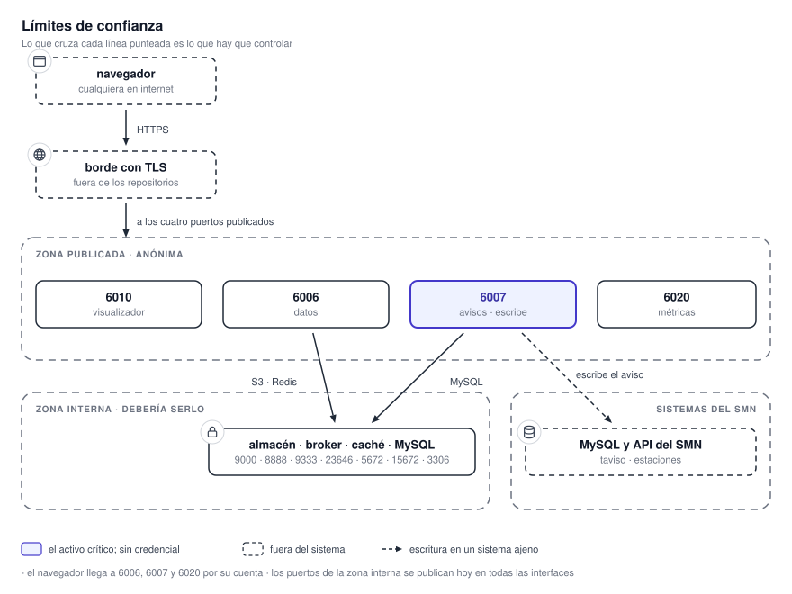

# Seguridad

Esta sección está escrita para alguien que tiene que decidir si este sistema puede desplegarse en su
red, y qué hay que cambiar antes de hacerlo. No parte del supuesto de que el sistema es seguro: parte
de lo que efectivamente hace, incluidas las cosas que hoy no protege.

!!! warning "Resumen para quien no va a leer el resto"
    El sistema **no tiene ningún concepto de identidad, sesión ni autorización**. Salvo las rutas de
    estaciones meteorológicas y una única ruta de escritura de métricas, todo lo que expone es
    anónimo. Además, tal como están escritas hoy las plantillas de despliegue, se publican en todas
    las interfaces varios puertos de infraestructura —almacén de objetos, broker, base de datos— que
    no tienen por qué salir del host.

    Es desplegable, pero **no tal cual**. Lo que hay que cambiar está en
    [Endurecimiento](endurecimiento.md).

## Cómo leer esta sección

| Página | Qué responde |
|---|---|
| Esta | Qué se protege, de quién, y dónde están los límites de confianza. |
| [Superficie expuesta](superficie.md) | Puerto por puerto y ruta por ruta: qué es alcanzable y qué pide credenciales. |
| [Datos y secretos](datos-y-secretos.md) | Qué información maneja, dónde vive, quién puede leerla y hacia dónde sale. |
| [Endurecimiento](endurecimiento.md) | La lista concreta de cambios previos al despliegue, ordenada por severidad. |

## Los activos

Lo que un atacante querría, en orden de gravedad:

1. **La capacidad de emitir un aviso.** Es el activo crítico y es de integridad, no de
   confidencialidad: un aviso meteorológico falso atribuido al SMN tiene consecuencias fuera del
   sistema. El servicio de avisos escribe en una base de datos operativa del organismo.
2. **El acceso de escritura a la base del SMN.** Más amplio que lo anterior: incluye la posibilidad
   de alterar o destruir datos que no pertenecen a este sistema.
3. **La disponibilidad del visualizador.** Es una herramienta operativa; que no esté disponible
   durante un evento severo es un daño real.
4. **La clave de acceso al servicio de estaciones.** Es la única credencial que el sistema le pide al
   usuario final.
5. **La integridad de los datos mostrados.** Un producto meteorológico manipulado induce una decisión
   equivocada.

Lo que **no** es un activo importante: los datos meteorológicos en sí. Casi todos provienen de
fuentes públicas —NOAA, ECMWF, IGN— y su confidencialidad no aporta nada.

## Los límites de confianza

{ .diagram loading=lazy }

Hay tres cruces que importan:

**Del navegador a los servicios.** Es el límite principal y hoy **no filtra nada**. Además, el
navegador no habla sólo con el visualizador: llama directamente al servicio de datos, al de avisos y
al de métricas. No hay proxy inverso que los agrupe. Publicar únicamente el puerto del visualizador
deja la aplicación inutilizable, y publicar los otros tres los deja anónimos.

**De la zona publicada a la zona interna.** El almacén de objetos, el broker, la caché y la base de
datos deberían estar sólo de este lado. Tal como están las plantillas de despliegue, varios de sus
puertos salen a todas las interfaces.

**Del sistema a la infraestructura del SMN.** Es el único límite donde el sistema es el que pide
permiso. La base operativa del organismo y su API son propiedad de un tercero, y el alcance de las
credenciales con que se las accede es la decisión de seguridad más importante del despliegue.

## El modelo de atacante

Contra quién tiene sentido evaluar esto:

| Atacante | Qué puede hacer hoy |
|---|---|
| **Anónimo en internet**, si los servicios están publicados | Insertar una fila de aviso en la base del SMN, leer todas las métricas operativas, agotar disco generando imágenes, y consultar el catálogo de rutas en la documentación interactiva que los servicios publican. |
| **Anónimo en la red interna**, si sólo se publicó el borde | Lo mismo que arriba más, si los puertos de infraestructura quedaron abiertos, leer y escribir el almacén de objetos y la caché sin autenticarse. |
| **Un sitio web cualquiera que la víctima visite** | Los servicios responden con origen permitido `*`. El de avisos además acepta credenciales, así que el navegador de un usuario puede ser usado para disparar operaciones sin que se entere. |
| **Alguien que consigue publicar contenido en el sitio de documentación** | El sitio se sirve dentro del mismo origen que la aplicación y sin aislamiento, así que puede leer el almacenamiento del navegador, incluida la clave de estaciones. |
| **Un contenedor comprometido** | Todos corren como `root` dentro del contenedor y ninguno tiene límites de memoria ni de CPU. Las credenciales del broker son las mismas para todos los procesos del procesador de mosaicos. |

## Lo que el sistema sí hace bien

No todo está flojo, y conviene saber dónde no hace falta gastar esfuerzo:

- **No hay inyección de SQL.** Todas las consultas en tiempo de ejecución están parametrizadas.
- **No hay ejecución de comandos.** No se usa intérprete de shell en ninguna llamada a subproceso: se
  invoca siempre con lista de argumentos.
- **No hay traversal de rutas** desde los datos externos: los nombres de archivo locales se derivan
  siempre del nombre base del objeto remoto, nunca de su ruta completa.
- **No hay secretos en el paquete del navegador.** Todo lo que se inyecta en tiempo de compilación
  son URL, un puerto y una bandera de interfaz.
- **Las comparaciones de credenciales son en tiempo constante** donde existen.
- **Los errores no filtran detalles internos**: no se devuelven trazas, ni rutas, ni nombres de
  buckets al cliente.
- **La verificación TLS nunca está desactivada** en las llamadas salientes del sistema.

El problema de este sistema no es la calidad del código: es que fue construido asumiendo una red de
confianza y nunca se le agregó la capa de control de acceso que un despliegue expuesto necesita.
