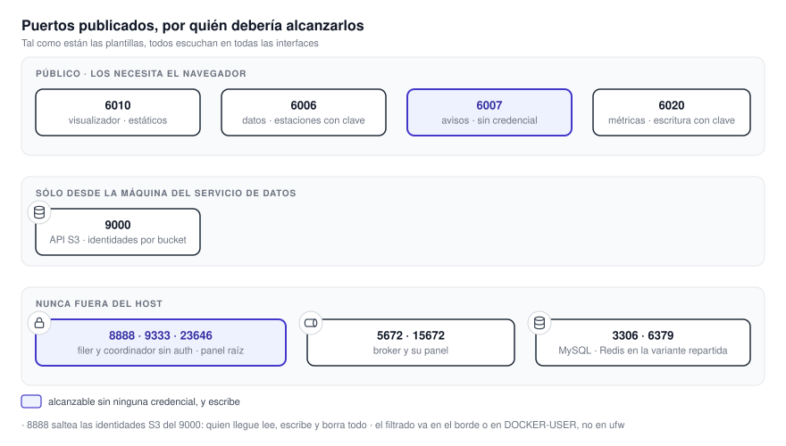

# 19.1 Superficie expuesta

**Todo lo que un atacante puede alcanzar, y qué le pide el sistema para dejarlo pasar.**

{ .diagram loading=lazy }

## Puertos

**Ninguna plantilla declara una interfaz de escucha.** **Un mapeo escrito como `9000:8333` se publica
en todas las interfaces del host.** **La columna «debería ser» es la recomendación, no lo que ocurre.**

| Puerto | Qué hay detrás | Autenticación | Debería ser |
|---|---|---|---|
| `6010` | Visualizador y este sitio, estáticos | Ninguna | Público |
| `6006` | API del servicio de datos | Ninguna, salvo estaciones | Público |
| `6007` | API del servicio de avisos | **Ninguna** | **Público sólo si se acepta el riesgo** |
| `6020` | API de métricas del procesador | Lectura anónima; escritura con clave | Restringido por IP |
| `9000` | API S3 del almacén | Identidades S3 por bucket | Sólo desde la máquina del servicio de datos |
| `8888` | Filer del almacén | **Ninguna** | **Interno** |
| `9333` | Coordinador del almacén | **Ninguna** | **Interno** |
| `23646` | Panel de administración del almacén | Credenciales raíz del almacén | **Interno** |
| `5672`, `15672` | Broker y su panel | Usuario y contraseña | **Interno** |
| `6379` | Redis, **sólo en la plantilla repartida** | **Ninguna** | **Interno** |
| `3306` | MySQL de avisos | Usuario y contraseña | **Interno** |

!!! danger "Los que hay que cerrar antes de exponer el host"
    - **`8888`.** Da acceso al árbol de archivos completo sin firmar nada. **Anula el control por
      bucket del `9000`**: quien llegue lee, escribe y borra cualquier objeto.
    - **`9333`.** **El propio script de arranque lo llama «puerto no autenticado».**
    - **`6379`**, en la variante repartida. El archivo lleva escrito el aviso de ponerle contraseña,
      y no está aplicado.
    - **`3306`.** **Los servicios llegan por el nombre interno; publicarlo no aporta nada.**

Un puerto `6011` que aparecía en versiones anteriores de esta documentación **no existe**: **este sitio
se sirve en el mismo puerto que la aplicación**.

!!! warning "El firewall del host puede no alcanzar"
    **Docker escribe sus propias reglas de redirección**, que se evalúan antes que las de un firewall
    de host configurado de la manera habitual. **El control efectivo va en el firewall del
    proveedor, en el borde, o en la cadena `DOCKER-USER`.**

## Rutas HTTP

### Servicio de datos

**47 rutas anónimas de 56.** Teselas, índices, consultas puntuales, mapas base, estado de
sincronización y las nueve rutas de métricas, incluidas las que reportan el estado interno de la
caché.

!!! warning "Una de las rutas anónimas escribe"
    `GET /basemap/{provider}/{z}/{x}/{y}.png` no es sólo lectura. **Cada tesela que trae del proveedor
    la escribe en Redis y en el bucket `basemap-tiles`**, y deja una marca negativa en cada falta.
    **Un llamante anónimo que recorra coordenadas produce escrituras sin tope.**

| Grupo | Control |
|---|---|
| Lectura de estaciones, 5 rutas | Cabecera `X-API-Key`; las claves viven como hash en un bucket |
| Administración de estaciones, 4 rutas | Cabecera `X-Admin-Password`, comparada en tiempo constante |

Un interruptor de configuración **apaga la verificación de `X-API-Key` por completo**. **Viene
encendido y no figura en el archivo de ejemplo.**

### Servicio de avisos

**Dieciséis rutas y un montaje de archivos estáticos. Ninguna autenticada.** **Incluye la que crea
un aviso.**

!!! danger "Un llamante anónimo puede insertar una fila de aviso en la base del SMN"
    `POST /alerts` acepta un polígono y un código de fenómeno sin credencial alguna, y termina
    insertando una fila en `taviso_temporal` marcada como no procesada. **Nada en el código
    distingue la base local de la del organismo: lo decide `MYSQL_HOST`.**

    Si la promoción de esa fila es desatendida, una petición anónima equivale a un aviso oficial. **El
    proceso que promueve no está en estos repositorios**, así que desde acá no se puede saber.

Las dos rutas de intersección **no tienen límite de tamaño de polígono y calculan en el mismo hilo
que atiende las peticiones**. **Un polígono suficientemente grande bloquea el servicio entero.** Además,
**sus errores devuelven el texto de la excepción**, incluida la ruta del archivo de capa ausente.

### API de métricas del procesador

**Lectura anónima de todo.** La única ruta protegida es la importación: clave por cabecera, comparada en
tiempo constante, y **falla cerrada con `503`** si la clave no está configurada.

### Visualizador

Archivos estáticos. **No hay ningún `proxy_pass`**: no es un proxy abierto, pero tampoco agrupa a los
demás. **Es la razón por la que el navegador termina hablando con cuatro puertos.**

## Documentación interactiva de las APIs

**Los tres servicios en Python publican `/docs` y `/openapi.json` sin restricción.** **Le entregan a un
atacante el catálogo completo de rutas y parámetros.** En el servicio de datos, además, la descripción
del esquema **nombra la cabecera de administración y la variable de entorno** de la que sale su
contraseña. **Desactivarlas en producción es un cambio de una línea por servicio.**

## Origen cruzado

**Los tres servicios responden con origen `*`, sin credenciales.** Con autenticación por cabecera y
sin sesión, hoy es aceptable. La combinación de origen comodín con credenciales que tenía el servicio
de avisos **se corrigió el 18 de agosto de 2026**; **el día que se agregue autenticación por sesión,
el origen tiene que restringirse antes**.

## Cabeceras de seguridad

El servidor web del visualizador **no emite ninguna cabecera de seguridad**, sólo de caché. Faltan
política de contenido, control de enmarcado, bloqueo de adivinación de tipo, política de referente,
política de permisos y transporte estricto. Tampoco está desactivada la firma de versión. **Es de las
cosas más baratas de arreglar.**

## El sitio de documentación dentro de la aplicación

La aplicación embebe este sitio en un marco del **mismo origen y sin aislamiento**, para poder
sincronizar la URL con la página leída. La consecuencia: **el contenido de la documentación está
dentro del límite de confianza de la aplicación**. **Cualquier script que llegue a servirse desde acá
puede leer el almacenamiento del navegador**, incluida la clave de estaciones. Hoy el contenido se
compila dentro de la imagen desde el repositorio, **así que el riesgo es de cadena de suministro**.

## Lo que no se encontró

- Sin inyección de SQL: las consultas de ejecución están parametrizadas.
- Sin ejecución de comandos: ningún subproceso usa shell.
- Sin traversal de rutas desde las fuentes externas.
- Sin secretos en el paquete del navegador.
- Sin verificación TLS desactivada.
