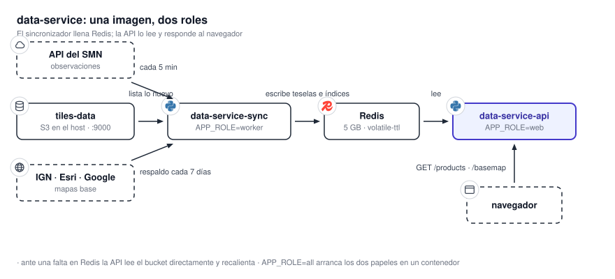

# 11.2 Data Service

`data-service` es **el intermediario entre el bucket y el navegador**. **Copia a Redis lo que genera
`tiles-processor` y lo sirve como teselas con baja latencia.** Además incorpora dos familias que no
vienen del procesador: los mapas base y las estaciones meteorológicas. **Es el servicio que recibe el
tráfico de los usuarios.**

{ .diagram loading=lazy }

## Unidades desplegables

| Contenedor | Imagen | Papel |
|---|---|---|
| `data-service-redis-dev` | `redis:8.10-trixie` | La caché. `--maxmemory 5gb`, expulsión `volatile-ttl`, sin contraseña. |
| `data-service-api` | Propia, `APP_ROLE=web` | Atiende HTTP. Lee Redis; ante una falta, lee el bucket. |
| `data-service-sync` | Propia, `APP_ROLE=worker` | Seis bucles de sincronización, el respaldo de mapas base, el de estaciones y el muestreo de Redis. |

**La imagen es una sola y el papel lo elige `APP_ROLE`.** El valor `all` arranca los dos papeles en
un contenedor y es el valor por defecto. **Un valor distinto de los tres hace fallar el arranque.**

!!! warning "Los routers se montan en todos los papeles"
    Un contenedor mal configurado **sigue respondiendo HTTP**, y el error no salta a la vista. Con
    los dos contenedores en `web`, nada sincroniza: Redis no se llena y todo sale por el camino
    lento del bucket. Con la API en `worker`, atiende peticiones mientras compite consigo misma por
    CPU.

Hay **tres plantillas de despliegue**:

| Plantilla | Qué levanta | Para qué |
|---|---|---|
| `docker-compose.yaml` | Redis, API y sincronizador | Todo en un host. Redis **no publica puerto**. |
| `docker-compose.data.yaml` | API y sincronizador | La aplicación sola, sobre la red externa `data_service_network`. |
| `docker-compose.redis.yaml` | Redis | La caché sola, `--maxmemory 7gb`, **publicada en `6379` sin contraseña**. |

**Las dos últimas son proyectos de compose separados.** **Ninguna crea la red externa**: hay que crearla a
mano una vez. Ver [15. Distribuir el sistema](../operacion/distribucion.md).

## Puertos y conexiones

| Puerto del host | Contenedor | Quién lo necesita |
|---|---|---|
| `${APP_HOST_PORT}` (6006) → `8080` | `data-service-api` | **El navegador**, directamente |
| `6379`, sólo en `docker-compose.redis.yaml` | `redis` | Una API en otro host |

| Destino | Protocolo | Cómo lo alcanza |
|---|---|---|
| SeaweedFS, API S3 | S3 | `S3_TILES_DATA_ENDPOINT`, hoy `host.docker.internal:9000`: **sale al host y vuelve a entrar** |
| Redis | RESP | `REDIS_URL`, hoy `redis://redis:6379/0` por nombre de servicio |
| API del SMN | HTTPS | Observaciones de estaciones, con usuario y contraseña |
| Registro de estaciones del SMN | **HTTP plano** | El padrón de estaciones |
| IGN, Esri, Google | HTTPS | Respaldo de mapas base |

## Qué guarda

| Volumen | Contenido | Copia única |
|---|---|---|
| `redis_data` | La caché. Instantáneas RDB cada 300 s, sin AOF. | **No**: se repuebla desde el bucket |
| `dataservice_data` | `metrics.sqlite` y el estado del recorrido de mapas base | Métricas: sí |

En el almacén, el servicio **escribe** tres buckets: `basemap-tiles`, `weather-stations-data` y
`api-keys`. **Sólo `api-keys` lo crea él mismo.** `basemap-tiles` lo crea el almacén al arrancar. Ver
[12.3 Almacenamiento y colas](../contratos/almacenamiento.md).

## Cuando algo falla

| Dependencia caída | Efecto |
|---|---|
| **Redis** | Nunca fatal. La conexión es perezosa y cada lectura cae al bucket. **Cuesta latencia, no errores.** |
| **SeaweedFS al arrancar** | **Bloquea el arranque.** Sondea con retroceso de 1 a 30 s. En `APP_ENV=production` aborta a los 120 s para que el orquestador reinicie. Fuera de producción espera para siempre. |
| SeaweedFS en marcha | Cada ruta degrada a su respuesta de falta: `404` o tesela transparente. |
| API del SMN | Las estaciones dejan de actualizarse. Las teselas siguen. |
| Proveedor de mapas base | El navegador lo nota primero: **pide al proveedor directamente** y usa el respaldo del servicio tesela por tesela. |

!!! warning "Un firewall puede romper el arranque, no sólo el tráfico"
    Como alcanza el almacén **por un puerto publicado del propio host**, una regla que filtre `9000`
    deja este contenedor en ciclo de reinicio. **Es el primer lugar donde mirar.** Ver
    [13. Topología de red](../operacion/topologia.md).

## Arranque

1. Conecta Redis de forma perezosa y migra `metrics.sqlite`.
2. **Comprueba el almacén** y espera hasta que responda.
3. Levanta las estrategias de lectura y, en `worker`, los bucles de fondo.
4. Responde `GET /health` con `{"status":"running"}`. **Esa ruta no comprueba Redis ni el almacén.**

**El healthcheck del contenedor consulta esa misma ruta cada 10 s, con 15 s de gracia.**

## Estrategias de caché

La estrategia se elige una vez al arrancar, con `SYNC_MODE` o `settings.json`.

- **`full`**, el modo desplegado. Seis bucles recorren el bucket y precargan Redis: `satellite`,
  `radar`, `ecmwf_tp`, `ecmwf_mslp`, `wrf` y `gfs`.
- **`on_demand`**. Sin bucles. Cada lectura resuelve Redis, luego el bucket, y recalienta.

| Dominio | Qué retiene en Redis |
|---|---|
| `satellite`, `radar` | Una ventana temporal por antigüedad |
| `ecmwf_tp`, `ecmwf_mslp` | Las 2 corridas más recientes |
| `wrf` | Las 3 inicializaciones más recientes |
| `gfs` | Los 2 ciclos más recientes |

!!! note "Los mapas base no pasan por Redis"
    El modo desplegado para mapas base es `no_cache`. **El recorrido de respaldo sigue corriendo y
    escribe `basemap-tiles`**, pero el lector va del proveedor al bucket sin tocar Redis.

## Superficie HTTP

El detalle completo está en [12.1 API HTTP](../contratos/api.md). En resumen:

| Familia | Para qué | Autenticación |
|---|---|---|
| `/products/*` | Índices, teselas, consultas puntuales y GeoJSON de cada producto | Ninguna |
| `/basemap/*` | Proveedores y teselas de fondo | Ninguna |
| `/weather-stations/*` | Estaciones: última instantánea, listados, series | `X-API-Key` |
| `/weather-stations/admin/*` | Alta y baja de claves | `X-Admin-Password` |
| `/metrics/*`, `/sync/status` | Lo que lee el panel de estado | Ninguna |

Las claves de estaciones **se guardan sólo como hash** en el bucket `api-keys`. **El secreto se devuelve
una única vez al crearlo.** **Un interruptor de configuración desactiva la verificación de `X-API-Key`
por completo**; viene encendida.

!!! warning "Una ruta de lectura anónima escribe"
    `GET /basemap/{provider}/{z}/{x}/{y}.png` **escribe** cada tesela que trae del proveedor en
    Redis y en el bucket. Un llamante anónimo que recorra coordenadas genera escrituras sin tope.
    Ver [19.1 Superficie expuesta](../seguridad/superficie.md).

## Estaciones meteorológicas

**El sincronizador se autentica contra la API del SMN con un token que renueva ante un `401`.** Descarga
el padrón, guarda instantáneas cada cinco minutos y precomputa las series por estación. **El punto de
rocío se calcula en la lectura**, a partir de temperatura y humedad.

## Cómo se agranda

- **Más réplicas de la API**: `WEB_CONCURRENCY` fija los procesos de uvicorn dentro del contenedor.
  **Varios contenedores `web` pueden compartir un mismo Redis.**
- **El sincronizador es uno.** Dos contenedores `worker` sincronizarían lo mismo dos veces.
- **Redis crece hasta `--maxmemory`** y expulsa por vencimiento. **Es el único componente del sistema
  con un tope de memoria real.**

## Comandos

| Comando | Qué hace |
|---|---|
| `make up` / `make prod` | Compose de desarrollo / producción, todo en uno |
| `make redis` + `make data` | Producción repartida sobre la red externa |
| `make local` | uvicorn con recarga, sin Docker |
| `make test` | Pruebas dentro de Docker |
| `make clean` | Baja ambos stacks y borra volúmenes |
