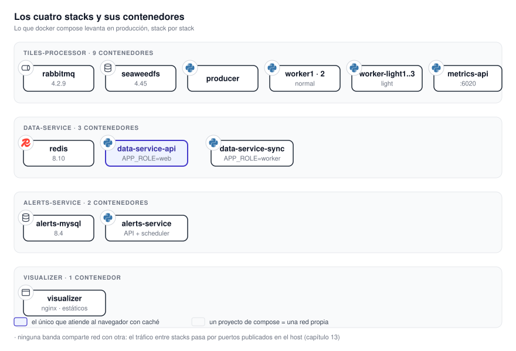

# 11. Los servicios

Cada servicio, visto como **lo que se despliega**: qué contenedores lo componen, en qué puertos
escuchan, con quién hablan, qué guardan, qué hacen cuando una dependencia falla y cómo se agrandan.
**La estructura interna aparece sólo cuando cambia una decisión operativa.**

{ .diagram loading=lazy }

Los cuatro sub-capítulos siguen el mismo orden de preguntas:

1. **Qué unidades desplegables** tiene, con sus imágenes.
2. **En qué escucha** y qué publica al host.
3. **Con qué habla** y por qué protocolo.
4. **Qué guarda** y en qué volumen.
5. **Qué hace cuando una dependencia está caída.**
6. **Qué necesita al arrancar** y en qué orden.
7. **Cómo se sabe que está sano.**
8. **Cómo se hace más grande.**

| Sub-capítulo | El servicio | Lo que más pesa operativamente |
|---|---|---|
| [11.1 Tiles Processor](tiles-processor.md) | El motor de generación: productor, workers, broker y almacén | **Memoria.** Es el que decide el tamaño de la máquina. |
| [11.2 Data Service](data-service.md) | La API de lectura y su sincronizador, con Redis | **Latencia.** Es el que ve el tráfico de los usuarios. |
| [11.3 Alerts Service](alerts-service.md) | La intersección geográfica y la generación del aviso | **Integridad.** Es el que escribe en una base del SMN. |
| [11.4 Visualizer](visualizer.md) | La aplicación web y este sitio | **Direcciones fijadas al compilar.** |

**Ningún stack comparte red con otro.** Lo que cruza de un stack a otro lo hace por un puerto
publicado en el host o por el bucket. Ese detalle está en [13. Topología de red](../operacion/topologia.md).
