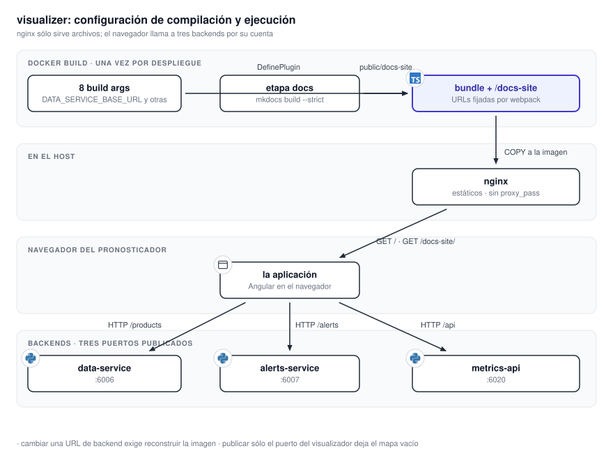

# 11.4 Visualizer

`visualizer` es la aplicación que utiliza el pronosticador y el contenedor que publica esta
documentación. El servidor nginx entrega archivos estáticos. La representación del mapa, el estado
de la interfaz y las llamadas a las tres API se ejecutan en el navegador.

{ .diagram loading=lazy }

## Unidades desplegables

Un contenedor, `visualizer-container`, sobre `nginx:mainline-alpine-slim`. No tiene volúmenes ni
dependencias: la imagen es autocontenida. La comprobación de salud es una conexión TCP al puerto
80, cada 10 s.

La imagen se construye en tres etapas:

1. Documentación. `mkdocs build --strict` sobre la imagen fijada de MkDocs Material.
2. Compilación. `npm run build` con las direcciones de los backends incrustadas.
3. Ejecución. nginx con el paquete compilado y este sitio bajo `/docs-site/`.

## Puertos y conexiones

| Puerto del host | Contenedor | Quién lo necesita |
|---|---|---|
| `${APP_HOST_PORT}` (6010) → `80` | `visualizer-container` | El navegador |

El servidor no habla con ningún backend. No hay `proxy_pass` en su configuración. Quien habla es
el navegador, con tres direcciones que se fijaron al compilar:

| Variable | A quién llama el navegador |
|---|---|
| `DATA_SERVICE_BASE_URL` | Teselas, índices, mapas base y estaciones |
| `ALERTS_SERVICE_BASE_URL` | Intersección y avisos |
| `METRICS_SERVICE_BASE_URL` | La pestaña Procesamiento del panel de estado |

!!! warning "Publicar sólo este puerto deja el mapa vacío"
    El navegador tiene que alcanzar los tres backends por su cuenta. Si sólo se publica el
    visualizador, la aplicación carga y no muestra ninguna capa.

## Configuración fijada al compilar

Las ocho variables llegan al paquete por un complemento de webpack durante `npm run build`.
En la plantilla de compose sólo cuentan los `args:` de construcción; el bloque `environment:` con los
mismos nombres no tiene efecto en tiempo de ejecución.

| Variable | Valor de reserva si no se define |
|---|---|
| `DATA_SERVICE_BASE_URL` | `https://data.mapasmn.com` |
| `ALERTS_SERVICE_BASE_URL` | `http://localhost:8080` |
| `METRICS_SERVICE_BASE_URL` | `http://localhost:6020` |
| `DOCS_URL` | `/docs-site` |
| `APP_HOST_PORT` | `4200` |
| `SMN_API_PROMPT_FOR_TOKEN`, `IGN_PLACE_SEARCH_URL`, `NOMINATIM_SEARCH_URL` | `true` y dos URL públicas |

Tres reservas discrepan del archivo de ejemplo. Una compilación sin variables no apunta a donde
sugiere `.env.example`. Y `APP_HOST_PORT` no la lee ninguna fuente de la aplicación: sólo la usa
la plantilla de compose para publicar el puerto. Está en la lista por uniformidad.

!!! warning "Cambiar una dirección obliga a reconstruir la imagen"
    Es el error de despliegue más frecuente del sistema. Editar el archivo de entorno y reiniciar el
    contenedor no cambia nada.

## Rutas

| Ruta | Qué muestra |
|---|---|
| `/` | El mapa y toda la interacción |
| `/docs`, `/docs/` | Este sitio, embebido en un marco del mismo origen |
| `/status/processing`, `/status/cache`, `/status/basemap`, `/status/alerts` | Las cuatro pestañas del panel de estado |

`/status` sin sufijo redirige a `processing`. Cualquier ruta desconocida vuelve a `/`.

## Cuando un backend falla

| Backend caído | Lo que ve el usuario |
|---|---|
| `data-service` | Un cartel de estado. La aplicación lo sondea cada 10 s por `/health`. Las capas no cargan. |
| `alerts-service` | El panel de avisos queda inutilizable. El resto del mapa funciona. |
| `metrics-api` | La pestaña Procesamiento muestra un cartel y conserva los últimos datos. |
| Un proveedor de mapas base | El navegador cae al respaldo de `data-service`, tesela por tesela. |

Cinco errores seguidos de teselas en una capa levantan una notificación en pantalla.

## Qué guarda

En el servidor, nada. En el navegador, dieciséis claves de `localStorage` con la forma
`mapasmn.<nombre>@2026-06-10T00:00:00Z`: capas activas, mapa base, herramientas, consultas
puntuales, escalas, unidades, zona horaria, polígonos y sus borradores, preferencias de estaciones,
la clave de estaciones, la búsqueda de lugares y la visibilidad de avisos. Cambiar la fecha de la
clave reinicia todas las preferencias de todos los usuarios.

## Lo que corre en el navegador

Sólo lo que cambia una decisión operativa:

- El catálogo tiene 153 capas en cinco grupos: satélite 6, radar 108 (18 radares por 6
  productos), modelos 14, estaciones 7 y referencia del IGN 18. Cuáles tienen datos lo decide el
  procesador, no el catálogo.
- Tres bandas de dibujado: datos de 1 a 1000, referencia de 1001 a 2000, puntos de 2001 a 3000.
  Una capa sólo se reordena dentro de su banda.
- Las capas activas se refrescan cada 10 s contra el servicio de datos. Con muchas capas
  activas, ese sondeo es tráfico constante.
- Las teselas de la ventana de animación se descargan por adelantado, con tope de descargas
  simultáneas y por capa. Es tráfico extra al servicio de datos por cada capa animada.
- Los mapas base se piden al proveedor directamente; el servicio de datos es el respaldo.

## Cómo se sirve este sitio

nginx sirve `/docs-site/` con políticas de caché distintas por árbol:

| Árbol | Caché | Por qué |
|---|---|---|
| `assets/javascripts/`, `assets/stylesheets/` | Inmutable, un año | Material versiona su paquete por contenido |
| `imgs/`, `videos/` | Inmutable, un año | Cada referencia lleva `?v=<hash>` estampado al compilar |
| El resto de `assets/` | Una semana | Íconos y logo, sin hash |
| Las páginas | 60 s con revalidación en segundo plano | Una edición llega en la visita siguiente |

`absolute_redirect off` es necesario porque el sitio usa URL de directorio; sin eso nginx perdería el
puerto detrás del proxy. Una URL inexistente bajo `/docs-site/` devuelve `404`, no la
aplicación.

## Cómo se agranda

Es un servidor de archivos sin estado. Cualquier cantidad de réplicas detrás de un proxy sirve
lo mismo. Lo que escala de verdad es el tráfico que el navegador le manda al servicio de datos, no
este contenedor.

## Comandos

| Comando | Qué hace |
|---|---|
| `npm start` | Servidor de desarrollo en `4200` |
| `npm run build` | Compilación de producción |
| `npm test` | Pruebas unitarias |
| `make docs` / `make docs-serve` | Construye la documentación / la sirve con recarga en `8000` |
| `make docs-check` | Rastrea el sitio construido: páginas huérfanas, anclas y rutas de video rotas |
| `make diagrams` | Recompila los diagramas a SVG y PNG |
| `make docs-media` | Vuelve a capturar las imágenes y clips del manual |
| `make up` / `make prod` | Compose de desarrollo / producción |

!!! note "`make docs` antes de `npm start`"
    `public/docs-site` no está versionado. Sin correr `make docs` al menos una vez, la ruta `/docs`
    devuelve `404` en desarrollo.
