# Uso General

## Tabla de Contenidos

1. [Interfaz](#interfaz)
   - [Mapas Base](#mapas-base)
   - [Capas Meteorológicas](#capas-meteorologicas)
   - [Animación de Capas](#animacion-de-capas)
2. [Navegación del mapa](#navegacion-del-mapa)
3. [Capas Activas (Control de Capas)](#capas-activas-control-de-capas)

Ejemplo de uso:

  <video autoplay loop muted playsinline title="Ejemplo de Uso" width="100%" style="max-height: 500px">
    <source src="../videos/ejemplo-de-uso.webm" type="video/webm" />
    Tu navegador no soporta este video.
  </video>

## Interfaz

La interfaz de usuario está compuesta por los siguientes elementos:

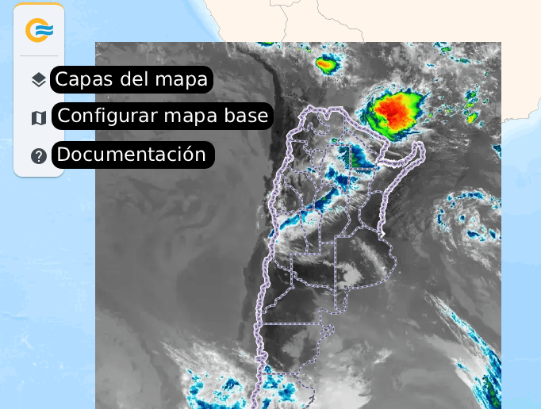{ .doc-figure style="max-height: 400px" }

De fondo se encuentra el mapa base, sobre el cual se superponen las capas meteorológicas (ej. Canal 13 ABI del GOES-19) y de referencia (ej. límites de provincias).

En la sección inferior derecha se encuentra un control de zoom (adicional al uso de la rueda de scroll del mouse).

### Mapas Base

Se puede seleccionar el mapa base que se desea utilizar, por defecto se muestra el mapa del IGN (ArgenMap), entre los siguientes:

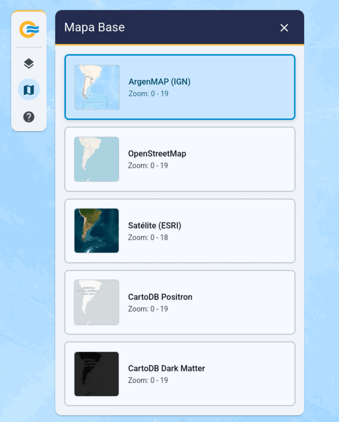{ .doc-figure style="max-height: 500px" }

### Capas Meteorológicas { #capas-meteorologicas }

Una vez seleccionado el desplegable de capas del mapa se observan las fuentes de datos disponibles:

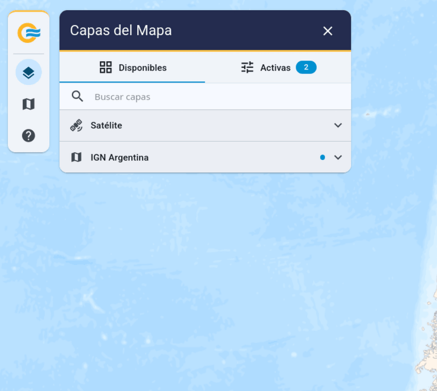{ .doc-figure style="max-height: 450px" }

Al desplegar las fuentes de datos se observan agrupaciones de productos/capas:

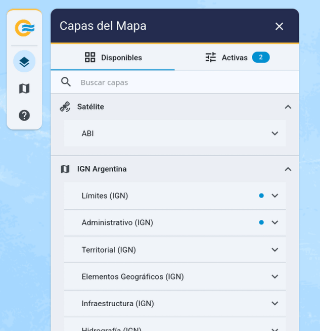{ .doc-figure style="max-height: 450px" }

Por defecto se encuentran activadas las capas de referencia de límites provinciales e internacionales.

Se puede observar que hay capas activas por el punto celeste presente en el desplegable.

Desplegando la agrupación de capas se pueden observar los productos individuales, en este caso por ejemplo el producto **Canal 13** y **Canal 9** del instrumento **ABI** del **Satélite GOES-19**.

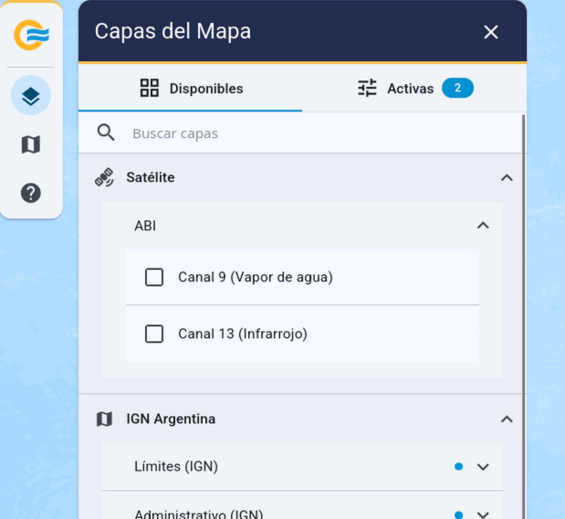{ .doc-figure style="max-height: 450px" }

Cuando se selecciona una capa haciendo click en el checkbox se visualiza en el mapa la última imagen disponible de la capa seleccionada y se agrega como "capa activa":

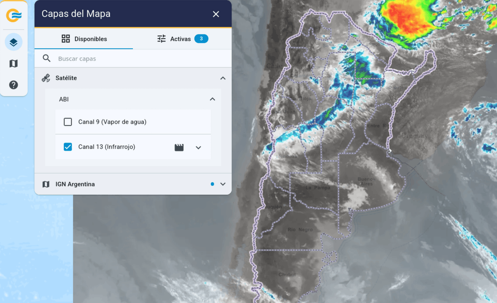{ .doc-figure style="max-height: 450px" }

Desplegando las configuraciones de una capa recién activada (por ejemplo el Canal 13 del GOES-19) se puede observar la configuración de opacidad de la capa:

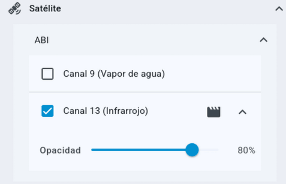{ .doc-figure style="max-height: 450px" }

### Animación de Capas { #animacion-de-capas }

Haciendo click en el ícono de animación se despliegan las configuraciones de animación de imágenes para poder ver la evolución de la capa seleccionada:

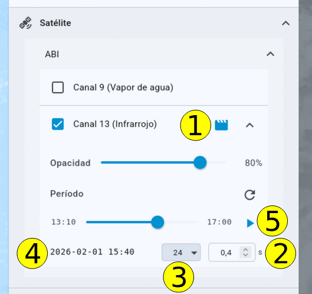{ .doc-figure style="max-height: 450px" }

Donde:

1. **Botón de animación**: Despliega/contrea la configuración de animación de imágenes.
2. **Tiempo entre imágenes**: Define el tiempo entre imágenes en la animación.
3. **Cantidad de imágenes**: Define la cantidad de imágenes en la animación, siempre utilizando las últimas. Por ejempl, 6 -> las últimas 6 imágenes, 24 -> las últimas 24 imágenes, etc.
4. **Timestamps**: Tiempo al que corresponde la imagen en UTC-0.
5. **Botón de play/pausa y slider de animación**: Inicia/pausa la animación. El slider de animación permite moverse entre las imágenes de la animación, con clicks del mouse o con las flechas del teclado.

  <video autoplay loop muted playsinline title="Animación de Capas" width="100%" style="max-height: 500px">
    <source src="../videos/animacion.webm" type="video/webm"/>
    Tu navegador no soporta este video.
  </video>

## Navegación del mapa { #navegacion-del-mapa }

- **Zoom**: Rueda del mouse ó controles de la UI (+/-).
- **Desplazamiento**: Arrastrar mapa (Click izquierdo + Drag) o usar las flechas del teclado.

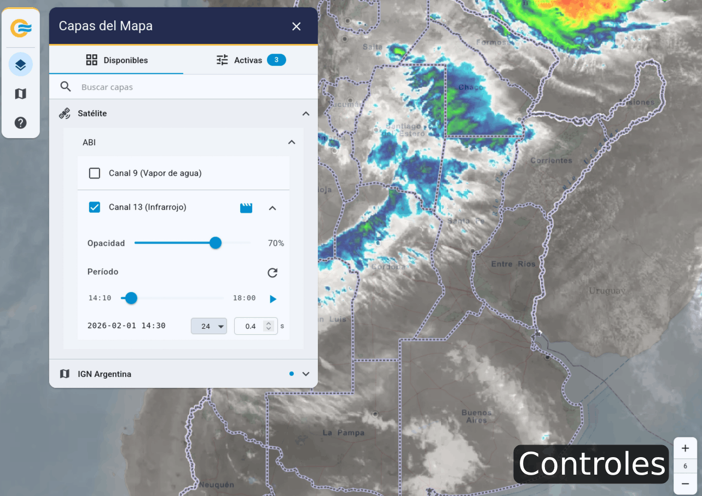{ .doc-figure style="max-height: 450px" }

## Capas Activas (Control de Capas)

Al seleccionar la sección de capas activas se despliegan las capas activas:

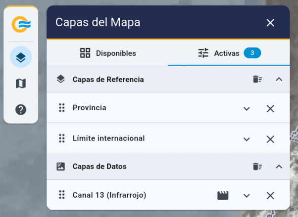{ .doc-figure style="max-height: 300px" }

Por defecto las capas de referencia se dibujan por encima de las capas de datos. De esta manera se pueden ver claramente, por ejemplo los límites provinciales, por encima de los productos meteorológicos.

Se puede controlar cuál capa está por encima de otra (z-index) arrastrando las capas y ordenándolas de la forma deseada.

Ejemplo del Canal 9 encima del Canal 13:

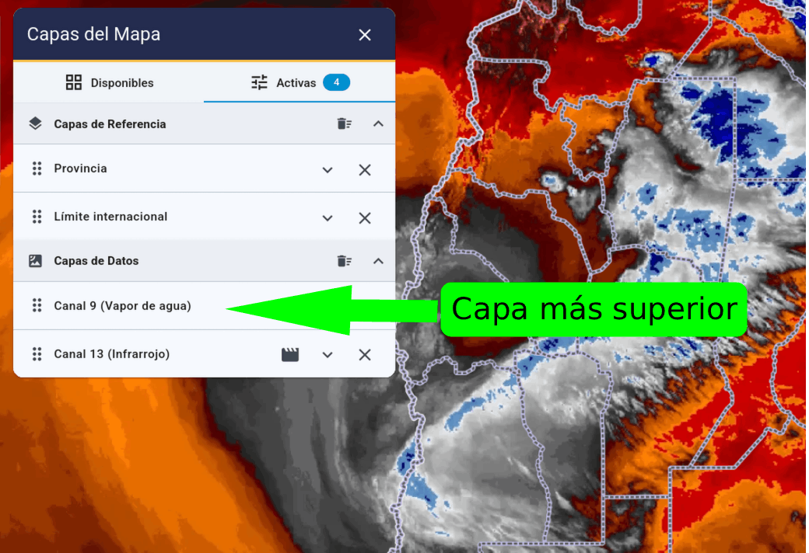{ .doc-figure style="max-height: 450px" }

Ejemplo del Canal 13 encima del Canal 9:

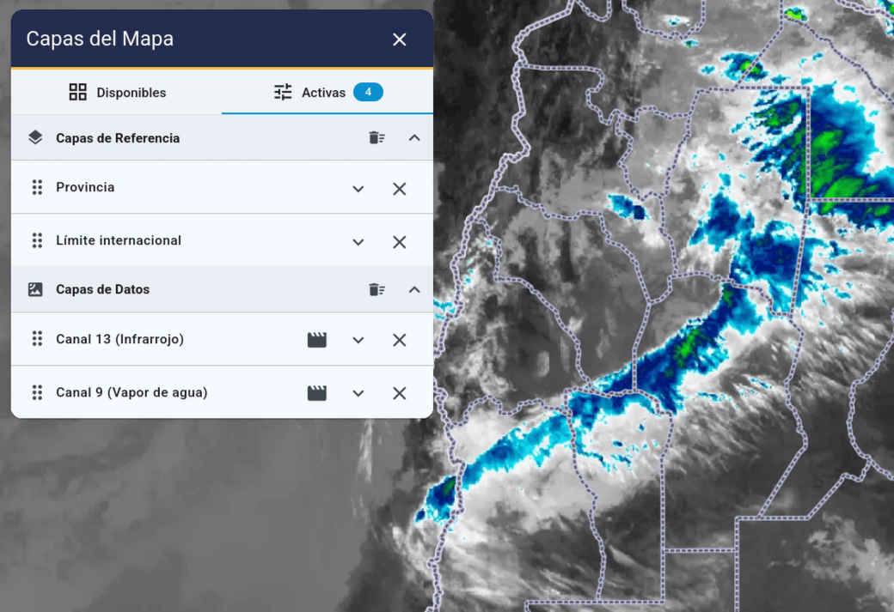{ .doc-figure style="max-height: 450px" }
